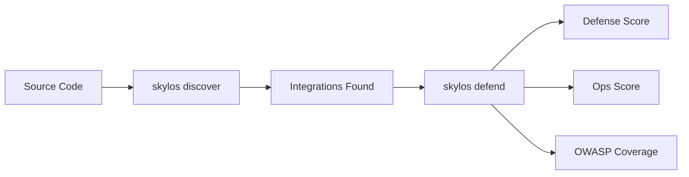

:::info
**New in Skylos 4.0:** AI Defense scans your Python codebase for LLM integrations and evaluates their security posture automatically. TypeScript support is planned.
:::

## Overview

Skylos AI Defense is a two-step pipeline:

1. **Discover** — Detect LLM/AI integrations via AST analysis
2. **Defend** — Run 13 automated security and ops checks against each integration



Discover performs static analysis to find every LLM call site in your codebase — provider, model, input sources, prompt construction, and output handling. Defend then evaluates each integration against 10 defense checks and 3 ops checks, producing a weighted score with OWASP LLM Top 10 mapping.

---

## Quick Start

```bash
# 1. Find all LLM integrations
skylos discover .

# 2. Run defense checks
skylos defend .

# 3. Get machine-readable output
skylos defend . --json
```

---

## Walkthrough

Given this example Python file with two LLM integrations — one insecure, one secure:

```python title="app.py"
import openai
import logging

logger = logging.getLogger(__name__)
client = openai.OpenAI()

def ask_ai(user_input):
    """Insecure: no validation, no delimiters, eval on output."""
    prompt = f"Help me with: {user_input}"
    response = client.chat.completions.create(
        model="gpt-4o",
        messages=[{"role": "user", "content": prompt}]
    )
    result = response.choices[0].message.content
    eval(result)  # dangerous!
    return result

def safe_ask(user_input):
    """Secure: delimiters, validation, logging, max_tokens."""
    if len(user_input) > 1000:
        raise ValueError("Input too long")
    prompt = f"---\nUser request:\n{user_input}\n---\nRespond in JSON."
    logger.info("Calling LLM with prompt length %d", len(prompt))
    response = client.chat.completions.create(
        model="gpt-4o-2024-11-20",
        messages=[{"role": "user", "content": prompt}],
        max_tokens=500
    )
    import json
    result = json.loads(response.choices[0].message.content)
    return result
```

### Step 1: Discover

```bash
skylos discover .
```

```
Found 2 LLM integration(s) in 1 files:

  Provider  Type  Location    Input Sources  Tools  Dangerous Sinks
  ───────── ───── ─────────── ────────────── ────── ───────────────
  OpenAI    chat  app.py:11   none           0      eval (L16)
  OpenAI    chat  app.py:25   none           0      none

Run 'skylos defend .' to check defenses.
```

Discover found both LLM call sites. The first one (`app.py:11`) is flagged with a dangerous sink — `eval()` on line 16 receives the raw LLM output.

### Step 2: Defend

```bash
skylos defend .
```

```
┌──────────────────────────────────────────────────────────────────────────┐
│ Skylos AI Defense Report                                                 │
│ Scanned: 1 files | Found: 2 LLM integration(s) | Score: 50% (MEDIUM)    │
├──────────────────────────────────────────────────────────────────────────┤

Integration 1: app.py:11
  Weighted Score: 0/16 (0%) — CRITICAL RISK
  ✗ no-dangerous-sink   LLM output flows to dangerous sink(s): eval (L16) [-8]
  ✗ output-validation   LLM output used without structured validation     [-5]
  ✗ model-pinned        Model uses floating alias 'gpt-4o'                [-3]
  ✗ logging-present     No logging detected around LLM call               [-3]
  ✗ cost-controls       No max_tokens set — unbounded token consumption   [-3]

Integration 2: app.py:25
  Weighted Score: 16/16 (100%) — SECURE RISK
  ✓ no-dangerous-sink   LLM output does not flow to any dangerous sink    [+8]
  ✓ output-validation   Output validation present at app.py:31            [+5]
  ✓ model-pinned        Model pinned to gpt-4o-2024-11-20                 [+3]
  ✓ logging-present     Logging detected near LLM call                    [+3]
  ✓ cost-controls       max_tokens set on LLM call                        [+3]

──────────────────────────────────────────────────────────────────────────

AI Defense Score: 50% (MEDIUM)
  16/32 weighted points | 3/6 checks passing

AI Ops Score: 50% (FAIR)
  2/4 ops checks passing

OWASP LLM Top 10 Coverage:
  ◐ LLM02 Insecure Output Handling              50% (2/4)
  ◐ LLM03 Training Data Poisoning / Supply Chain 50% (1/2)
  ◐ LLM10 Unbounded Consumption                 50% (1/2)
```

`ask_ai` scores 0% — it passes LLM output straight to `eval()`, uses a floating model alias, has no logging, and no token limit. `safe_ask` scores 100% — it validates output with `json.loads()`, pins the model version, logs calls, and sets `max_tokens`.

### Filtering by OWASP Category

Use `--owasp` to focus on specific OWASP LLM Top 10 items:

```bash
skylos defend . --owasp LLM01        # prompt injection checks only
skylos defend . --owasp LLM01,LLM02  # prompt injection + insecure output
```

### CI Gating

Use `--fail-on` and `--min-score` to gate your pipeline:

```bash
skylos defend . --fail-on critical    # exit 1 if any critical check fails
skylos defend . --min-score 80        # exit 1 if overall score < 80%
skylos defend . --fail-on high --min-score 70  # combine both
```

---

## Discover

`skylos discover` performs AST-based detection of LLM integrations. No runtime, no API keys, no network access required — it reads your source code and identifies every LLM call site.

### Supported Providers

| Provider | Import | Detection |
|----------|--------|-----------|
| OpenAI | `import openai` | `client.chat.completions.create()` |
| Anthropic | `import anthropic` | `client.messages.create()` |
| Google Gemini | `import google.generativeai` | `model.generate_content()` |
| Cohere | `import cohere` | `client.chat()` |
| Mistral | `from mistralai import Mistral` | `client.chat.complete()` |
| Ollama | `import ollama` | `client.chat()` |
| Together AI | `import together` | `client.chat.completions.create()` |
| Groq | `import groq` | `client.chat.completions.create()` |
| LiteLLM | `import litellm` | `litellm.completion()` |
| LangChain | `from langchain...` | `chain.invoke()` |
| CrewAI | `from crewai...` | `crew.kickoff()` |

### What It Detects

For each integration found, Discover extracts:

- **Provider** — Which LLM SDK is being used
- **Model** — The model string passed to the API call
- **Function location** — File, line number, and enclosing function
- **Input sources** — Where user input enters the prompt
- **Prompt sites** — Where the prompt string is constructed
- **Dangerous sinks** — `eval()`, `exec()`, `subprocess` calls on LLM output
- **Output validation** — Whether LLM output is validated or parsed
- **Prompt delimiters** — Structural separators in the prompt (e.g., `---`, XML tags)
- **RAG context** — Whether retrieval-augmented generation context is injected
- **PII filters** — Whether output is filtered for sensitive data
- **Logging** — Whether LLM calls are logged
- **Rate limiting** — Whether rate limiting is applied
- **max_tokens** — Whether token limits are set on API calls

---

## Defend

`skylos defend` takes the integrations found by Discover and runs 13 automated checks against each one. Checks are split into two categories: **defense** (security) and **ops** (operational best practices).

### Defense Checks (10)

| Check | Severity | OWASP | What It Verifies |
|-------|----------|-------|-----------------|
| `no-dangerous-sink` | CRITICAL | LLM02 | No `eval`/`exec` on LLM output |
| `untrusted-input-to-prompt` | CRITICAL | LLM01 | User input has delimiter or length check |
| `output-validation` | HIGH | LLM02, LLM09 | LLM output is validated/parsed |
| `prompt-delimiter` | HIGH | LLM01 | Prompt uses structural delimiters |
| `model-pinned` | MEDIUM | LLM03 | Model version is pinned (dated suffix) |
| `input-length-limit` | MEDIUM | LLM01 | Input length is bounded |
| `tool-schema-present` | HIGH | LLM04, LLM07 | Agent tools have schemas |
| `tool-scope` | HIGH | LLM04, LLM07, LLM08 | Tools don't use `subprocess`/`exec` |
| `rag-context-isolation` | HIGH | LLM01 | RAG context has prompt delimiters |
| `output-pii-filter` | HIGH | LLM06 | Output is filtered for PII |

### Ops Checks (3)

| Check | Severity | What It Verifies |
|-------|----------|-----------------|
| `logging-present` | MEDIUM | Logging calls exist in LLM functions |
| `cost-controls` | MEDIUM | `max_tokens` is set on LLM calls |
| `rate-limiting` | MEDIUM | Rate limiting is applied |

:::tip
Ops checks are tracked separately and do **not** affect your defense score or CI gating. They provide operational best-practice guidance.
:::

### Scoring

Defense and ops scores are calculated using weighted severity:

| Severity | Weight |
|----------|--------|
| CRITICAL | 4 |
| HIGH | 3 |
| MEDIUM | 2 |
| LOW | 1 |

**Defense score** = (weighted passes / weighted maximum) as a percentage.

**Risk ratings** based on defense score:

| Score | Rating |
|-------|--------|
| >= 90% | SECURE |
| >= 70% | LOW |
| >= 40% | MEDIUM |
| >= 20% | HIGH |
| < 20% | CRITICAL |

**Ops score ratings:**

| Score | Rating |
|-------|--------|
| >= 80% | EXCELLENT |
| >= 60% | GOOD |
| >= 40% | FAIR |
| < 40% | POOR |

### OWASP LLM Top 10 Coverage

| OWASP ID | Name | Checks |
|----------|------|--------|
| LLM01 | Prompt Injection | `prompt-delimiter`, `input-length-limit`, `untrusted-input-to-prompt`, `rag-context-isolation` |
| LLM02 | Insecure Output | `no-dangerous-sink`, `output-validation` |
| LLM03 | Training Data Poisoning | `model-pinned` |
| LLM04 | Model Denial of Service | `tool-schema-present`, `tool-scope` |
| LLM06 | Sensitive Info Disclosure | `output-pii-filter` |
| LLM07 | Insecure Plugin Design | `tool-schema-present`, `tool-scope` |
| LLM08 | Excessive Agency | `tool-scope` |
| LLM09 | Overreliance | `output-validation` |
| LLM10 | Model Theft | `input-length-limit`, `cost-controls`, `rate-limiting` |

---

## CLI Reference

### skylos discover

```bash
# Discover LLM integrations
skylos discover <path>

# JSON output
skylos discover <path> --json

# Save to file
skylos discover <path> --json -o integrations.json

# Exclude directories
skylos discover <path> --exclude vendor tests
```

### skylos defend

```bash
# Basic scan
skylos defend <path>

# JSON output
skylos defend <path> --json

# Save to file
skylos defend <path> --json -o defense.json

# CI gating
skylos defend <path> --fail-on critical   # exit 1 if critical failures
skylos defend <path> --min-score 80       # exit 1 if score < 80%

# Filtering
skylos defend <path> --min-severity high  # only high+ severity checks
skylos defend <path> --owasp LLM01       # only OWASP LLM01 checks
skylos defend <path> --owasp LLM01,LLM02 # multiple OWASP filters

# Policy file
skylos defend <path> --policy policy.yaml

# Exclude directories
skylos defend <path> --exclude vendor tests

# Upload to cloud dashboard
skylos defend <path> --upload
skylos defend <path> --json --upload    # JSON output + upload
```

---

## Policy Files

Override default severities, disable checks, and set gating thresholds with a YAML policy file:

```yaml
rules:
  model-pinned:
    severity: critical    # override default severity
  logging-present:
    enabled: false        # disable a check
  cost-controls:
    enabled: false
gate:
  min_score: 60           # minimum passing score
  fail_on: high           # fail on high+ severity failures
```

Pass it to defend with the `--policy` flag:

```bash
skylos defend . --policy policy.yaml
```

Policy files let teams enforce project-specific standards. For example, a team that considers model pinning critical can escalate its severity, while a team that handles logging externally can disable that check entirely.

---

## CI/CD Integration

Add AI Defense to your pipeline to catch regressions automatically:

```yaml
- name: AI Defense Check
  run: |
    pip install skylos
    skylos defend . --fail-on critical --min-score 70
```

:::warning
The `--fail-on` flag only considers **defense** checks. Ops check failures will not cause CI to fail.
:::

The `--fail-on` flag accepts severity levels: `critical`, `high`, `medium`, `low`. The command exits with code 1 if any check at or above the specified severity fails. Combine with `--min-score` to enforce both individual check compliance and overall score thresholds.

### Generate Workflow with Defense

Use `skylos cicd init --defend` to include an AI Defense step in your generated GitHub Actions workflow:

```bash
skylos cicd init --defend
skylos cicd init --defend --upload     # also upload results to cloud
```

This generates a workflow step that runs:
```yaml
- name: AI Defense Check
  run: skylos defend . --fail-on critical --min-score 70 --json -o defense-results.json
```

### Pre-commit Hook

Add Skylos AI Defense as a pre-commit hook to block commits with critical defense failures:

```yaml
# .pre-commit-config.yaml
repos:
  - repo: https://github.com/duriantaco/skylos
    rev: v4.0.0
    hooks:
      - id: skylos-defend
```

---

## Cloud Dashboard

Upload defense results to the Skylos Cloud dashboard for tracking, trending, and team visibility:

```bash
skylos defend . --upload
```

The dashboard provides:
- **Defense score** with historical trend chart
- **OWASP LLM Top 10 coverage grid** with per-item progress bars
- **Missing defenses list** sorted by severity
- **Ops checks** displayed separately from defense checks
- **Per-integration breakdown** showing which LLM call sites need attention

:::info
Cloud upload requires a Skylos token. Run `skylos sync connect` or set `SKYLOS_TOKEN` to authenticate.
:::

