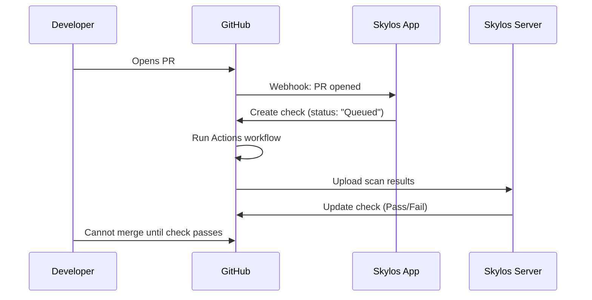

# CI/CD Quality Gate

Skylos integrates with your CI/CD pipeline to automatically block pull requests that introduce security vulnerabilities or code quality issues.

## Overview

There are two ways to use Skylos in CI/CD:

| Approach | Plan | Enforcement |
|----------|------|-------------|
| GitHub Actions only | Free | Soft (can be bypassed) |
| GitHub App + Actions | Pro | Hard (server-controlled) |

---

## Free Tier: GitHub Actions

### Basic Setup

Create `.github/workflows/skylos.yml`:

```yaml
name: Skylos Quality Gate

on:
  pull_request:
    branches: [main, master]

jobs:
  skylos:
    runs-on: ubuntu-latest
    steps:
      - uses: actions/checkout@v4
        with:
          fetch-depth: 0
      
      - uses: actions/setup-python@v5
        with:
          python-version: '3.11'
      
      - name: Install Skylos
        run: pip install skylos
      
      - name: Run Skylos Scan
        run: skylos . --danger --gate
```

### How It Works

1. Developer opens a pull request
2. GitHub Actions runs the workflow
3. `skylos . --danger --gate` scans the code
4. Exit code `1` = check fails, exit code `0` = check passes

### Limitations

:::warning
With the free tier, anyone with write access to the repository can:
- Delete or modify the workflow file
- Bypass the check via admin privileges
- Merge without the check passing
:::

---

## Pro Tier: GitHub App Integration

The Pro tier uses a **server-controlled GitHub check** that cannot be bypassed by developers.

### How It Works



### Key Difference

The GitHub App check is **created and updated by the Skylos server**, not by the Actions workflow. This means:

- ✅ Developers cannot delete or modify the check
- ✅ Developers cannot bypass the check (unless they're admins)
- ✅ The check persists even if the workflow is deleted
- ✅ Only the Skylos server can mark the check as passed

### Setup

#### Step 1: Connect Skylos

```bash
pip install skylos
skylos sync setup
```

Follow the prompts to:
1. Enter your API token (from Dashboard → Settings)
2. Install git hooks (optional)
3. Create GitHub Actions workflow

#### Step 2: Install GitHub App

1. Go to **[Dashboard](https://skylos.dev/dashboard) → Settings**
2. Select your project
3. Click **Install GitHub App**
4. Select the repository you want to protect
5. Authorize the requested permissions

#### Step 3: Configure Branch Protection

1. Go to your GitHub repository
2. Navigate to **Settings → Branches**
3. Click **Add rule** (or edit existing)
4. Set branch name pattern: `main` (or your default branch)
5. Enable these options:
   - ✅ **Require status checks to pass before merging**
   - Select **"Skylos Quality Gate"** from the list
   - ✅ **Do not allow bypassing the above settings** (for strict enforcement)

#### Step 4: Add Token to GitHub Secrets

1. Go to repository **Settings → Secrets and variables → Actions**
2. Click **New repository secret**
3. Add:
   - **Name:** `SKYLOS_TOKEN`
   - **Value:** Your API key from Dashboard → Settings

### Generated Workflow

After running `skylos sync setup`, this workflow is created:

```yaml
name: Skylos Quality Gate

on:
  pull_request:
    branches: [main, master]

permissions:
  contents: read
  pull-requests: write
  checks: write

jobs:
  skylos:
    runs-on: ubuntu-latest
    steps:
      - uses: actions/checkout@v4
        with:
          fetch-depth: 0
      
      - uses: actions/setup-python@v5
        with:
          python-version: '3.11'
      
      - name: Install Skylos
        run: pip install skylos
      
      - name: Run Skylos Scan
        env:
          SKYLOS_TOKEN: ${{ secrets.SKYLOS_TOKEN }}
        run: skylos . --danger --gate
```

---

## Comparison Table

| Feature | Free | Pro |
|---------|:----:|:---:|
| Local scans (`skylos .`) | ✅ | ✅ |
| Exit codes (`--gate`) | ✅ | ✅ |
| GitHub Actions workflow | ✅ | ✅ |
| One-click setup (`sync setup`) | ❌ | ✅ |
| Server-controlled check | ❌ | ✅ |
| Cannot be bypassed | ❌ | ✅ |
| PR diff analysis | ❌ | ✅ |
| Suppressions | ❌ | ✅ |
| Slack notifications | ❌ | ✅ |
| Discord notifications | ❌ | ✅ |
| Dashboard history | Limited | Full |

---

## CLI Reference

### Basic Scan

```bash
skylos .
```

### Scan with Security Checks

```bash
skylos . --danger
```

### Quality Gate Mode

```bash
skylos . --danger --gate
```

Returns exit code `1` if issues are found.

### Force Bypass (Local Only)

```bash
skylos . --danger --gate --force
```

:::note
The `--force` flag only bypasses the local exit code. It does **not** affect the server-controlled GitHub App check for Pro users.
:::

---

## Troubleshooting

### Check is stuck on "Queued"

The GitHub App check was created but never updated. This usually means:

1. The scan didn't run or didn't upload results
2. The `SKYLOS_TOKEN` is missing or invalid
3. The commit SHA doesn't match

**Fix:** Ensure `SKYLOS_TOKEN` is set in GitHub Secrets and the workflow runs successfully.

### Check shows "Expected"

The branch protection is configured but the check hasn't been created yet.

**Fix:** Push a new commit or re-run the workflow to trigger the check.

### "No commit found for SHA" error

The scan ran before the commit was pushed to GitHub.

**Fix:** Always push your commits before running `skylos . --gate` locally, or let GitHub Actions handle it.

### Token not working

Make sure you're using the correct token for your environment:
- **Production:** Get token from https://skylos.dev/dashboard/settings
- **Local dev:** Check your `SKYLOS_API_URL` environment variable

---