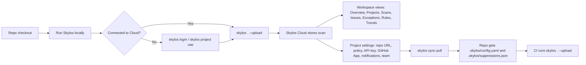

This is the operational guide for the cloud workflow. It reflects the current `skylos` CLI and `skylos-cloud` app behavior.

Use this page when you want to answer:
- Which command should I run?
- What gets stored locally vs in the cloud?
- When do I need a GitHub repo URL?
- How do policy, suppressions, custom rules, and CI fit together?

If you only want the feature overview, read [Cloud Platform](/cloud). For auth details, read [Authentication](/authentication). For CI examples, read [CI/CD Integration](/ci-cd).
For security-team review and procurement posture, read [Enterprise Trust](/enterprise-trust).

## Command Map

| You want to... | Use this | What it actually does |
|---|---|---|
| Connect the current repo to a cloud project | `skylos login` or `skylos project use` | Opens the browser chooser, lets you pick or create a project, verifies the token, and links this repo |
| Upload a scan | `skylos . --upload` | Runs analysis locally, then uploads findings and metadata to Skylos Cloud |
| Keep local policy and suppressions in sync | `skylos sync pull` | Writes `.skylos/config.yaml` and `.skylos/suppressions.json` into the repo |
| See which project this repo uses | `skylos project status` | Shows the repo link and active project |
| List known linked projects | `skylos project list` | Shows locally saved projects from `~/.skylos/credentials.json` |
| Switch or remove the repo link | `skylos project use` / `skylos project unlink` | Rebinds the repo or removes only the repo-to-project link |
| Check the saved cloud connection | `skylos sync status` | Verifies the saved token against `/api/sync/whoami` |
| Connect headlessly with an API key | `skylos sync connect <token>` | Stores the token and links the repo without browser auth |

## End-to-End Flow



## 1. Start Local

You do not need the cloud to use Skylos.

```bash
skylos .
skylos . --danger --quality --secrets
skylos . --gate
```

Local-only mode is the right choice when you want:
- a fast developer scan
- no hosted state
- repo-local thresholds and exit codes
- no shared history or team review

Add the cloud when you want:
- scan history and trends
- project-level policy managed in the dashboard
- shared suppressions
- issue grouping and exception workflows
- GitHub App integration, deep links, or repo-bound OIDC uploads

## 2. Connect the Repo to Skylos Cloud

Preferred command:

```bash
skylos login
```

`skylos project use` uses the same browser chooser but is framed around selecting the project for the current repo.

What happens:
1. The CLI opens `skylos.dev/cli/connect`.
2. You sign in with GitHub if needed.
3. You pick an existing project or create a new one.
4. The CLI verifies the returned token with `/api/sync/whoami`.
5. The CLI stores credentials and writes the repo link.

Files written locally:
- `~/.skylos/credentials.json`
- `<repo>/.skylos/link.json`

`link.json` is the repo-to-project binding. `credentials.json` stores saved project tokens and metadata.

### Switching projects

Re-running `skylos login` does not require a full disconnect. The chooser opens again. If you finish the flow with a different project, the repo link is updated. If you close the browser flow, the current project is kept.

Useful repo commands:

```bash
skylos project status
skylos project list
skylos project unlink
```

### Headless or manual setup

If you do not want browser auth:

```bash
skylos sync connect
# or
skylos sync connect sk_live_xxx...
```

Get the API key from `Dashboard -> Settings -> choose project -> API key`.

## 3. Upload Scans

Basic upload:

```bash
skylos . --upload
```

Common variants:

```bash
skylos . --danger --quality --upload
skylos defend . --upload
```

What happens on upload:
1. Analysis still runs locally.
2. The CLI resolves auth.
3. Findings and scan metadata are sent to Skylos Cloud.
4. Skylos Cloud stores the scan, groups issues, applies suppressions, and evaluates the project gate.
5. The dashboard updates.

Skylos Cloud records server-side upload attribution for the resolved project and auth path. For API keys, the upload is tied to the resolved project key identity. For GitHub Actions OIDC, it is tied to verified GitHub OIDC claims and the matched repo/project binding.

### What auth the CLI uses

The current token resolution order is:
1. `SKYLOS_TOKEN`
2. GitHub Actions OIDC
3. the current repo link plus `~/.skylos/credentials.json`
4. the legacy default saved token
5. system keyring fallback

### Linked repos auto-upload by default

Once a repo is linked, plain `skylos .` will auto-enable upload unless you opt out:

```bash
skylos .
skylos . --no-upload
```

That behavior is intentional and worth documenting for teams.

### Custom rules are loaded at scan time

If the CLI has a valid cloud token, it also asks Skylos Cloud for org-level custom rules during scan startup. Those rules are applied locally during analysis. They are not written by `skylos sync pull`.

## 4. What Appears in Skylos Cloud

Workspace navigation currently includes:
- `Overview`
- `Projects`
- `Scans`
- `Issues`
- `Exceptions`
- `Rules`
- `Trends`

Each project currently has tabs for:
- `Overview`
- `Scans`
- `Issues`
- `Suppressions`
- `Defense`
- `Provenance`
- `Settings`

In practice, the cloud split looks like this:
- CLI: runs analysis
- Cloud: stores history, groups recurring findings, applies shared policy, manages suppressions, and exposes team workflows

## 5. Configure the Project in the Dashboard

The main project management surface is:

`Dashboard -> Settings -> choose project`

That surface currently manages:
- repository URL
- API key rotation
- GitHub App installation
- Slack and Discord notifications
- team members
- workspace/project policy
- policy inheritance

### Repo URL: optional for basic uploads, required for GitHub-native features

A project can stay cloud-only with no repo URL and still accept normal API-key uploads.

Set the repo URL when you want:
- GitHub Actions OIDC uploads
- GitHub App installation
- GitHub deep links
- PR-linked GitHub check runs and comments
- repo-aware default-branch resolution

OIDC uploads require one unique project whose `repo_url` matches the GitHub repository. If no project matches, or multiple projects match, OIDC upload fails.

## 6. Pull Cloud Policy and Suppressions Back Into the Repo

```bash
skylos sync pull
```

This writes:
- `<repo>/.skylos/config.yaml`
- `<repo>/.skylos/suppressions.json`

Use it after:
- changing project policy in the dashboard
- adding or revoking suppressions
- changing gate mode or thresholds
- updating exclude paths or security contracts

### Local config precedence

The local CLI does not treat the synced file as the only source of truth.

Current precedence is:
1. Skylos defaults
2. `.skylos/config.yaml` from `sync pull`
3. `pyproject.toml` `[tool.skylos]`
4. CLI flags

That means dashboard policy can seed the repo, but local `pyproject.toml` and explicit flags can still override it for a given run.

## 7. CI/CD

There are two main cloud upload patterns.

### GitHub Actions with OIDC

Use this when you want secretless GitHub uploads.

Preconditions:
- the project has a unique GitHub `repo_url` saved in dashboard settings
- the workflow has `id-token: write`

```yaml
name: Skylos Scan

on:
  pull_request:
    branches: [main, master]

permissions:
  contents: read
  id-token: write

jobs:
  skylos:
    runs-on: ubuntu-latest
    steps:
      - uses: actions/checkout@v4
        with:
          fetch-depth: 0
      - uses: actions/setup-python@v5
        with:
          python-version: "3.11"
      - run: pip install skylos
      - run: skylos . --danger --quality --upload
```

### Token-based CI

Use this for GitHub without OIDC, GitLab, CircleCI, Jenkins, or any other CI.

```yaml
- name: Run Skylos
  env:
    SKYLOS_TOKEN: ${{ secrets.SKYLOS_TOKEN }}
  run: skylos . --danger --quality --upload
```

### Sync pull in CI

If you want the CI runner to use the latest synced dashboard thresholds and suppressions locally before the scan, add:

```bash
skylos sync pull
```

That requires `SKYLOS_TOKEN`, because OIDC is used for upload resolution, not for `sync pull`.

### Generated workflows vs OIDC

`skylos cicd init --upload` currently generates a token-based upload workflow. It does not generate an OIDC workflow for you.

### `skylos sync setup`

`skylos sync setup` is a token-driven helper for scaffolding hooks and workflow files. It currently asks for a token and writes token-based workflow examples. It is not the browser-based OIDC setup path.

## 8. How the Cloud Gate Decides Pass or Fail

This is the key difference between `--gate` and `--upload`.

### Local gate

```bash
skylos . --gate
```

Local gate uses local findings and local config. It only controls the CLI exit code.

### Cloud gate

```bash
skylos . --upload
```

Cloud gate uses the project in Skylos Cloud and evaluates:
- the effective project policy
- active suppressions
- strict mode
- AI assurance, if enabled
- PR diff data when available
- otherwise the latest successful or overridden baseline scan on the same branch, or the default branch

That is why a repo linked to the dashboard can behave differently from a local-only run.

## 9. Recommended Rollout

A clean team rollout usually looks like this:

1. Start with local scans only.
2. Connect the repo with `skylos login`.
3. Upload from a developer machine once with `skylos . --upload`.
4. Set the project repo URL if you want GitHub-native features.
5. Configure policy in `Dashboard -> Settings`.
6. Run `skylos sync pull` so the repo has the latest synced config and suppressions.
7. Add CI with either OIDC or `SKYLOS_TOKEN`.
8. Add the GitHub App and branch protection only after uploads are stable.

## Troubleshooting

### `skylos .` uploads even without `--upload`

The repo is linked. Use `--no-upload` to force a local-only run.

### OIDC says the repo is not linked

Save the exact GitHub repo URL on the project in dashboard settings.

### OIDC says the repo binding is ambiguous

More than one project has the same `repo_url`. Fix the duplicate binding so one repo maps to one project.

### `skylos sync pull` says not connected

Run `skylos login` or `skylos sync connect` first.

### The repo is connected to the wrong project

Use:

```bash
skylos project unlink
skylos login
```

### Custom rules do not appear locally

Custom rules are loaded from the cloud only when a valid token is available. Paid-plan custom rule features also require the right plan.

## Related Docs

- [Cloud Platform](/cloud)
- [Authentication](/authentication)
- [CI/CD Integration](/ci-cd)
- [Project Policy](/project-policy)
- [Custom Rules](/custom-rules)
- [Billing & Credits](/billing)
