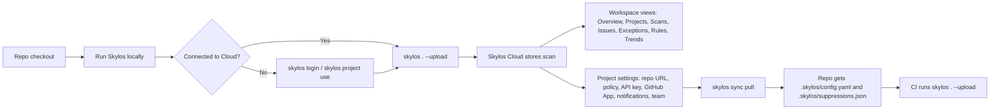

This is the operational guide for the cloud workflow. It reflects the current `skylos` CLI and `skylos-cloud` app behavior.

Use this page when you want to answer:
- Which command should I run?
- What gets stored locally vs in the cloud?
- When do I need a GitHub repo URL?
- How do policy, suppressions, custom rules, and CI fit together?

If you only want the feature overview, read [Cloud Platform](/cloud). For auth details, read [Authentication](/authentication). For CI examples, read [CI/CD Integration](/ci-cd).
For security-team review and procurement posture, read [Enterprise Trust](/enterprise-trust).

## Command Map

| You want to... | Use this | What it actually does |
|---|---|---|
| Connect the current repo to a cloud project | `skylos login` or `skylos project use` | Opens the browser chooser, lets you pick or create a project, verifies the token, and links this repo |
| Upload a scan | `skylos . --upload` | Runs analysis locally, then uploads findings and metadata to Skylos Cloud |
| Keep local policy and suppressions in sync | `skylos sync pull` | Writes `.skylos/config.yaml` and `.skylos/suppressions.json` into the repo |
| See which project this repo uses | `skylos project status` | Shows the repo link and active project |
| List known linked projects | `skylos project list` | Shows locally saved projects from `~/.skylos/credentials.json` |
| Switch or remove the repo link | `skylos project use` / `skylos project unlink` | Rebinds the repo or removes only the repo-to-project link |
| Check the saved cloud connection | `skylos sync status` | Verifies the saved token against `/api/sync/whoami` |
| Connect headlessly with an API key | `skylos sync connect <token>` | Stores the token and links the repo without browser auth |

## End-to-End Flow


```mermaid
flowchart LR
    A[Repo checkout] --> B[Run Skylos locally]
    B --> C{Connected to Cloud?}
    C -- No --> D[skylos login / skylos project use]
    C -- Yes --> E[skylos . --upload]
    D --> E
    E --> F[Skylos Cloud stores scan]
    F --> G[Workspace views: Overview, Projects, Scans, Issues, Exceptions, Rules, Trends]
    F --> H[Project settings: repo URL, policy, API key, GitHub App, notifications, team]
    H --> I[skylos sync pull]
    I --> J[Repo gets .skylos/config.yaml and .skylos/suppressions.json]
    J --> K[CI runs skylos . --upload]
```

## 1. Start Local

You do not need the cloud to use Skylos.

```bash
skylos .
skylos . --danger --quality --secrets --ai-defects
skylos . --gate
```

Local-only mode is the right choice when you want:
- a fast developer scan
- no hosted state
- repo-local thresholds and exit codes
- no shared history or team review

Add the cloud when you want:
- scan history and trends
- project-level policy managed in the dashboard
- shared suppressions
- issue grouping and exception workflows
- GitHub App integration, deep links, or repo-bound OIDC uploads

## 2. Connect the Repo to Skylos Cloud

Preferred command:

```bash
skylos login
```

`skylos project use` uses the same browser chooser but is framed around selecting the project for the current repo.

What happens:
1. The CLI opens `skylos.dev/cli/connect`.
2. You sign in with GitHub if needed.
3. You pick an existing project or create a new one.
4. The CLI verifies the returned token with `/api/sync/whoami`.
5. The CLI stores credentials and writes the repo link.

Files written locally:
- `~/.skylos/credentials.json`
- `<repo>/.skylos/link.json`

`link.json` is the repo-to-project binding. `credentials.json` stores saved project tokens and metadata.

### Switching projects

Re-running `skylos login` does not require a full disconnect. The chooser opens again. If you finish the flow with a different project, the repo link is updated. If you close the browser flow, the current project is kept.

Useful repo commands:

```bash
skylos project status
skylos project list
skylos project unlink
```

### Headless or manual setup

If you do not want browser auth:

```bash
skylos sync connect
# or
skylos sync connect sk_live_xxx...
```

Get the API key from `Dashboard -> Settings -> choose project -> API key`.

## 3. Upload Scans

Basic upload:

```bash
skylos . --upload
```

Common variants:

```bash
skylos . --danger --quality --ai-defects --upload
skylos defend . --upload
```

What happens on upload:
1. Analysis still runs locally.
2. The CLI resolves auth.
3. Findings and scan metadata are sent to Skylos Cloud.
4. Skylos Cloud stores the scan, groups issues, applies suppressions, and evaluates the project gate.
5. The dashboard updates.

Skylos Cloud records server-side upload attribution for the resolved project and auth path. For API keys, the upload is tied to the resolved project key identity. For GitHub Actions OIDC, it is tied to verified GitHub OIDC claims and the matched repo/project binding.

### What auth the CLI uses

The current token resolution order is:
1. `SKYLOS_TOKEN`
2. GitHub Actions OIDC
3. the current repo link plus `~/.skylos/credentials.json`
4. the legacy default saved token
5. system keyring fallback

### Linked repos upload when requested

Linking saves the upload destination and credentials. Plain scans stay local;
add `--upload` to send a report:

```bash
skylos .
skylos . --upload
```

The generated CI workflow has a separate upload job that passes `--upload`
on default-branch pushes.

### Custom rules are loaded at scan time

If the CLI has a valid cloud token, it also asks Skylos Cloud for org-level custom rules during scan startup. Those rules are applied locally during analysis. They are not written by `skylos sync pull`.

## 4. What Appears in Skylos Cloud

Workspace navigation currently includes:
- `Overview`
- `Projects`
- `Scans`
- `Issues`
- `Exceptions`
- `Rules`
- `Trends`

Each project currently has tabs for:
- `Overview`
- `Scans`
- `Issues`
- `Suppressions`
- `Defense`
- `Provenance`
- `Settings`

In practice, the cloud split looks like this:
- CLI: runs analysis
- Cloud: stores history, groups recurring findings, applies shared policy, manages suppressions, and exposes team workflows

## 5. Configure the Project in the Dashboard

The main project management surface is:

`Dashboard -> Settings -> choose project`

That surface currently manages:
- repository URL
- API key rotation
- GitHub App installation
- Slack and Discord notifications
- team members
- workspace/project policy
- policy inheritance

### Repo URL: optional for basic uploads, required for GitHub-native features

A project can stay cloud-only with no repo URL and still accept normal API-key uploads.

Set the repo URL when you want:
- GitHub Actions OIDC uploads
- GitHub App installation
- GitHub deep links
- PR-linked GitHub check runs and comments
- repo-aware default-branch resolution

OIDC requires a unique project for the verified repository and the project
subpath supplied by the request. Multiple projects in one monorepo work when
each request identifies its root, such as `apps/api`. If no project matches,
or several projects still match the repository and requested subpath, Cloud
rejects the upload. A request without a subpath is ambiguous when it matches
several projects.

## 6. Pull Cloud Policy and Suppressions Back Into the Repo

```bash
skylos sync pull
```

This writes:
- `<repo>/.skylos/config.yaml`
- `<repo>/.skylos/suppressions.json`

Use it after:
- changing project policy in the dashboard
- adding or revoking suppressions
- changing gate mode or thresholds
- updating exclude paths or security contracts

### Local config precedence

The local CLI does not treat the synced file as the only source of truth.

Current precedence is:
1. Skylos defaults
2. `.skylos/config.yaml` from `sync pull`
3. `pyproject.toml` `[tool.skylos]`
4. CLI flags

That means dashboard policy can seed the repo, but local `pyproject.toml` and explicit flags can still override it for a given run.

## 7. CI/CD

There are two main cloud upload patterns.

### GitHub Actions with OIDC

Use this for uploads from default-branch pushes without a stored API key.
PR scans and tests run separately, without Cloud credentials or OIDC.
`skylos cicd init` generates both paths; see [CI/CD Integration](/ci-cd#github-actions-with-oidc).

The onboarding workflow and generator options described here require
**Skylos 4.46.0 or newer**. Skylos 4.45.0 has the older generator.

Preconditions:
- the project is bound to the GitHub repository in dashboard settings
- the Skylos GitHub App is installed on the repository
- only the upload job has `id-token: write`

This upload-only example assumes one Cloud project for the repository and
`main` as its default branch. Replace the branch name as needed. Use the
App's per-root workflow for multiple monorepo projects.

```yaml
name: Skylos Cloud upload

on:
  push:
    branches: [main]

permissions:
  contents: read

jobs:
  cloud-upload:
    if: github.event_name == 'push' && github.ref == format('refs/heads/{0}', github.event.repository.default_branch)
    runs-on: ubuntu-latest
    timeout-minutes: 15
    permissions:
      contents: read
      id-token: write
    steps:
      - uses: actions/checkout@34e114876b0b11c390a56381ad16ebd13914f8d5
        with:
          fetch-depth: 0
          persist-credentials: false
      - uses: actions/setup-python@a26af69be951a213d495a4c3e4e4022e16d87065
        with:
          python-version: '3.12'
      - run: python -I -m pip install "skylos>=4.46.0"
      - run: skylos sync pull
      - run: skylos . --danger --secrets --quality --ai-defects --upload
        env:
          SKYLOS_COMMIT: ${{ github.sha }}
          SKYLOS_BRANCH: ${{ github.ref_name }}
```

Cloud rejects uploads from ordinary `pull_request` jobs. Its GitHub App has
a separate PR workflow with an unprivileged scanner and isolated trusted
policy and publishing jobs. Use that generated workflow for Cloud-verified
PR checks; do not add credentials to your PR tests.

The App's Done job selects test setup from the reviewed base branch. Python
test dependencies share the scanner's Python environment and must preserve
the selected Skylos version; setup stops with an error if installation
replaces it. Expected local build artifacts, such as `*.egg-info/`, must have
narrow ignore patterns in the reviewed base `.gitignore`. Done still requires
a clean checkout: do not hide source changes or ignore all untracked files.

### Token-based CI

Use this in a trusted CI job for providers without OIDC or for explicit
project selection. Keep stored tokens out of PR test jobs.

```yaml
- name: Run Skylos
  env:
    SKYLOS_TOKEN: ${{ secrets.SKYLOS_TOKEN }}
  run: skylos . --danger --quality --ai-defects --upload
```

### Sync pull in CI

If you want the CI runner to use the latest synced dashboard thresholds and suppressions locally before the scan, add:

```bash
skylos sync pull
```

The generated default-branch upload job authenticates policy sync with its
GitHub OIDC identity. For local use or CI without OIDC, provide a saved API
key or `SKYLOS_TOKEN`.

### Generated workflows vs OIDC

`skylos cicd init` generates a PR quality gate, a Done job when pytest tests
or a configured test command are found, and a separate default-branch upload
job using GitHub OIDC. Upload is on by default; use `--no-upload` to omit it.
Use `--done` or `--no-done` to override test discovery. Regenerate after
upgrading Skylos to update the installed-version pin.

For multiple Cloud projects in a monorepo, use the GitHub App's generated
per-root workflow. CLI `--scan-path` changes the scanned directory, but the
CLI-generated `skylos sync pull` step does not send a GitHub project-subpath
header and can fail with an ambiguous binding.

### `skylos sync setup`

`skylos sync setup` asks for a token to connect the local repository and
scaffold hooks and workflow files. Its generated CI workflow scans PRs
locally and uploads default-branch pushes through GitHub OIDC. Use
`skylos cicd init` to generate the quality gate and discovered Done job.

## 8. How the Cloud Gate Decides Pass or Fail

This is the key difference between `--gate` and `--upload`.

### Local gate

```bash
skylos . --gate
```

Local gate uses local findings and local config. It only controls the CLI exit code.

### Cloud gate

```bash
skylos . --upload
```

Cloud gate uses the project in Skylos Cloud and evaluates:
- the effective project policy
- active suppressions
- strict mode
- AI assurance, if enabled
- PR diff data when available
- otherwise the latest successful or overridden baseline scan on the same branch, or the default branch

That is why a repo linked to the dashboard can behave differently from a local-only run.

## 9. Recommended Rollout

A clean team rollout usually looks like this:

1. Start with local scans only.
2. Connect the repo with `skylos login`.
3. Upload from a developer machine once with `skylos . --upload` to check the connection. This scan is unverified and cannot pass the Cloud GitHub gate.
4. Set the project repo URL if you want GitHub-native features.
5. Configure policy in `Dashboard -> Settings`.
6. Run `skylos sync pull` so the repo has the latest synced config and suppressions.
7. Install the GitHub App, then generate CI with `skylos cicd init`: PR checks plus default-branch OIDC uploads.
8. Check that the expected PR jobs run, then require them in branch protection.

## Troubleshooting

### A linked scan does not appear in Cloud

Linking alone does not enable scan uploads. Run `skylos . --upload` to send
the report.

### OIDC says the repo is not linked

Save the exact GitHub repo URL on the project in dashboard settings.

### OIDC says the repo binding is ambiguous

Check the requested project subpath and remove duplicate bindings for the
same repository and subpath. For multiple monorepo projects, use the App's
per-root workflow; CLI `--scan-path` alone does not route policy sync.

### `skylos sync pull` says not connected

Run `skylos login` or `skylos sync connect` first.

### The repo is connected to the wrong project

Use:

```bash
skylos project unlink
skylos login
```

### Custom rules do not appear locally

Custom rules are loaded from the cloud only when a valid token is available. Paid-plan custom rule features also require the right plan.

## Related Docs

- [Cloud Platform](/cloud)
- [Authentication](/authentication)
- [CI/CD Integration](/ci-cd)
- [Project Policy](/project-policy)
- [Custom Rules](/custom-rules)
- [Billing & Credits](/billing)
