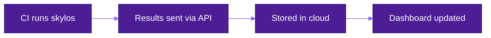

The Skylos CLI runs locally and outputs results to your terminal. The **cloud platform** stores those results, tracks them over time, and gives your team the visibility to actually improve.

## CLI vs Cloud

| What You Get | CLI (Free) | Cloud |
|--------------|:----------:|:-----:|
| Dead code detection | ✅ | ✅ |
| Security scanning (taint analysis) | ✅ | ✅ |
| Quality metrics | ✅ | ✅ |
| CI/CD quality gate | ✅ | ✅ |
| AI-powered fixes | ✅ | ✅ |
| **Scan history** | ❌ | ✅ |
| **Trend visualization** | ❌ | ✅ |
| **File hotspot analysis** | ❌ | ✅ |
| **Violation pattern tracking** | ❌ | ✅ |
| **Multi-project management** | ❌ | ✅ |
| **Team access** | ❌ | ✅ |
| **Custom governance policies** | ❌ | ✅ |

---

## The Problem with Point-in-Time Scans

The CLI answers: **"What's wrong right now?"**

But teams need to answer:
- Are we getting **better or worse** over time?
- Which **files** should we prioritize for refactoring?
- Which **rules** does the team violate most often?
- Did that cleanup sprint actually **reduce debt**?
- How does `main` compare to `feature-x`?

**You can't improve what you don't measure.**

---

## What the Platform Shows

### Trend Charts

Every scan is stored. The platform plots your security and quality issues over time, per branch:

- **Downward trend** → Team is improving
- **Upward trend** → New issues being introduced
- **Spikes** → Correlate with specific commits

Filter by branch to compare `main` vs feature branches, or track how a specific PR affected your metrics.

### File Hotspots

The **Toxic Files** chart shows which files have the highest issue density.

The Pareto principle applies to code: a small percentage of files contain most issues. Instead of fixing problems randomly, this chart tells you exactly where to focus for maximum impact.

### Violation Patterns

See which rules your team breaks most frequently.

Use this for:
- Targeted code review checklists
- Team training priorities
- Deciding which linter rules to enforce

### Scan Details

Click any scan to see:
- Full list of findings, grouped by file
- Code snippets with the problematic line highlighted
- Deep links to the exact line in GitHub
- Severity and category for each issue

### Multi-Project Dashboard

Manage multiple repositories from one place. Each project gets:
- Isolated scan history
- Separate trend tracking
- Its own API key for CI/CD

---

## How It Works



### 1. Get Your API Key

After signing in, go to **Settings** to get your project's API key.

### 2. Add to CI

Pass the `--api-key` flag when running Skylos:


**skylos:**


```bash . --danger --quality --api-key $SKYLOS_API_KEY
```

### 3. View Results

After each scan, results appear in your dashboard within seconds.

---

## Setup

### GitHub Actions


**name:**


```yaml: Skylos

on: [push, pull_request]

jobs:
  scan:
    runs-on: ubuntu-latest
    steps:
      - uses: actions/checkout@v4
      - uses: actions/setup-python@v5
        with:
          python-version: '3.11'
      
      - run: pip install skylos
      
      - run: |
          skylos . \
            --danger \
            --quality \
            --api-key ${{ secrets.SKYLOS_API_KEY }}
```

Add `SKYLOS_API_KEY` to your repository secrets (Settings → Secrets → Actions).

### GitLab CI


**skylos:**


```yaml:
  image: python:3.11
  script:
    - pip install skylos
    - skylos . --danger --quality --api-key $SKYLOS_API_KEY
```

Add `SKYLOS_API_KEY` as a CI/CD variable (Settings → CI/CD → Variables).

---

## What Data Is Sent

When you use `--api-key`, Skylos sends:

| Sent | Not Sent |
|------|----------|
| Finding details (rule, message, severity) | Source code |
| File paths | File contents |
| Line numbers | Your codebase |
| Metrics (counts, scores) | Environment variables |
| Commit hash, branch name | Secrets |

**Your code stays on your machine.** Only the analysis results are transmitted.

---

## Custom Governance Policies

Define organization-specific rules in the Settings page:

```
All database queries must use the ORM layer
API endpoints must validate authentication
No print() statements in production code
Logging must not include PII fields
```

These rules are injected into the AI Auditor's context when you run `--audit`, giving you organization-aware code reviews.

---

## API Key Management

From the Settings page, you can:

- **View** your API key (hidden by default)
- **Copy** to clipboard
- **Rotate** the key (immediately invalidates the old one)

:::warning
Rotating your key requires updating all CI/CD secrets that use it.
:::

---

## Pricing


  ### Community
    **Free forever**
    
    - CLI with all analysis features
    - Unlimited local scans
    - CI/CD quality gate
    - AI-powered fixes (bring your own key)
    
    [Install CLI →](/getting-started)
  
  ### Team
    **$29/month**
    
    - Everything in Community
    - Cloud dashboard
    - Trend tracking
    - File hotspots
    - Custom policies
    - Priority support
    
    [Start Free Trial →](https://app.skylos.io)
  


---

## FAQ


  <details>
<summary>Can I try the cloud platform before paying?</summary>

    Yes. New accounts get a 14-day free trial with full access.
  </details>
  
  <details>
<summary>What happens if I cancel?</summary>

    Your scan history is retained for 30 days. You can export data as JSON at any time.
  </details>
  
  <details>
<summary>Can multiple team members access the dashboard?</summary>

    Yes. All members of your organization can view projects and scan history.
  </details>
  
  <details>
<summary>Do I need the cloud to use the CLI?</summary>

    No. The CLI works completely independently. The cloud is optional—for teams that want tracking and visibility.
  </details>
