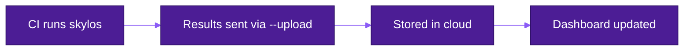

The Skylos CLI runs locally and outputs results to your terminal. The **cloud platform** stores those results, tracks them over time, and gives your team the visibility to actually improve.

If you want the full operational flow, read:

- [CLI to Dashboard Workflow](/cloud-workflow)
- [Project Policy](/project-policy)
- [Custom Rules](/custom-rules)

:::tip New Users
Every new account gets **50 starter credits** and a **7-day Pro trial** — no credit card required. Just run `skylos . --upload` to get started.
:::

## CLI vs Cloud

| What You Get | CLI (Free) | Cloud |
|--------------|:----------:|:-----:|
| Dead code detection | ✅ | ✅ |
| Security scanning (taint analysis) | ✅ | ✅ |
| Quality metrics | ✅ | ✅ |
| CI/CD quality gate | ✅ | ✅ |
| AI-powered fixes | ✅ | ✅ |
| **Scan history** | ❌ | ✅ |
| **Trend visualization** | ❌ | ✅ (Pro) |
| **File hotspot analysis** | ❌ | ✅ |
| **Violation pattern tracking** | ❌ | ✅ |
| **Multi-project management** | ❌ | ✅ |
| **Team collaboration** | ❌ | ✅ (Pro) |
| **Slack & Discord notifications** | ❌ | ✅ (Pro) |
| **Inline PR comments** | ❌ | ✅ (Pro) |
| **Compliance reports** | ❌ | ✅ (Pro) |
| **Custom governance policies** | ❌ | ✅ (Pro) |

---

## The Problem with Point-in-Time Scans

The CLI answers: **"What's wrong right now?"**

But teams need to answer:
- Are we getting **better or worse** over time?
- Which **files** should we prioritize for refactoring?
- Which **rules** does the team violate most often?
- Did that cleanup sprint actually **reduce debt**?
- How does `main` compare to `feature-x`?

**You can't improve what you don't measure.**

---

## What the Platform Shows

### Trend Charts

Every scan is stored. The platform plots your security and quality issues over time, per branch:

- **Downward trend** → Team is improving
- **Upward trend** → New issues being introduced
- **Spikes** → Correlate with specific commits

Filter by branch to compare `main` vs feature branches, or track how a specific PR affected your metrics.

{/*  */}

### File Hotspots

The **Toxic Files** chart shows which files have the highest issue density.

The Pareto principle applies to code: a small percentage of files contain most issues. Instead of fixing problems randomly, this chart tells you exactly where to focus for maximum impact.

### Violation Patterns

See which rules your team breaks most frequently.

Use this for:
- Targeted code review checklists
- Team training priorities
- Deciding which linter rules to enforce

### Scan Details

Click any scan to see:
- Full list of findings, grouped by file
- Code snippets with the problematic line highlighted
- Deep links to the exact line in GitHub
- Severity and category for each issue

{/*  */}

### Multi-Project Dashboard

Manage multiple repositories from one place. Each project gets:
- Isolated scan history
- Separate trend tracking
- Its own authentication context

{/*  */}

---

## How It Works


```mermaid
%%{init: {'theme': 'base', 'themeVariables': { 'primaryColor': '#4C1D95', 'primaryTextColor': '#fff', 'primaryBorderColor': '#2E1065', 'lineColor': '#8B5CF6'}}}%%
flowchart LR
    A[CI runs skylos] --> B[Results sent via --upload] --> C[Stored in cloud] --> D[Dashboard updated]
```

### 1. Authenticate

Run `skylos . --upload` — the browser opens automatically for first-time setup. See [Authentication](/authentication) for details.

### 2. Upload Results

```bash
skylos . --danger --upload
```

The CLI scans locally, then uploads findings to the cloud. **Your source code never leaves your machine.**

### 3. View Results

After each scan, results appear in your dashboard within seconds.

---

## Setup

### Local Development

Just run:

```bash
skylos . --upload
```

On first run, the browser opens automatically. You log in with GitHub, pick (or create) a project, and you're done. Future uploads work without any prompts.

See [Authentication](/authentication) for the full details.

### GitHub Actions (Recommended: Tokenless OIDC)

**No secrets required!** GitHub Actions can authenticate using OpenID Connect:

```yaml
name: Skylos Quality Gate

on:
  pull_request:
    branches: [main, master]

permissions:
  contents: read
  id-token: write  # Enables tokenless auth

jobs:
  skylos:
    runs-on: ubuntu-latest
    steps:
      - uses: actions/checkout@v4
        with:
          fetch-depth: 0
      - uses: actions/setup-python@v5
        with:
          python-version: '3.11'
      - run: pip install skylos
      - name: Run Skylos Scan
        run: skylos . --danger --upload
```

No `SKYLOS_TOKEN` secret needed. The CLI detects the GitHub Actions environment and authenticates via OIDC automatically.

### GitHub Actions (Manual Token)

If you prefer explicit tokens:

```yaml
name: Skylos Quality Gate

on:
  pull_request:
    branches: [main, master]

jobs:
  skylos:
    runs-on: ubuntu-latest
    steps:
      - uses: actions/checkout@v4
        with:
          fetch-depth: 0
      - uses: actions/setup-python@v5
        with:
          python-version: '3.11'
      - run: pip install skylos
      - name: Run Skylos Scan
        env:
          SKYLOS_TOKEN: ${{ secrets.SKYLOS_TOKEN }}
        run: skylos . --danger --upload
```

Add `SKYLOS_TOKEN` to your repository secrets (Settings → Secrets → Actions).

### Other CI Systems (GitLab, CircleCI, Jenkins)

Use the `SKYLOS_TOKEN` environment variable:

**GitLab CI:**
```yaml
skylos:
  image: python:3.11
  script:
    - pip install skylos
    - skylos . --danger --upload
  variables:
    SKYLOS_TOKEN: $SKYLOS_TOKEN
```

**CircleCI:**
```yaml
- run:
    name: Skylos Scan
    command: skylos . --danger --upload
    environment:
      SKYLOS_TOKEN: $SKYLOS_TOKEN
```

Add `SKYLOS_TOKEN` as a CI/CD variable in your CI provider's settings.

---

## What Data Is Sent

When you use `--upload`, Skylos sends:

| Sent | Not Sent |
|------|----------|
| Finding details (rule, message, severity) | Source code |
| File paths | File contents |
| Line numbers | Your codebase |
| Metrics (counts, scores) | Environment variables |
| Commit hash, branch name | Secrets |

**Your code stays on your machine.** Only the analysis results are transmitted.

---

## Custom Governance Policies

Define organization-specific rules in the Settings page:

```
All database queries must use the ORM layer
API endpoints must validate authentication
No print() statements in production code
Logging must not include PII fields
```

These rules are injected into the AI Auditor's context when you run `--audit`, giving you organization-aware code reviews.

Pro plans support up to **50 custom rules**.

---

## API Key Management

From the Settings page, you can:

- **View** your API key (hidden by default)
- **Copy** to clipboard
- **Rotate** the key (immediately invalidates the old one)

For local development, browser-based authentication is now recommended over manual API keys. See [Authentication](/authentication) for details.

:::warning
Rotating your key requires updating all CI/CD secrets that use it. GitHub Actions with OIDC are not affected by key rotation.
:::

---

## Pricing

Skylos uses **credit packs** — one-time purchases, no subscriptions. Credits never expire. Each purchase extends your **Pro access**.

| Pack | Credits | Price | Per-Credit | Pro Access |
|------|---------|-------|------------|------------|
| **Starter** | 500 | $9 | $0.018 | 30 days |
| **Builder** | 2,500 | $39 | $0.016 | 90 days |
| **Team** | 10,000 | $129 | $0.013 | 180 days |
| **Scale** | 50,000 | $499 | $0.010 | 365 days |

Each cloud upload costs 1 credit. For a team doing 20 PRs/day, that's about 60 credits/day — the Team pack lasts over 5 months.

**Enterprise plans** with unlimited credits, SSO, and compliance reports are available. Contact `founder@skylos.dev`.

See [Billing & Credits](/billing) for full details on what costs credits and what's free.

---

## Free vs Pro vs Enterprise

| Feature | Free | Pro | Enterprise |
|---------|------|-----|------------|
| Local scans | ✅ | ✅ | ✅ |
| Upload to dashboard | ✅ (1 credit) | ✅ (1 credit) | ✅ (unlimited) |
| Projects | 1 | 10 | Unlimited |
| Scan history | 10 scans | 500 scans | 10,000 scans |
| History retention | 7 days | 90 days | 365 days |
| API rate limit | 20/hour | 500/hour | 5,000/hour |
| GitHub Actions | ✅ | ✅ | ✅ |
| Server-controlled checks | ❌ | ✅ | ✅ |
| Full trend charts | ❌ | ✅ | ✅ |
| Team collaboration | ❌ | ✅ | ✅ |
| Slack & Discord | ❌ | ✅ | ✅ |
| Suppression governance | ❌ | ✅ | ✅ |
| SARIF export | ❌ | ✅ | ✅ |
| Inline PR comments | ❌ | ✅ | ✅ |
| Findings export | ❌ | ✅ | ✅ |
| Custom rules | ❌ | Up to 50 | Unlimited |
| Compliance reports | ❌ | ✅ (500 credits) | ✅ (unlimited) |
| SSO/SAML | ❌ | ❌ | ✅ |
| Priority support | ❌ | ❌ | ✅ |

---

## FAQ

<details>
<summary>Do I need the cloud to use the CLI?</summary>

No. The CLI works completely independently. Local scanning is free forever with no limits. The cloud is optional — for teams that want history, trends, and team visibility.
</details>

<details>
<summary>Can multiple team members access the dashboard?</summary>

Yes. All members of your organization can view projects and scan history. Team collaboration features (shared suppressions, governance) require Pro.
</details>

<details>
<summary>Do credits expire?</summary>

No. Credits never expire. Buy them once, use them whenever you need.
</details>

<details>
<summary>Does Pro access expire?</summary>

Yes. Pro is time-bound — each credit pack purchase extends your Pro duration. If it expires, you drop to Free but keep your credits. Buy any pack to reactivate.
</details>

<details>
<summary>What happens at zero credits?</summary>

Local scanning still works. Cloud uploads return a 402 error with a link to buy more credits. Your CI pipeline won't crash — the scan results are still available in the build output.
</details>

<details>
<summary>Is there a free trial?</summary>

Yes! Every new account gets **50 starter credits** and a **7-day Pro trial** — no credit card required.
</details>
