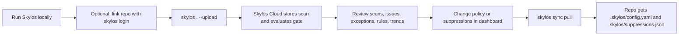

Skylos is local-first. The CLI does the analysis on your machine or in CI. **Skylos Cloud** is the hosted layer that stores scan results, applies shared project policy, tracks issues over time, and gives your team one place to review and act.

If you want the full repo-to-dashboard flow, read:

- [CLI to Dashboard Workflow](/cloud-workflow)
- [Authentication](/authentication)
- [CI/CD Integration](/ci-cd)

:::tip New Users
Every new account gets **50 starter credits** and a **7-day Pro trial**. You can start with `skylos . --upload` and add deeper GitHub integration later.
:::

## Use Local Only vs Add Cloud

| If you want... | Use this |
|---|---|
| Local scan only | `skylos .` |
| Local security, secrets, and quality checks | `skylos . --danger --secrets --quality` |
| Local exit-code enforcement only | `skylos . --gate` |
| Connect this repo to a cloud project | `skylos login` |
| Upload a scan to the dashboard | `skylos . --upload` |
| Pull project policy and suppressions into the repo | `skylos sync pull` |
| Inspect which project this repo is linked to | `skylos project status` |

Stay local when you only need a fast developer or CI scan.

Add the cloud when you need:
- scan history
- shared suppressions
- project policy managed in the dashboard
- issues and exception workflows
- trends across branches and time
- GitHub-native features such as OIDC, the GitHub App, deep links, or PR checks

## What Cloud Adds

### Workspace Views

Skylos Cloud currently gives you workspace-level navigation for:
- `Overview`
- `Projects`
- `Scans`
- `Issues`
- `Exceptions`
- `Rules`
- `Trends`

### Project Views

Each project currently has tabs for:
- `Overview`
- `Scans`
- `Issues`
- `Suppressions`
- `Defense`
- `Provenance`
- `Settings`

### Project Settings

`Dashboard -> Settings` is the project-management surface for:
- repository URL
- API key rotation
- GitHub App installation
- Slack and Discord notifications
- team members
- workspace/project policy
- policy inheritance

## How the Cloud Fits the CLI

```mermaid
flowchart LR
    A[Run Skylos locally] --> B[Optional: link repo with skylos login]
    B --> C[skylos . --upload]
    C --> D[Skylos Cloud stores scan and evaluates gate]
    D --> E[Review scans, issues, exceptions, rules, trends]
    E --> F[Change policy or suppressions in dashboard]
    F --> G[skylos sync pull]
    G --> H[Repo gets .skylos/config.yaml and .skylos/suppressions.json]
```

The split is simple:
- **CLI:** analysis happens here
- **Cloud:** history, policy, suppressions, grouping, and team workflows happen here

## Repo URL: Optional vs Required

A project can stay cloud-only and still accept normal API-key uploads.

Set the project `repo_url` when you want:
- GitHub Actions OIDC uploads
- GitHub App installation
- GitHub deep links in the dashboard
- PR-linked GitHub check runs or comments
- repo-aware default-branch behavior

That distinction matters. Basic uploads do **not** require a GitHub repo binding. GitHub-native automation does.

## What Data Gets Sent

When you upload a scan, Skylos Cloud receives analysis results and metadata, not your repository contents.

| Sent | Not sent |
|---|---|
| finding details | source code files |
| file paths | full repository contents |
| line numbers | secrets from your environment |
| branch / commit metadata | your `.env` files as raw uploads |
| summary counts and gate data | your git history as source blobs |

## Next Step

For the complete end-to-end flow from `skylos` to `skylos-cloud`, read [CLI to Dashboard Workflow](/cloud-workflow). That guide covers login, upload, policy sync, repo URL requirements, CI, and the difference between local vs cloud gating.
