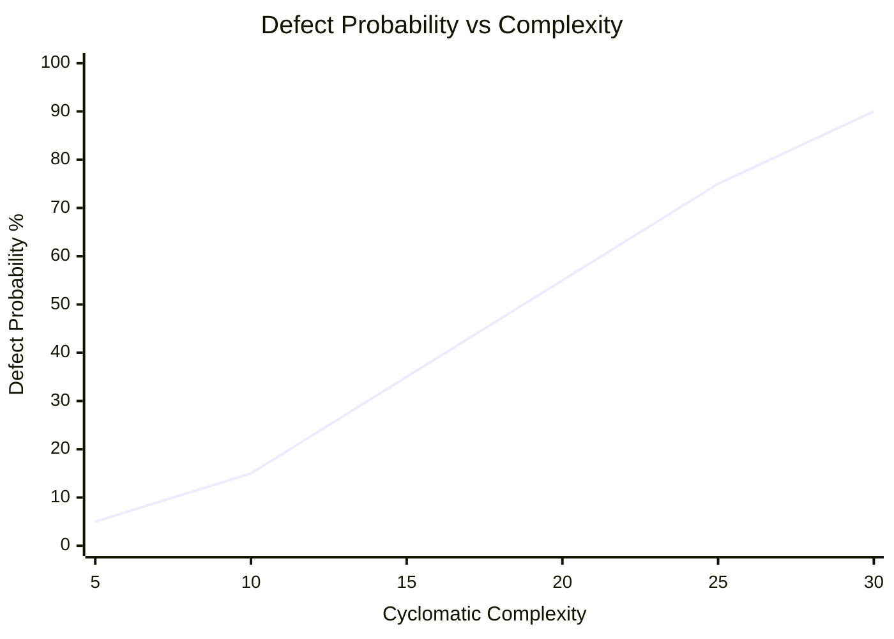
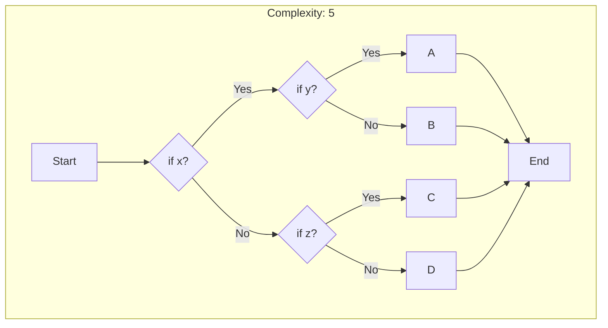

import Tabs from '@theme/Tabs';
import TabItem from '@theme/TabItem';

:::info
**Enable quality checks:** `skylos . --quality`
:::

## Why Quality Metrics Matter

Complex code isn't just hard to read—it's statistically more likely to contain bugs.


Research shows that functions with complexity above 10 have significantly higher defect rates. At 20+, the function is nearly impossible to test exhaustively.

| Complexity | Risk Level | Description |
|------------|------------|-------------|
| 1-10 | **Low risk** | Easy to understand, test, and maintain |
| 11-20 | **Moderate risk** | Consider refactoring when touching this code |
| 21+ | **High risk** | Likely contains bugs, very hard to test |

---

## Cyclomatic Complexity (SKY-Q301)

Cyclomatic complexity counts the number of independent paths through a function. Each decision point adds a path.


### What Adds Complexity

| Construct | Complexity Added |
|-----------|-----------------|
| `if` / `elif` | +1 per branch |
| `for` / `while` | +1 |
| `try` / `except` | +1 per handler |
| `with` | +1 |
| `and` / `or` | +1 per operator |
| Ternary `x if y else z` | +1 |
| List/dict/set comprehension | +1 |

### Example
```python
def process_order(order): 
    if not order.valid:
        return None
    
    if order.priority == 'high':
        if order.value > 1000:
            apply_discount(order)
        notify_manager(order)
    elif order.priority == 'medium':
        queue_order(order)
    
    for item in order.items:
        if item.backordered:
            handle_backorder(item)
        elif item.fragile: 
            mark_fragile(item)
    
    return order
```

### How to Reduce Complexity

<Tabs>
  <TabItem value="extract" label="Extract Functions" default>
```python
# Before: Complexity 8
def process_order(order):
    if not order.valid:
        return None
    # ... 50 more lines of nested logic

# After: Complexity 3 each
def process_order(order):
    if not order.valid:
        return None
    handle_priority(order)
    process_items(order)
    return order

def handle_priority(order):
    # Isolated complexity
    pass

def process_items(order):
    # Isolated complexity
    pass
```

  </TabItem>
  <TabItem value="early-returns" label="Early Returns">
```python
# Before: Nested conditionals
def validate(data):
    if data:
        if data.user:
            if data.user.active:
                return process(data)
    return None

# After: Guard clauses
def validate(data):
    if not data:
        return None
    if not data.user:
        return None
    if not data.user.active:
        return None
    return process(data)
```

  </TabItem>
  <TabItem value="polymorphism" label="Polymorphism">
```python
# Before: Type switching
def calculate(shape):
    if shape.type == 'circle':
        return 3.14 * shape.radius ** 2
    elif shape.type == 'square':
        return shape.side ** 2
    elif shape.type == 'rectangle':
        return shape.width * shape.height

# After: Method dispatch
class Circle:
    def area(self):
        return 3.14 * self.radius ** 2

class Square:
    def area(self):
        return self.side ** 2
```

  </TabItem>
</Tabs>

---

## Nesting Depth (SKY-Q302)

Deep nesting forces readers to hold multiple conditions in working memory simultaneously.
```python
# Depth 5 - Very hard to follow
def bad_example():
    if condition1:              # 1st level
        for item in items:      # 2nd level
            if condition2:      # 3rd level
                try:            # 4th level
                    if condition3:  # 5th level (RIP)
                        process(item)
                except:
                    pass
```

### Severity Thresholds

| Depth | Severity | Action |
|-------|----------|--------|
| ≤3 | OK | No issue |
| 4-5 | MEDIUM | Consider refactoring |
| 6-8 | HIGH | Should refactor |
| 9+ | CRITICAL | Must refactor |

### Reducing Nesting
```python
# Before: Depth 4
def process_users(users):
    for user in users:
        if user.active:
            if user.verified:
                if user.has_permission:
                    do_something(user)

# After: Depth 1 (using continue)
def process_users(users):
    for user in users:
        if not user.active:
            continue
        if not user.verified:
            continue
        if not user.has_permission:
            continue
        do_something(user)
```

---

## Structure Rules

### Function Length (SKY-Q303)

Long functions usually do too much. They're hard to test and understand.
```toml
[tool.skylos]
max_lines = 50  # Default
```

:::tip
**Rule of thumb:** If you can't see the whole function on one screen, it's probably too long.
:::

### Argument Count (SKY-Q304)

Functions with many parameters are hard to call correctly and often indicate a missing abstraction.
```python
# Too many arguments
def create_user(name, email, age, address, phone, department, role, manager, start_date):
    pass

# Group into objects
@dataclass
class UserInfo:
    name: str
    email: str
    age: int

@dataclass  
class Employment:
    department: str
    role: str
    manager: str
    start_date: date

def create_user(info: UserInfo, employment: Employment):
    pass
```
```toml
[tool.skylos]
max_args = 5  # Default
```

---

## Logic Rules

### Mutable Default Arguments (SKY-L001)

One of Python's most common gotchas:
```python
# Bug: list is shared across all calls
def append_to(item, target=[]):
    target.append(item)
    return target

>>> append_to(1)
[1]
>>> append_to(2)
[1, 2]  # Unexpected! Same list.
```
```python
# Fixed
def append_to(item, target=None):
    if target is None:
        target = []
    target.append(item)
    return target
```

### Bare Except (SKY-L002)

Catching everything swallows `KeyboardInterrupt` and `SystemExit`:
```python
# Too broad
try:
    risky()
except:  # Catches Ctrl+C, sys.exit(), everything
    pass

# Specific
try:
    risky()
except Exception:  # Excludes BaseException subclasses
    handle_error()
```

### Identity Comparisons (SKY-L003)

Use `is` for singletons:
```python
# Wrong
if value == None:
    pass

# Correct
if value is None:
    pass
```

---

## Visual Dashboard

When you run Skylos with `--quality`, you get a clear breakdown:
```
────────────────────────── Quality Issues ──────────────────────────
 #   Type        Function              Detail                      Location
 1   Complexity  process_order         McCabe=18 (target ≤10)      orders.py:45
 2   Nesting     validate_input        Depth 6 (target ≤3)         validators.py:23
 3   Structure   generate_report       142 lines (target ≤50)      reports.py:10
 4   Logic       create_cache          Mutable default argument    cache.py:5

Tip: split helpers, add early returns, flatten branches.
```

---

## Configuration
```toml
[tool.skylos]
complexity = 10    # McCabe complexity threshold
nesting = 3        # Max nesting depth
max_args = 5       # Max function arguments
max_lines = 50     # Max function length

# Ignore specific rules
ignore = ["SKY-L003"]  # Allow == None comparisons
```

### Per-Language Overrides

TypeScript often has higher complexity in UI code:
```toml
[tool.skylos.languages.typescript]
complexity = 15
nesting = 4
```

---

## Integrating Quality Gates

Block PRs that introduce complex code:
```yaml
- name: Quality Gate
  run: skylos . --quality --gate
```

With configuration:
```toml
[tool.skylos.gate]
max_quality = 10  # Fail if >10 quality issues
```

---

## Next Steps

- [Quality Gate](/quality-gate) - Enforce quality standards in CI/CD
- [Rule Reference](/rule-reference) - Complete list of all quality rules