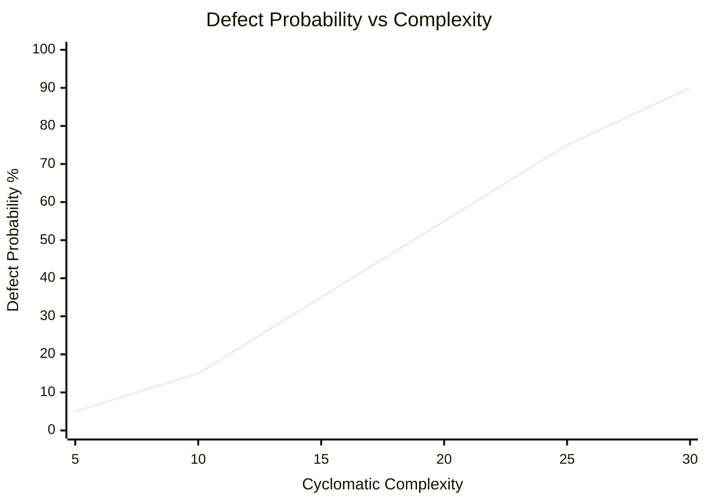
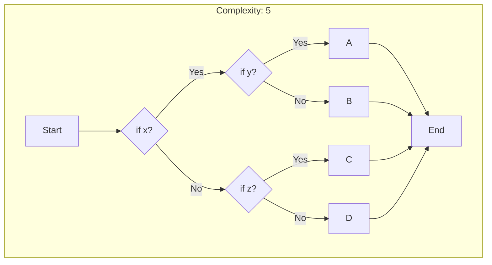

import Tabs from '@theme/Tabs';
import TabItem from '@theme/TabItem';

:::info
**Enable quality checks:** `skylos . --quality`
:::

## What Counts As Good Coding Practice

Skylos treats a coding practice as enforceable only when it has a clear source of authority. That source can be a language standard, a security standard, an accepted ecosystem tool, a framework convention, or an explicit repository policy.

Taste-only preferences should not become default rules. They can still be enforced as project policy, but the recommended rollout is advisory first, then blocking once the team has burned down existing findings.

| Practice area | Source | Skylos / CI coverage |
|---|---|---|
| Python style and lint hygiene | PEP 8, Ruff | `SKY-R102`, advisory `ruff check .` |
| Python type clarity | PEP 484, mypy / pyright | `SKY-T101`, `SKY-T102`, `SKY-R101`, advisory mypy |
| TypeScript type safety | TypeScript strict mode | `SKY-R105`, advisory TypeScript build |
| Rust idioms and correctness | Rustfmt, Clippy | advisory `cargo fmt --check`, `cargo clippy` |
| API authorization and response contracts | OWASP API Security Top 10, FastAPI conventions, CWE | `SKY-F101`, `SKY-F102` |
| Maintainability and complexity | ISO/IEC 5055, ISO/IEC 25010, CWE coding-standard classes | `SKY-Q*`, `SKY-C*`, `SKY-L*` |
| Repository enforcement | `pyproject.toml`, `.pre-commit-config.yaml`, CI workflow policy | `SKY-R101` through `SKY-R105` |

## Why Quality Metrics Matter

Complex code isn't just hard to read—it's statistically more likely to contain bugs.

```mermaid
xychart-beta
    title "Defect Probability vs Complexity"
    x-axis "Cyclomatic Complexity" [5, 10, 15, 20, 25, 30]
    y-axis "Defect Probability %" 0 --> 100
    line [5, 15, 35, 55, 75, 90]
```

Research shows that functions with complexity above 10 have significantly higher defect rates. At 20+, the function is nearly impossible to test exhaustively.

| Complexity | Risk Level | Description |
|------------|------------|-------------|
| 1-10 | **Low risk** | Easy to understand, test, and maintain |
| 11-20 | **Moderate risk** | Consider refactoring when touching this code |
| 21+ | **High risk** | Likely contains bugs, very hard to test |

---

## Cyclomatic Complexity (SKY-Q301)

Cyclomatic complexity counts the number of independent paths through a function. Each decision point adds a path.

```mermaid
flowchart TB    
    subgraph high["Complexity: 5"]
        A2[Start] --> B2{if x?}
        B2 -->|Yes| C2{if y?}
        B2 -->|No| D2{if z?}
        C2 -->|Yes| E2[A]
        C2 -->|No| F2[B]
        D2 -->|Yes| G2[C]
        D2 -->|No| H2[D]
        E2 --> I2[End]
        F2 --> I2
        G2 --> I2
        H2 --> I2
    end
```

### What Adds Complexity

| Construct | Complexity Added |
|-----------|-----------------|
| `if` / `elif` | +1 per branch |
| `for` / `while` | +1 |
| `try` / `except` | +1 per handler |
| `with` | +1 |
| `and` / `or` | +1 per operator |
| Ternary `x if y else z` | +1 |
| List/dict/set comprehension | +1 |

### Example
```python
def process_order(order): 
    if not order.valid:
        return None
    
    if order.priority == 'high':
        if order.value > 1000:
            apply_discount(order)
        notify_manager(order)
    elif order.priority == 'medium':
        queue_order(order)
    
    for item in order.items:
        if item.backordered:
            handle_backorder(item)
        elif item.fragile: 
            mark_fragile(item)
    
    return order
```

### How to Reduce Complexity

<Tabs>
  <TabItem value="extract" label="Extract Functions" default>
```python
# Before: Complexity 8
def process_order(order):
    if not order.valid:
        return None
    # ... 50 more lines of nested logic

# After: Complexity 3 each
def process_order(order):
    if not order.valid:
        return None
    handle_priority(order)
    process_items(order)
    return order

def handle_priority(order):
    # Isolated complexity
    pass

def process_items(order):
    # Isolated complexity
    pass
```

  </TabItem>
  <TabItem value="early-returns" label="Early Returns">
```python
# Before: Nested conditionals
def validate(data):
    if data:
        if data.user:
            if data.user.active:
                return process(data)
    return None

# After: Guard clauses
def validate(data):
    if not data:
        return None
    if not data.user:
        return None
    if not data.user.active:
        return None
    return process(data)
```

  </TabItem>
  <TabItem value="polymorphism" label="Polymorphism">
```python
# Before: Type switching
def calculate(shape):
    if shape.type == 'circle':
        return 3.14 * shape.radius ** 2
    elif shape.type == 'square':
        return shape.side ** 2
    elif shape.type == 'rectangle':
        return shape.width * shape.height

# After: Method dispatch
class Circle:
    def area(self):
        return 3.14 * self.radius ** 2

class Square:
    def area(self):
        return self.side ** 2
```

  </TabItem>
</Tabs>

---

## Nesting Depth (SKY-Q302)

Deep nesting forces readers to hold multiple conditions in working memory simultaneously.
```python
# Depth 5 - Very hard to follow
def bad_example():
    if condition1:              # 1st level
        for item in items:      # 2nd level
            if condition2:      # 3rd level
                try:            # 4th level
                    if condition3:  # 5th level (RIP)
                        process(item)
                except:
                    pass
```

### Severity Thresholds

| Depth | Severity | Action |
|-------|----------|--------|
| ≤3 | OK | No issue |
| 4-5 | MEDIUM | Consider refactoring |
| 6-8 | HIGH | Should refactor |
| 9+ | CRITICAL | Must refactor |

### Reducing Nesting
```python
# Before: Depth 4
def process_users(users):
    for user in users:
        if user.active:
            if user.verified:
                if user.has_permission:
                    do_something(user)

# After: Depth 1 (using continue)
def process_users(users):
    for user in users:
        if not user.active:
            continue
        if not user.verified:
            continue
        if not user.has_permission:
            continue
        do_something(user)
```

---

## Structure Rules

### Function Length (SKY-Q303)

Long functions usually do too much. They're hard to test and understand.
```toml
[tool.skylos]
max_lines = 50  # Default
```

:::tip
**Rule of thumb:** If you can't see the whole function on one screen, it's probably too long.
:::

### Argument Count (SKY-Q304)

Functions with many parameters are hard to call correctly and often indicate a missing abstraction.
```python
# Too many arguments
def create_user(name, email, age, address, phone, department, role, manager, start_date):
    pass

# Group into objects
@dataclass
class UserInfo:
    name: str
    email: str
    age: int

@dataclass  
class Employment:
    department: str
    role: str
    manager: str
    start_date: date

def create_user(info: UserInfo, employment: Employment):
    pass
```
```toml
[tool.skylos]
max_args = 5  # Default
```

---

## Logic Rules

### Mutable Default Arguments (SKY-L001)

One of Python's most common gotchas:
```python
# Bug: list is shared across all calls
def append_to(item, target=[]):
    target.append(item)
    return target

>>> append_to(1)
[1]
>>> append_to(2)
[1, 2]  # Unexpected! Same list.
```
```python
# Fixed
def append_to(item, target=None):
    if target is None:
        target = []
    target.append(item)
    return target
```

### Bare Except (SKY-L002)

Catching everything swallows `KeyboardInterrupt` and `SystemExit`:
```python
# Too broad
try:
    risky()
except:  # Catches Ctrl+C, sys.exit(), everything
    pass

# Specific
try:
    risky()
except Exception:  # Excludes BaseException subclasses
    handle_error()
```

### Identity Comparisons (SKY-L003)

Use `is` for singletons:
```python
# Wrong
if value == None:
    pass

# Correct
if value is None:
    pass
```

---

## Standards-Backed Practice Rules

These checks are intended to catch bad coding practices that create review, security, or maintenance risk.

| Rule | What it catches | Why it matters |
|---|---|---|
| `SKY-T101` | Public functions in typed modules with untyped parameters | Public API contracts are harder to review and type-check |
| `SKY-T102` | Public functions in typed modules without return annotations | Callers lose the API contract and regressions hide until runtime |
| `SKY-F101` | FastAPI routes without `response_model`, `response_class`, or return annotation | Responses become undocumented and harder to validate |
| `SKY-F102` | Mutating routes without an obvious auth, security, or dependency guard | API write paths need an explicit authorization boundary |
| `SKY-R101` | Python repos without mypy or pyright policy | Type checking should be visible as repo policy |
| `SKY-R102` | Python repos without Ruff policy | Lint policy should be explicit and repeatable |
| `SKY-R103` | Repos without `[tool.skylos.gate]` | Gate thresholds should be checked into source control |
| `SKY-R104` | Repos without pre-commit config | Local staged checks should be part of the workflow |
| `SKY-R105` | TypeScript packages with `tsconfig.json` but no `tsc` script | TypeScript type checking should be runnable in CI |

---

## Reading the Output

When you run Skylos with `--quality`, you get a table like this:
```
────────────────────────── Quality Issues ──────────────────────────
 #   Type        Name                  Detail                           Location
 1   Complexity  process_order         Complexity: 18 (max 10)          orders.py:45
 2   Nesting     validate_input        Deep nesting: depth 6            validators.py:23
 3   Structure   generate_report       Line count: 142, 142 lines       reports.py:10
 4   Quality     "lokal"               repeated 12× (max 3)             PDF_in_Akte.py:588
 5   Logic       create_cache          Mutable default argument         cache.py:5
 6   Typing      create_user           missing return annotation        users.py:12
 7   Framework Security create_user    mutating route has no auth guard api.py:34
```

**What each column means:**

| Column | Meaning |
|--------|---------|
| **Type** | The category: Complexity, Nesting, Structure, Quality (duplicate literals, coupling, cohesion), Logic, Typing, Framework, Framework Security, or Repo Policy |
| **Name** | The function, class, or string literal that triggered the finding |
| **Detail** | The measured value and the threshold. For example: `Complexity: 18 (max 10)` means 18 branches were found but the limit is 10. `repeated 12× (max 3)` means a string literal appears 12 times — extract it to a named constant |
| **Location** | `file:line` where the finding starts |

:::tip
Below the table, Skylos prints a legend explaining each metric type. You can tune all thresholds in `pyproject.toml` under `[tool.skylos]`.
:::

---

## Configuration
```toml
[tool.skylos]
complexity = 10       # McCabe complexity threshold
nesting = 3           # Max nesting depth
max_args = 5          # Max function arguments
max_lines = 50        # Max function length
duplicate_strings = 3 # Max times a string can repeat before flagging

# Ignore specific rules
ignore = ["SKY-L003"]  # Allow == None comparisons
```

### Per-Language Overrides

TypeScript often has higher complexity in UI code:
```toml
[tool.skylos.languages.typescript]
complexity = 15
nesting = 4
```

---

## Integrating Quality Gates

Block PRs that introduce complex code:
```yaml
- name: Quality Gate
  run: skylos . --quality --gate
```

With configuration:
```toml
[tool.skylos.gate]
max_quality = 10  # Fail if >10 quality issues
```

### Advisory rollout

For existing repos, start with advisory checks so teams see the signal without failing every pull request on legacy debt. A typical advisory bundle includes:

- `ruff check .`
- `mypy skylos` or your chosen mypy/pyright target
- TypeScript compile/build scripts
- `cargo fmt --check` and `cargo clippy` for Rust crates
- `skylos . --danger --secrets --quality --diff-base origin/main --diff origin/main`

Use the hard gate only after the findings are diff-aware, baseline-aware, or low enough to enforce.

---

## Next Steps

- [Quality Gate](/quality-gate) - Enforce quality standards in CI/CD
- [Rules Reference](/rules-reference) - Complete list of all quality rules
