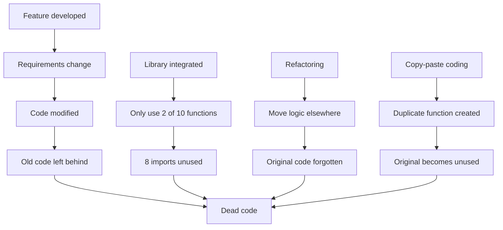
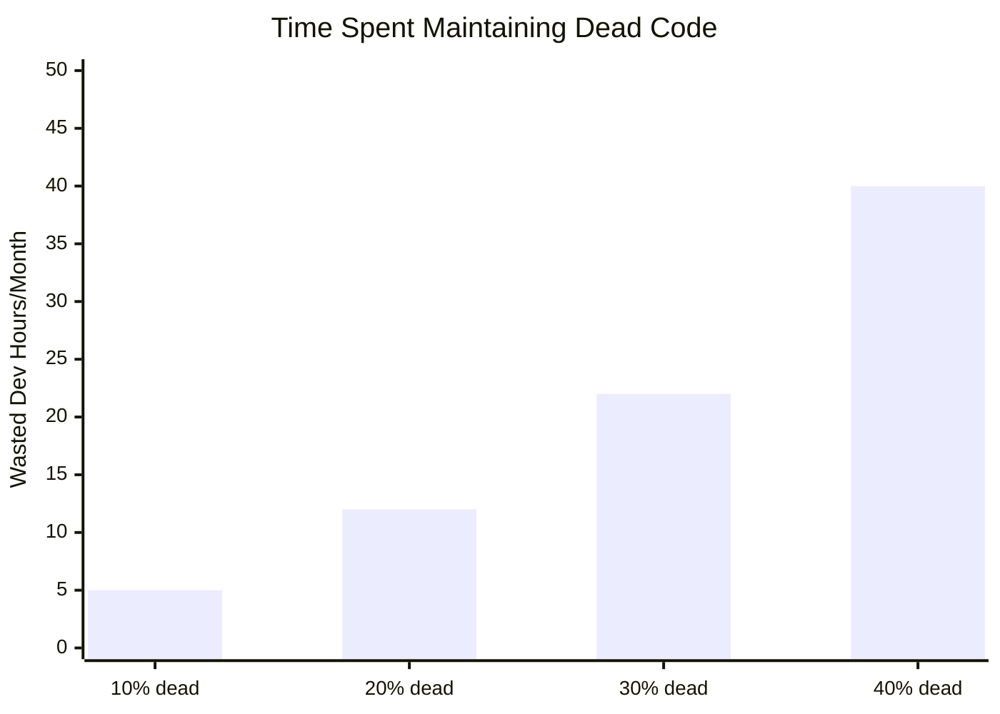
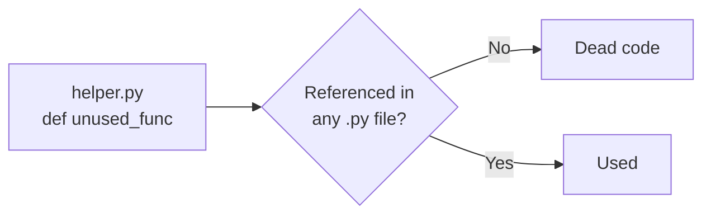

Dead code is code that exists in your codebase but **never executes**. It might be an unused function, an import you forgot to remove, or a variable that's assigned but never read.

## Why Does Dead Code Exist?

Dead code accumulates naturally over time:



Common sources:
- **Feature evolution:** Old implementations left behind
- **Abandoned experiments:** Prototype code never cleaned up
- **Defensive over-importing:** "I might need this later"
- **Incomplete refactoring:** Moved code, forgot to delete original
- **AI-generated code:** Copilot/ChatGPT suggests things you don't use

---

## The True Cost of Dead Code

Dead code isn't harmless. It has real costs:

### 1. Cognitive Load

Every line of code is a line someone has to read and understand:

```python
# Developer sees this and wonders:
# "Is this used? Should I update it too? What does it do?"

def legacy_process(data):  # dead
    # 50 lines of complex logic...
    pass

def process(data):  # used
    # Different logic...
    pass
```

More code = slower onboarding, harder debugging, confused developers.

### 2. Maintenance Burden

Dead code still needs to be:
- Updated when dependencies change
- Reviewed in code reviews
- Included in test coverage metrics
- Migrated during major upgrades



### 3. Hidden Security Vulnerabilities

"Unused" code can still be exploited:

```python
# "Dead" admin function, but still accessible via URL!
def admin_delete_all():  # Looks unused
    db.execute("DELETE FROM users")

# Attacker finds: yoursite.com/admin/delete_all
```

If it's in the codebase, it's in the attack surface.

### 4. Misleading Metrics

Dead code skews your metrics:

| Metric | With Dead Code | Without |
|--------|----------------|---------|
| Lines of Code | 100,000 | 70,000 |
| Test Coverage | 60% | 85% |
| Complexity Score | High | Medium |
| Onboarding Time | 3 weeks | 2 weeks |

### 5. Slower Builds & Larger Bundles

Dead imports still get processed:

```python
# Each import adds to startup time
import pandas  # Unused - but still loads 100MB library
import numpy   # Unused
import tensorflow  # Unused
```

---

## Types of Dead Code

### Unreachable Code

Code that **can never execute** due to control flow:


**def:**


```python
# example():
    return "done"
    print("This never runs")  # Unreachable

def another():
    if True:
        return "always"
    return "never"  # Unreachable
```

### Unused Definitions

Functions, classes, or variables **defined but never referenced**:


**def:**


```python helper_v1():  # Defined but never called
    pass

def helper_v2():  # called
    pass

result = helper_v2()
```

### Unused Imports

Modules imported but **never used**:


**import:**


```python json  #  Never used
import os    # Never used
from typing import List, Dict, Optional  # Dict, Optional unused

def get_items() -> List[str]:
    return ["a", "b"]
```

### Dead Parameters

Function parameters that are **never read**:


**def:**


```python process(data, debug=False):  # debug is never used
    return transform(data)
```

### Dead Variables

Variables that are **assigned but never read**:


**def:**


```python
# calculate():
    temp = compute_something()  # temp is never used
    result = compute_other()
    return result
```

---

## Why Removal is Hard

If dead code is so bad, why don't we just delete it?

### Fear of Breaking Things

```python
# Is this really unused? What if:
# - It's called dynamically via getattr()
# - It's imported by another service
# - It's used in production but not in the codebase I'm looking at
```

### No Tooling Confidence

Simple grep/search isn't enough:

```python
# Searching for "helper" finds:
# - The function definition
# - Comments mentioning it
# - String literals with the word
# - Actually usage? Hard to tell.
```

### Time Pressure

"I could clean this up... or ship the feature."

Dead code removal gets deprioritized because:
- It's not a feature
- It's not a bug fix
- It's hard to quantify the benefit

---

## How Skylos Helps

Skylos makes dead code removal **safe and confident**:

### 1. Cross-File Analysis

Skylos checks the **entire codebase**, not just one file:



### 2. Framework Awareness

Skylos understands that frameworks call code implicitly:

```python
@app.route("/users")  # Skylos sees: Flask route decorator
def get_users():       # Not flagged as unused
    return users
```

### 3. Confidence Scoring

Instead of binary "used/unused", Skylos scores confidence:

| Finding | Confidence | Recommendation |
|---------|------------|----------------|
| `def _private_helper()` | 20% | Probably internal, skip |
| `def unused_public_fn()` | 90% | Safe to remove |
| `import json  # in test file` | 15% | Might be for fixtures |

### 4. Safe Removal Workflow

```bash
# 1. See what would be removed
skylos . --dry-run

# 2. Interactive selection
skylos . -i

# 3. Comment out instead of delete (safer)
skylos . -i --comment-out
```

---

## Best Practices


  <details>
<summary>Delete code, don't comment it</summary>

    Git remembers everything. Don't leave commented code "just in case."
    
    ```python
    # Bad - clutters the file
    # def old_function():
    #     pass
    
    # Good - deleted, recoverable from git history
    ```
  </details>
  
  <details>
<summary>Run Skylos in CI</summary>

    Prevent new dead code from being introduced:
    
    ```yaml
    - name: Check for dead code
      run: skylos . --confidence 80 --gate
    ```
  </details>
  
  <details>
<summary>Schedule regular cleanups</summary>

    Dedicate time (e.g., monthly) to dead code removal. It's hygiene, like vacuuming.
  </details>
  
  <details>
<summary>Start with high confidence</summary>

    Begin with `--confidence 90` to get easy wins. Lower the threshold as you build trust.
  </details>


---

## Next Steps


  ### [Dead Code Detection](/dead-code-detection)
    How Skylos finds dead code
  
  ### [Vibe Coding & AI Debt](/concepts/vibe-coding)
    Why AI assistants create dead code
  

