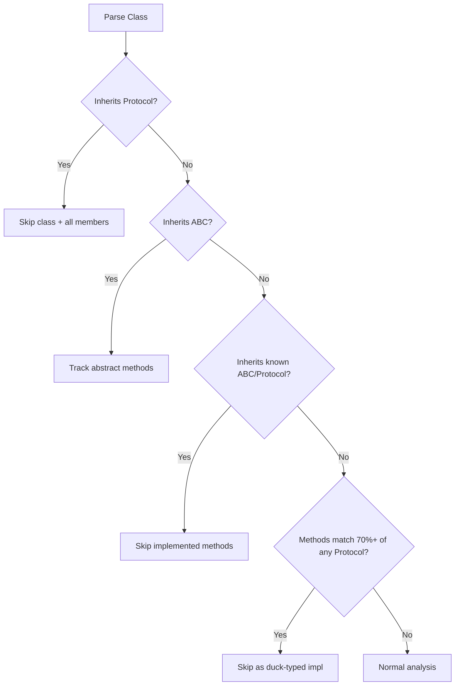

Static analyzers struggle with Python's dynamic typing patterns. Code can be used in ways that aren't visible through simple reference tracking - inheritance, duck typing, framework magic, and data class machinery.

Skylos will handle most of these patterns.

---

## Patterns We Detect

| Category | Patterns |
|----------|----------|
| **Protocols** | Protocol classes, Protocol members, Protocol implementers, duck-typed implementations |
| **ABCs** | ABC classes, `@abstractmethod` methods, ABC implementers |
| **Mixins** | `*Mixin` class methods |
| **Base Classes** | `Base*`, `*Base`, `*ABC`, `*Interface`, `*Adapter` |
| **Test Doubles** | `Mock*`, `Fake*`, `Stub*`, `*Mock`, `*Fake`, etc. |
| **Data Classes** | `@dataclass`, `NamedTuple`, `TypedDict`, `attrs`, Pydantic |
| **Enums** | `enum.Enum` members |
| **ORM Models** | SQLAlchemy columns, Django model fields |
| **Type System** | Type aliases, `TypeVar`, `ParamSpec` |
| **Config Classes** | `*Settings`, `*Config` class attributes |

---

## Protocol & ABC Detection

### The Problem

```python
from typing import Protocol

class DataStore(Protocol):
    def get(self, key: str) -> str: ...
    def set(self, key: str, value: str) -> None: ...

class RedisStore:  # No explicit inheritance
    def get(self, key: str) -> str:
        return self.client.get(key)
    
    def set(self, key: str, value: str) -> None:
        self.client.set(key, value)
```

A naive analyzer will flag all of these methods as unused. But they're clearly designed to work together.

### How Skylos Handles It

1. **Protocol classes** -> Detected and skipped entirely
2. **ABC classes** -> Abstract methods tracked for matching
3. **Explicit implementers** -> Classes inheriting from Protocol/ABC skipped
4. **Duck-typed implementers** -> Classes matching ≥70% of Protocol methods (min 3) detected



### Cross-File Detection

All detection works **globally across files**:

```python
# protocols.py
class DataStore(Protocol):
    def get(self, key): ...

# redis_store.py  
class RedisStore:  # Different file, still detected!
    def get(self, key): ...
```

---

## Mixin & Base Class Detection

### Mixin Classes

Methods in `*Mixin` classes are called via inheritance, not direct reference:

```python
class LoggingMixin:
    def log_action(self, action):  # Called by child classes
        print(f"Action: {action}")

class UserService(LoggingMixin):
    def create_user(self, name):
        self.log_action("create_user")  # Calls mixin method
```

**Result**: `LoggingMixin.log_action` gets a **-60% confidence** penalty (it will not be skipped, but lower priority).

### Abstract Base Classes

Methods in classes with "base" naming are meant to be overridden:

```python
class BaseHandler:  # Prefix pattern
    def handle(self, data): ...

class AbstractValidator:  # Contains "Abstract"
    def validate(self, value): ...

class StorageInterface:  # Suffix pattern
    def save(self, obj): ...
```

**Detected patterns**: `Base*`, `*Base`, `*ABC`, `*Interface`, `*Adapter`

**Result**: All methods → **confidence = 0** (fully skipped)

---

## Test Double Detection

Test doubles implement interfaces for testing purposes:

```python
class InMemoryCache:  # Prefix: InMemory*
    def get(self, key): ...
    def set(self, key, value): ...

class MockPaymentGateway:  # Prefix: Mock*
    def charge(self, amount): ...

class DatabaseFake:  # Suffix: *Fake
    def query(self, sql): ...
```

**Detected prefixes**: `InMemory*`, `Mock*`, `Fake*`, `Stub*`, `Dummy*`, `Fixed*`

**Detected suffixes**: `*Mock`, `*Stub`, `*Fake`, `*Double`

**Result**: All methods get **-40% confidence** penalty

---

## Data Class Field Detection

Data class fields are accessed via the class machinery, not direct reference:

### @dataclass

```python
from dataclasses import dataclass

@dataclass
class User:
    name: str      # Accessed via User(name="x").name
    email: str     # Looks unused but it is used
    age: int = 0
```

**Result**: All fields -> **confidence = 0**

### NamedTuple

```python
from typing import NamedTuple

class Point(NamedTuple):
    x: float  # Accessed via point.x
    y: float
```

**Result**: All fields -> **confidence = 0**

### TypedDict

```python
from typing import TypedDict

class UserDict(TypedDict):
    name: str   # Accessed via d["name"]
    email: str
```

**Result**: All fields -> **confidence = 0**

### attrs

```python
import attr

@attr.s
class Config:
    host: str = attr.ib()
    port: int = attr.ib(default=8080)
```

**Result**: All fields → **confidence = 0**

### Pydantic

```python
from pydantic import BaseModel

class UserModel(BaseModel):
    name: str
    email: str
```

**Result**: All fields -> **confidence = 0**

---

## Enum Member Detection

Enum members are accessed as class attributes:

```python
from enum import Enum

class Status(Enum):
    PENDING = "pending"    # Status.PENDING
    APPROVED = "approved"  # Status.APPROVED
    REJECTED = "rejected"  # Status.REJECTED
```

**Result**: All enum members -> **confidence = 0**

---

## ORM Model Detection

ORM columns are accessed by the ORM, not direct code:

### SQLAlchemy

```python
from sqlalchemy import Column, Integer, String
from sqlalchemy.orm import declarative_base

Base = declarative_base()

class User(Base):
    __tablename__ = "users"
    id = Column(Integer, primary_key=True)
    name = Column(String)  # Used by ORM
```

### Django

```python
from django.db import models

class User(models.Model):
    name = models.CharField(max_length=100)  # Used by ORM
    email = models.EmailField()
```

**Result**: All model columns -> **confidence = 0**

---

## Type Alias Detection

Type aliases define types, not values:

```python
from typing import TypeAlias, List, Dict

type UserId = int
type UserMap = Dict[str, User]
```

**Result**: All type aliases -> **confidence = 0**

---

## Settings/Config Class Detection

Configuration classes have attributes accessed externally:

```python
class AppSettings:
    DEBUG = True
    API_KEY = "secret"
    MAX_RETRIES = 3

class DatabaseConfig:
    HOST = "localhost"
    PORT = 5432
```

**Detected patterns**: `*Settings`, `*Config`

**Result**: All attributes -> **confidence = 0**

### SCREAMING_CASE Class Variables

```python
class MyClass:
    MAX_RETRIES = 3      # prob a constant
    DEFAULT_TIMEOUT = 30
```

**Result**: SCREAMING_CASE class variables get **-40% confidence**

---

## Framework Lifecycle Methods

Framework methods are called by the framework, not your code:

### Event Handlers

```python
class MyWidget:
    def on_mount(self):
        pass
    
    def on_click(self, event):  # Called by framework
        pass
```

**Result**: `on_*` methods get **-30% confidence**

### Reactive Watchers

```python
class MyWidget:
    def watch_value(self, new_value):  # Called reactively
        self.update_display()
```

**Result**: `watch_*` methods get **-30% confidence**

### Compose Methods

```python
class MyScreen:
    def compose(self):  # Called by Textual/React-like frameworks
        yield Header()
        yield Footer()
```

**Result**: `compose` method gets **-40% confidence**

---

## BINDINGS Detection

Textual's `BINDINGS` system maps keys to `action_*` methods:

```python
class MyApp(App):
    BINDINGS = [
        ("q", "quit", "Quit"),
        ("c", "copy", "Copy"),
    ]
    
    def action_quit(self):  # Called via BINDINGS
        self.exit()
    
    def action_copy(self):  # Called via BINDINGS
        self.copy_to_clipboard()
```

**How it works**:
1. Skylos parses `BINDINGS` assignments
2. Extracts action names ("quit", "copy")
3. Marks `action_*` methods as used **globally across all classes**

---

## Multiple Candidate Resolution

When a reference has multiple matching definitions:

```python
class ResultsMixin:
    def action_copy(self): ...

class DataMixin:
    def action_copy(self): ...  # Same name, different class

# BINDINGS references "action_copy" - which one?
```

**Solution**: Mark **ALL** candidates as potentially used. 

---

## What Gets Skipped vs Penalized

### Hard Skips (Confidence = 0)

| Pattern | Reason |
|---------|--------|
| Protocol classes + members | Interface definition |
| ABC abstract method implementations | Required by contract |
| `Base*`, `*Base`, `*ABC`, `*Interface`, `*Adapter` methods | Abstract base |
| Dataclass fields | Data class machinery |
| NamedTuple fields | Tuple access |
| Enum members | Class attribute access |
| Pydantic/attrs/ORM fields | Framework machinery |
| Type aliases | Type system |
| Settings/Config attributes | External configuration |

### Penalties (Reduced Confidence)

| Pattern | Penalty | Reason |
|---------|---------|--------|
| `*Mixin` methods | -60% | Called via inheritance |
| Test doubles (`Mock*`, `*Fake`, etc.) | -40% | Test implementation |
| `on_*` methods | -30% | Event handler convention |
| `watch_*` methods | -30% | Reactive watcher convention |
| `compose` method | -40% | Framework lifecycle |
| SCREAMING_CASE class vars | -40% | Likely constants |
| Method name matches abstract | -40% | Might implement interface |

---

## Configuration

All detection is **automatic** - no configuration required.

To whitelist additional patterns:

```toml
[tool.skylos.whitelist]
names = ["*Impl", "*Implementation", "register_*"]
```

---

## Limitations

1. **Runtime inheritance**: `class X(get_base())` cannot be detected
2. **Dynamic Protocols**: Protocols must be statically defined
3. **70% threshold**: Fixed for duck-typing (may be configurable in future)
4. **Cross-file only in same analysis run**: Multi-project analysis not supported

---

## Next Steps

<Cards>
  <Card title="Confidence & Penalties" href="/concepts/penalties">
    Full penalty system reference
  </Card>
  <Card title="Framework Detection" href="/concepts/framework-detection">
    Django, Flask, pytest pattern detection
  </Card>
</Cards>