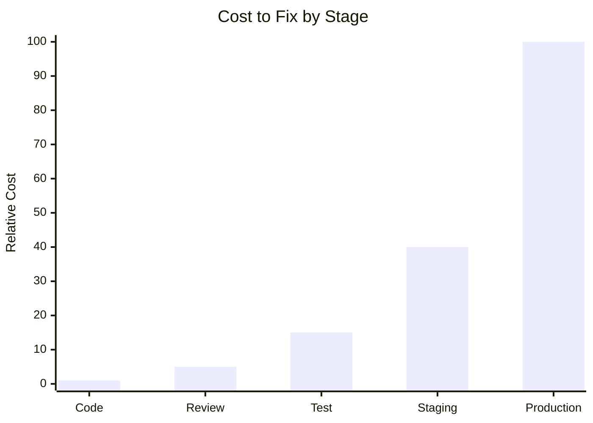
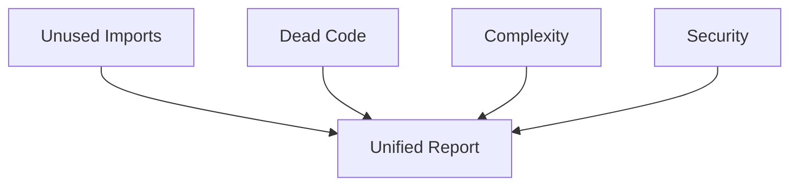

Static analysis examines your source code **without executing it**. Unlike tests that run your code to check behavior, static analysis reads the code itself to find bugs, vulnerabilities, and quality issues.

## Static vs Dynamic Analysis

| Aspect | Static Analysis | Dynamic Analysis (Tests) |
|--------|-----------------|-------------------------|
| **When it runs** | Before/without execution | During execution |
| **What it sees** | All code paths | Only executed paths |
| **Speed** | Fast (no runtime) | Slower (needs execution) |
| **Coverage** | Complete source | Depends on test coverage |
| **False positives** | Possible | Rare |
| **False negatives** | Possible | Depends on tests |

## Why Static Analysis Matters

### 1. Finds Bugs Tests Miss

Tests only cover the paths you think to test. Static analysis examines **every path**:


**def:**


```python
# process(data):
    if data.type == "A":
        return handle_a(data)
    elif data.type == "B":
        return handle_b(data)
    # What if data.type == "C"? Tests might not cover this.
    # Static analysis sees the uncovered branch.
```

### 2. Catches Issues Earlier

The earlier you find a bug, the cheaper it is to fix:



Static analysis catches issues at the **code stage**—before review, testing, or deployment.

### 3. Scales to Large Codebases

Manual code review doesn't scale:

| Codebase Size | Manual Review | Static Analysis |
|---------------|---------------|-----------------|
| 1K lines | 1 hour | 1 second |
| 100K lines | 100 hours | 10 seconds |
| 1M lines | Impossible | 1 minute |

### 4. Enforces Consistency

Static analysis applies rules uniformly. It doesn't:
- Get tired on Friday afternoon
- Forget to check that one file
- Apply standards inconsistently

---

## Types of Static Analysis

### Syntactic Analysis (Linting)

Checks code **style and structure** without understanding meaning:

```python
# Syntactic issues
import os    # unused import - linter catches this
x=1+2        # spacing violation - linter catches this
```

Tools: Pylint, Flake8, ESLint, Ruff

### Semantic Analysis

Understands **meaning and relationships**:

```python
# Semantic issue: calling undefined function
def main():
    result = proccess_data(x)  # Typo: 'proccess' not defined
```

Tools: Pyright, mypy, TypeScript

### Data Flow Analysis

Tracks how **values move through code**:

```python
# Data flow issue: variable might be None
def get_user(id):
    user = db.find(id)  # Returns User or None
    return user.name    # user might be None!
```

Tools: Pyright (partial), Infer, Skylos

### Taint Analysis

Traces **untrusted data** to dangerous operations:

```python
# Taint issue: user input reaches SQL
user_input = request.args.get("q")  # Source: tainted
query = f"SELECT * FROM t WHERE x = {user_input}"  # Propagation
cursor.execute(query)  # Sink: SQL execution
```

Tools: Semgrep, Snyk Code, **Skylos**

---

## How Skylos Fits In

Skylos combines multiple analysis types:



| Analysis Type | What Skylos Finds |
|---------------|-------------------|
| Syntactic | Unused imports |
| Semantic | Dead functions, classes, variables |
| Data Flow | Complexity, nesting depth |
| Taint | SQL injection, command injection, SSRF, XSS |

---

## Limitations of Static Analysis

Static analysis is powerful but not perfect:

### Can't Understand Runtime Values


**def:**


```python
# dynamic_call(func_name):
    func = getattr(module, func_name)  # Which function? Unknown at static time.
    func()
```

Skylos uses **confidence scoring** to handle uncertainty.

### Can't Prove Correctness

Static analysis finds **potential** issues. It can't prove your code is correct—only that it doesn't have known problems.

### May Have False Positives

```python
# Looks unused, but called via framework
@app.route("/users")
def get_users():  # Static analysis might miss the decorator
    return users
```

Skylos uses **framework awareness** to reduce false positives.

---

## Static Analysis in Your Workflow

The best time to run static analysis:

```mermaid
# ---
config:
  look: handDrawn
  theme: neutral
---

flowchart LR
    A[Write Code] --> B[Pre-commit Hook]
    B --> C[Push]
    C --> D[CI Pipeline]
    D --> E{Gate Pass?}
    E -->|Yes| F[Deploy]
    E -->|No| G[Fix Issues]
    G --> A
    
    style B fill:#d1fae5
    style D fill:#d1fae5
```

**Pre-commit:** Fast feedback, catch issues immediately
**CI Pipeline:** Enforce standards, block bad PRs

---

## Key Concepts Glossary

| Term | Definition |
|------|------------|
| **AST** | Abstract Syntax Tree—structured representation of code |
| **Taint** | Untrusted data that could be dangerous |
| **Source** | Where tainted data enters (user input, files) |
| **Sink** | Dangerous operation (SQL, shell, eval) |
| **False positive** | Reported issue that isn't actually a problem |
| **False negative** | Real issue that wasn't detected |
| **Cyclomatic complexity** | Count of independent paths through code |

---

## Next Steps


  ### [What is Dead Code?](/concepts/dead-code)
    Learn why unused code is dangerous
  
  ### [What is Taint Analysis?](/concepts/taint-analysis)
    Deep dive into security analysis
  

