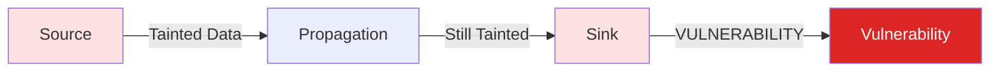

Taint analysis tracks untrusted data from where it enters your application to where it could cause harm. Skylos uses this to detect SQL injection, command injection, SSRF, and XSS vulnerabilities.

---

## The Core Concept



| Term | Definition | Example |
|------|------------|---------|
| **Source** | Where untrusted data enters | `request.args.get("id")` |
| **Sink** | Dangerous operation | `cursor.execute(query)` |
| **Propagation** | How taint spreads | `query = f"SELECT * FROM users WHERE id = {user_id}"` |

---

## What Skylos Detects

### SQL Injection

```python
user_id = request.args.get("id")  # ← Source: tainted
query = f"SELECT * FROM users WHERE id = {user_id}"  # Propagation
cursor.execute(query)  # ← Sink: SQL injection
```

### Command Injection

```python
filename = request.form["file"]  # Source: tainted
os.system(f"cat {filename}")  # Sink: command injection
```

### SSRF (Server-Side Request Forgery)

```python
url = request.args.get("url")  # Source: tainted
requests.get(url)  # Sink: SSRF!
```

### XSS (Cross-Site Scripting)

```python
name = request.args.get("name")  # Source: tainted
return f"<h1>Hello {name}</h1>"  # Sink: XSS
```

---

## How Skylos Tracks Taint

1. **Identify sources**: User input, file reads, environment variables
2. **Track propagation**: Variable assignments, string operations, function returns
3. **Flag sinks**: Database queries, shell commands, HTTP requests, HTML output

```python
# Skylos traces this entire flow:
user_input = request.get_json()["query"]  # Source
processed = user_input.strip()             # Still tainted
final_query = f"SELECT * FROM t WHERE x = '{processed}'"  # Still tainted
db.execute(final_query)                    # Sink -> ALERT!
```

---

## Safe vs Unsafe Patterns

| Pattern | Safe? | Why |
|---------|-------|-----|
| `cursor.execute(query, (param,))` | ✅ | Parameterized query |
| `cursor.execute(f"... {param}")` | ❌ | String interpolation |
| `subprocess.run(["ls", filename])` | ✅ | List form, no shell |
| `os.system(f"ls {filename}")` | ❌ | Shell injection |
| `escape(user_input)` | ✅ | Sanitized |
| `f"<div>{user_input}</div>"` | ❌ | Raw HTML |

---

## Running Taint Analysis

```bash
# Enable security scanning
skylos analyze . --danger

# Output includes:
# - SQL injection vulnerabilities
# - Command injection vulnerabilities  
# - SSRF vulnerabilities
# - XSS vulnerabilities
```

---

## Limitations

Taint analysis is **conservative**. It may flag code that is actually safe:

- Can't always detect sanitization functions
- May miss taint through complex control flow
- Runtime-only sanitization not visible
