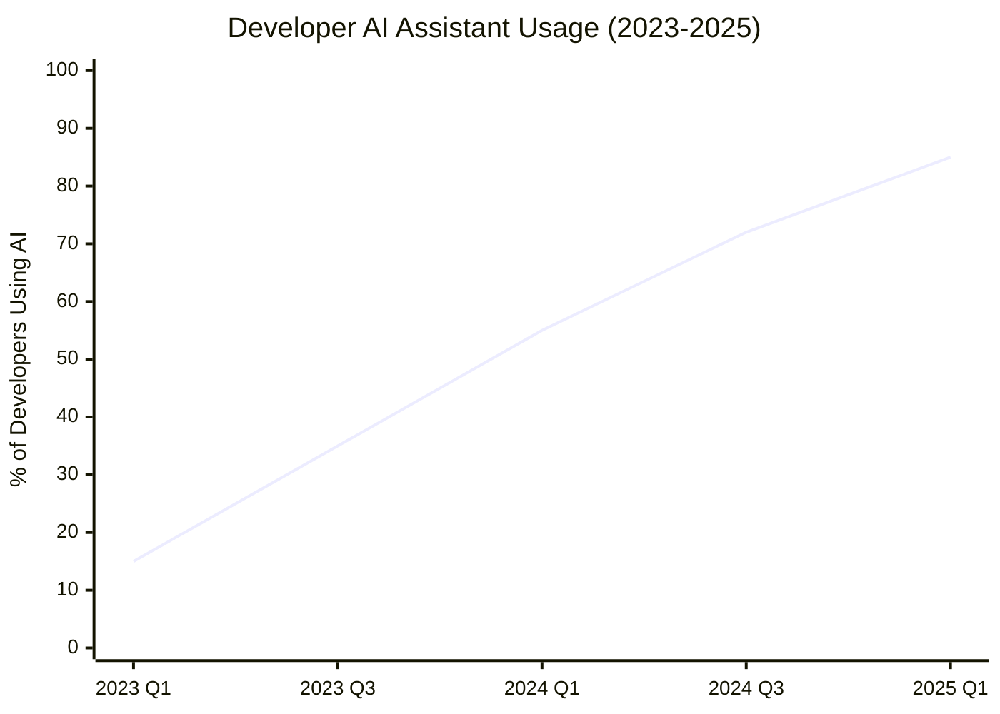
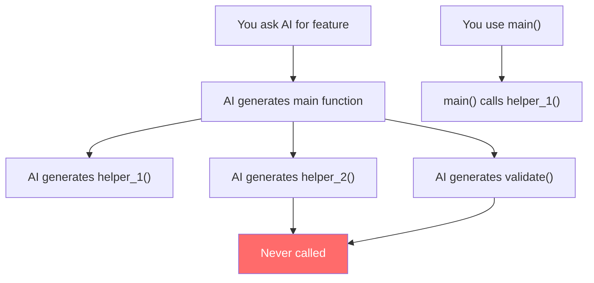
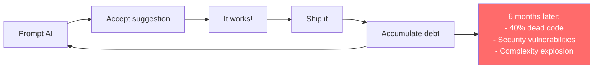

"Vibe coding" is the practice of coding with AI assistants—accepting suggestions from Copilot, ChatGPT, or Claude without fully understanding every line. It's fast, it's productive, and it's creating a **new category of technical debt**.

## The Rise of AI-Assisted Development



AI coding assistants are now mainstream:
- **GitHub Copilot:** 1.3M+ paid subscribers
- **ChatGPT/Claude:** Used daily by millions of developers
- **Cursor, Windsurf, Replit:** AI-native IDEs growing fast

The productivity gains are real. But so are the problems.

---

## The Hidden Costs of Vibe Coding

### 1. Dead Code Accumulation

AI suggests complete solutions. You use 60% of it:

```python
# You asked: "function to parse JSON config"
# AI gave you:

import json
import yaml  # only need JSON
import toml  # only needed JSON
from pathlib import Path
from typing import Dict, Any, Optional, List  # List unused

def parse_config(path: str) -> Dict[str, Any]:
    file_path = Path(path)
    
    if file_path.suffix == '.json':
        with open(file_path) as f:
            return json.load(f)
    elif file_path.suffix in ['.yml', '.yaml']:  # never use YAML
        with open(file_path) as f:
            return yaml.safe_load(f)
    elif file_path.suffix == '.toml':  # never use TOML
        with open(file_path) as f:
            return toml.load(f)
    else:
        raise ValueError(f"Unsupported format: {file_path.suffix}")

def validate_config(config: Dict[str, Any]) -> bool:  # never called this
    required_keys = ['database', 'api_key', 'debug']
    return all(key in config for key in required_keys)
```

You wanted 10 lines. You got 25. Half is dead.

### 2. Security Vulnerabilities

AI doesn't understand your security context:

```python
# You asked: "function to run shell command"
# AI gave you:

import subprocess

def run_command(cmd: str) -> str:
    result = subprocess.run(
        cmd, 
        shell=True,  # CRITICAL: Command injection vulnerability!
        capture_output=True,
        text=True
    )
    return result.stdout

# AI didn't ask: "Is cmd from user input?"
# AI didn't know: This is called from a web endpoint
```

**Result:** Exploitable vulnerability shipped to production.

### 3. Complexity Creep

AI writes verbose, "safe" code that handles cases you don't have:

```python
# You asked: "sum a list of numbers"
# You expected: sum(numbers)
# AI gave you:

from typing import List, Union, Optional
from decimal import Decimal
import logging

logger = logging.getLogger(__name__)

def sum_numbers(
    numbers: List[Union[int, float, Decimal]], 
    initial: Optional[Union[int, float, Decimal]] = None,
    ignore_none: bool = True,
    round_result: Optional[int] = None
) -> Union[int, float, Decimal]:
   
    if not numbers:
        logger.warning("Empty list provided to sum_numbers")
        return initial or 0
        
    total = initial or 0
    for num in numbers:
        if num is None and ignore_none:
            continue
        if num is None:
            raise ValueError("None value in list")
        total += num
    
    if round_result is not None:
        total = round(total, round_result)
        
    return total
```

**30 lines instead of 1.** Complexity: 6 instead of 1.

### 4. Orphaned Functions

AI creates helper functions you never call:



### 5. Copy-Paste Propagation

You accept AI suggestions across multiple files. Same pattern, same bugs:

```python
# file1.py - AI wrote this
data = request.json()  # No validation
db.execute(f"INSERT INTO t VALUES ({data['id']})")

# file2.py - You asked AI for similar code
data = request.json()  # Same vulnerability copied
db.execute(f"INSERT INTO other VALUES ({data['id']})")

# file3.py - Pattern continues...
```

---

## The Vibe Coding Cycle



The problem isn't AI—it's **accepting without reviewing**.

---

## Why Traditional Tools Miss This

### Linters Don't Catch Logic Issues

```python
# Passes all linters!
def process(user_id):
    query = f"SELECT * FROM users WHERE id = {user_id}"  # SQL injection
    return db.execute(query)
```

### Tests Only Cover What You Test

AI-generated code often has:
- Untested error branches
- Unused parameters (no test exercises them)
- Dead functions (no test calls them)

### Code Review Doesn't Scale

```
Average PR size with AI assistance: 2.5x larger
Code review time: Fixed
Result: Less scrutiny per line
```

---

## How Skylos Fixes Vibe Coding Debt

### 1. Dead Code Detection

Find the AI bloat:

```bash
skylos . --confidence 70
```

```
Unused imports: 23
Unused functions: 8
Unused parameters: 12
```

### 2. Security Scanning

Catch what AI didn't consider:

```bash
skylos . --danger
```

```
SKY-D210 CRITICAL: SQL injection in api/users.py:45
SKY-D212 CRITICAL: Command injection in utils/shell.py:12
```

### 3. Complexity Alerts

Flag AI's over-engineering:

```bash
skylos . --quality
```

```
SKY-Q301: Function 'sum_numbers' has complexity 6 (threshold: 10)
SKY-Q304: Function 'parse_config' has 5 parameters (threshold: 5)
```

### 4. Quality Gate

Prevent AI debt from shipping:

```bash
skylos . --danger --quality --gate
```

**Block PRs** that introduce vulnerabilities or dead code.

---

### Best Practices


  <details>
<summary>1. Run Skylos before committing</summary>

    ```bash
    # Pre-commit hook
    skylos . --danger --quality || exit 1
    ```
    
    Catches AI-introduced issues immediately.
  </details>
  
  <details>
<summary>2. Delete AI's unused suggestions</summary>

    AI gives you 5 functions. You need 2. Delete the other 3.

    ```bash
    skylos . -i  # Interactive mode
    ```
  </details>
  
  <details>
<summary>3. Question AI's security assumptions</summary>

    AI doesn't know:
    - Where your data comes from
    - Who can call this function
    - What's sensitive in your context
    
    Ask: "Is this input trusted?"
  </details>
  
  <details>
<summary>4. Simplify AI's over-engineering</summary>

    ```python
    # AI gave you 30 lines for summing
    # You need:
    total = sum(numbers)
    ```
    
    Use Skylos complexity warnings as a signal.
  </details>
  
  <details>
<summary>5. Set up CI gates</summary>

    Don't let AI debt accumulate:
    
    ```yaml
    - run: skylos . --danger --quality --gate
    ```
  </details>


---

## The Numbers

| Metric | Without Skylos | With Skylos |
|--------|----------------|-------------|
| Dead code from AI | ~30% of AI-generated code | < 5% |
| Security vulns shipped | 1 in 10 PRs | Blocked at CI |
| Average function complexity | 12 | 7 |
| Time to onboard new dev | 3 weeks | 2 weeks |

---

## Next Steps


  ### [Getting Started](/getting-started)
    Install Skylos and scan your codebase
  
  ### [CI/CD Integration](/ci-cd)
    Set up quality gates to prevent AI debt
  

