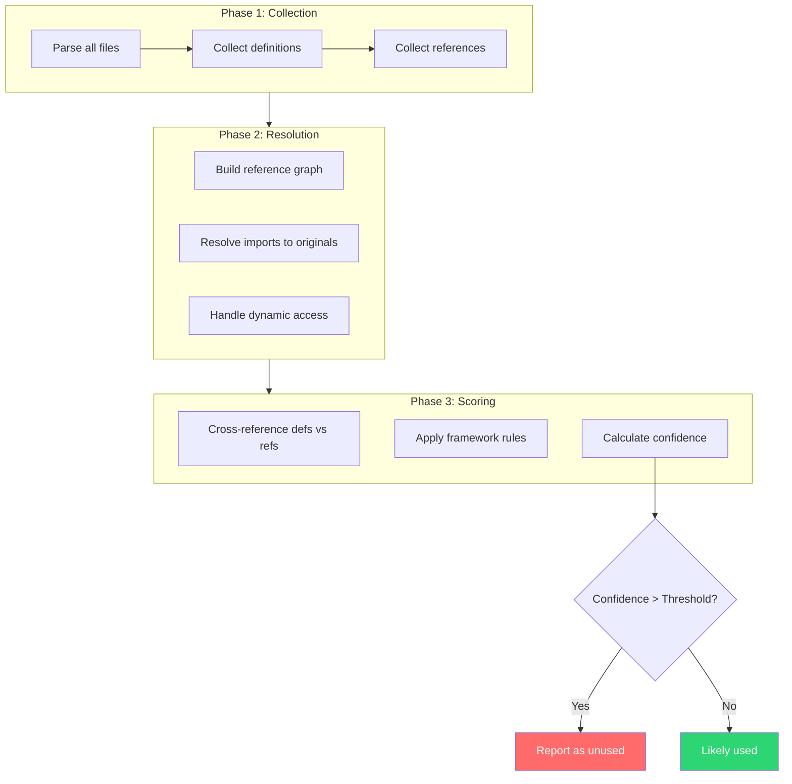
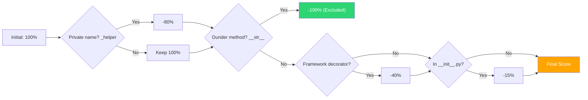
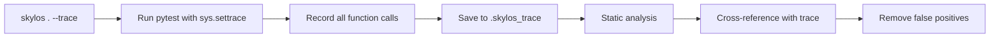

import Tabs from '@theme/Tabs';
import TabItem from '@theme/TabItem';

## The Hidden Cost of Dead Code

Dead code isn't just clutter. It's **active technical debt** that:

- **Slows Development** - Developers read and reason about code that does nothing
- **Hides Bugs** - Unused code paths can mask logic errors and security issues
- **Increases Attack Surface** - Vulnerable code that's "not used" can still be exploited
- **Bloats Bundles** - Unused imports increase load times and memory usage

**The problem?** Removing code is scary. What if it's actually used somewhere you didn't check?

---

## How Skylos Finds Dead Code

Skylos builds a complete **reference graph** of your codebase, then identifies definitions with zero references.


### What Gets Detected

| Category | Example | Detection Method |
|----------|---------|------------------|
| **Unreachable functions** | `def helper(): ...` never called | No call references found |
| **Unused imports** | `import json` but `json` never used | No name references found |
| **Unused classes** | `class OldModel: ...` never instantiated | No instantiation or inheritance |
| **Unused variables** | `result = compute()` but `result` never read | Assigned but never referenced |
| **Unused parameters** | `def fn(a, b): return a` | Parameter `b` never used in body |

---

## The Confidence System

Not all "unused" code is actually dead. A helper function might be:

- Called dynamically via `getattr()`
- Used by a framework implicitly
- Part of a public API

Skylos assigns a **confidence score** (0-100) to each finding, so you can filter out uncertain results.


### Confidence Penalties

| Pattern | Penalty | Reason |
|---------|---------|--------|
| Private name (`_foo`) | -80 | Convention for internal use |
| Dunder (`__str__`) | -100 | Called implicitly by Python |
| Underscore var (`_`) | -100 | Intentionally unused |
| In `__init__.py` | -15 | Often public API re-exports |
| Framework decorator | -40 | Called by framework |
| Dynamic module | -40 | May use `getattr()` |
| Test-related | -100 | Called by test runner |

### Using Confidence Threshold
```bash
# Default: only findings with ≥60% confidence
skylos .

# Include more uncertain findings
skylos . --confidence 40

# Only high-confidence findings
skylos . --confidence 80
```

---

## Framework Awareness

Skylos understands that framework code is called implicitly:

<Tabs>
  <TabItem value="django" label="Django" default>
```python
# Not flagged - Django calls this via URL routing
def user_detail(request, pk):
    return render(request, 'user.html', {'user': User.objects.get(pk=pk)})

# Not flagged - Signal receiver
@receiver(post_save, sender=User)
def create_profile(sender, instance, **kwargs):
    Profile.objects.create(user=instance)

# Not flagged - Class-based view methods
class UserView(View):
    def get(self, request):
        return HttpResponse("Hello")
```

  </TabItem>
  <TabItem value="flask" label="Flask / FastAPI">
```python
# Not flagged - Route handler
@app.route('/users')
def get_users():
    return jsonify(users)

# Not flagged - Error handler
@app.errorhandler(404)
def not_found(e):
    return "Not found", 404

# Not flagged - FastAPI dependency
async def get_db():
    db = SessionLocal()
    try:
        yield db
    finally:
        db.close()
```

  </TabItem>
  <TabItem value="pydantic" label="Pydantic">
```python
# Not flagged - Pydantic model
class UserCreate(BaseModel):
    name: str
    email: str

# Not flagged - Validator
@field_validator('email')
def validate_email(cls, v):
    if '@' not in v:
        raise ValueError('Invalid')
    return v
```

  </TabItem>
  <TabItem value="pytest" label="Pytest">
```python
# Not flagged - Fixture
@pytest.fixture
def db_session():
    return create_session()

# Not flagged - Test function
def test_user_creation(db_session):
    user = User(name='Test')
    assert user.name == 'Test'
```

  </TabItem>
</Tabs>

---

## Smart Tracing (Runtime Analysis)

Static analysis can't catch everything. When code is called dynamically via `getattr()`, visitor patterns, or reflection, Skylos may flag it as unused.

**The solution:** Run your tests with call tracing enabled.
```bash
skylos . --trace
```

This:
1. Runs your test suite with `sys.settrace()` enabled
2. Records every function that was actually called
3. Uses that data to eliminate false positives

### What Gets Captured

| Pattern | Static Analysis | With `--trace` |
|---------|----------------|----------------|
| `visitor.visit(node)` → `visit_FunctionDef()` | Missed | Caught |
| `getattr(obj, "method")()` | Missed | Caught |
| Plugin hooks (`pytest_configure`) | Missed | Caught |
| Reflection / dynamic imports | Missed | Caught |

### When to Use `--trace`

**Use It:**
- Projects with visitor patterns (AST, CST)
- Plugin architectures
- Heavy use of `getattr()` / reflection
- Many false positives from static analysis

**Skip It:**
- Simple codebases with direct calls
- No test suite available
- CI where speed matters (tracing adds overhead)

### How It Works


:::tip
**Tip:** Commit `.skylos_trace` to your repo if your test suite is stable. Then `skylos .` will use it automatically without re-running tests.
:::

---

## Comparison: Why Not Just Use Your IDE?

| Feature | IDE "Unused" Warning | Skylos |
|---------|---------------------|--------|
| Cross-file analysis | ❌ Single file | ✅ Entire codebase |
| Framework awareness | ❌ | ✅ Django, Flask, FastAPI, Pydantic |
| Confidence scoring | ❌ | ✅ Filter uncertain findings |
| CI/CD integration | ❌ | ✅ Block PRs, generate reports |
| Batch removal | ❌ | ✅ Interactive selection |
| Import tracking | Basic | ✅ Resolves re-exports |

---

## Safe Removal Workflow

### 1. Scan with high confidence

Start with findings you can trust:
```bash
skylos . --confidence 80
```

### 2. Review in interactive mode

Select what to remove:
```bash
skylos . -i --dry-run
```

### 3. Remove or comment out
```bash
# Delete selected items
skylos . -i

# Or comment out (safer)
skylos . -i --comment-out
```

### 4. Run tests

Verify nothing broke:
```bash
pytest
```

### Comment-Out Mode

Instead of deleting, Skylos can comment out code with a marker:
```python
# Before
def unused_helper():
    return "I'm not used"

# After --comment-out
# SKYLOS DEADCODE: def unused_helper():
# SKYLOS DEADCODE:     return "I'm not used"
```

Search for `SKYLOS DEADCODE` later to permanently remove or restore.

---

## Output Formats

<Tabs>
  <TabItem value="table" label="Table (Default)" default>
```
─────────────────── Unreachable Functions ───────────────────
 #   Name                    Location
 1   unused_helper           utils.py:42
 2   legacy_processor        core/processing.py:128

────────────────────── Unused Imports ───────────────────────
 #   Name                    Location
 1   json                    api/views.py:3
 2   Optional                models.py:1
```

  </TabItem>
  <TabItem value="tree" label="Tree">
```bash
skylos . --tree
```
```
my-project/
├── api/
│   └── views.py
│       ├── L3 Unused import: json
│       └── L45 Unused function: old_endpoint
└── utils.py
    └── L42 Unused function: unused_helper
```

  </TabItem>
  <TabItem value="json" label="JSON">
```bash
skylos . --json -o report.json
```
```json
{
  "unused_functions": [
    {
      "name": "unused_helper",
      "file": "utils.py",
      "line": 42,
      "confidence": 85
    }
  ],
  "unused_imports": [...]
}
```

  </TabItem>
</Tabs>

---

## Real-World Impact

### Case Study: E-commerce Platform

A 200K LOC Python codebase ran Skylos and found:

- **47 unused functions** (3,200 lines of dead code)
- **156 unused imports** (faster startup, smaller bundles)
- **12 unused classes** (legacy models never migrated)

**Result:** 15% reduction in codebase size, faster CI builds, easier onboarding for new developers.

---

## Next Steps

- [Framework Awareness](/framework-awareness) - See all supported frameworks and patterns
- [CI/CD Integration](/ci-cd) - Automate dead code detection in your pipeline