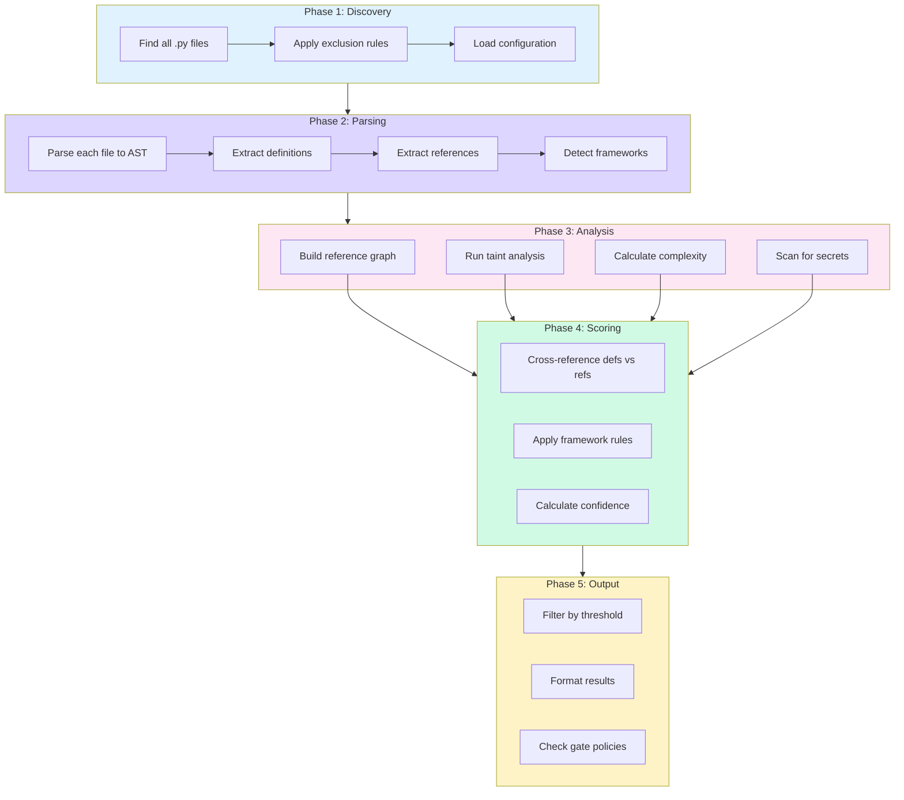
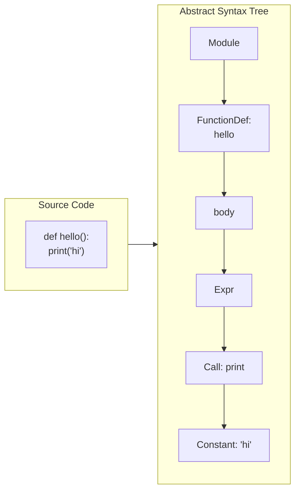
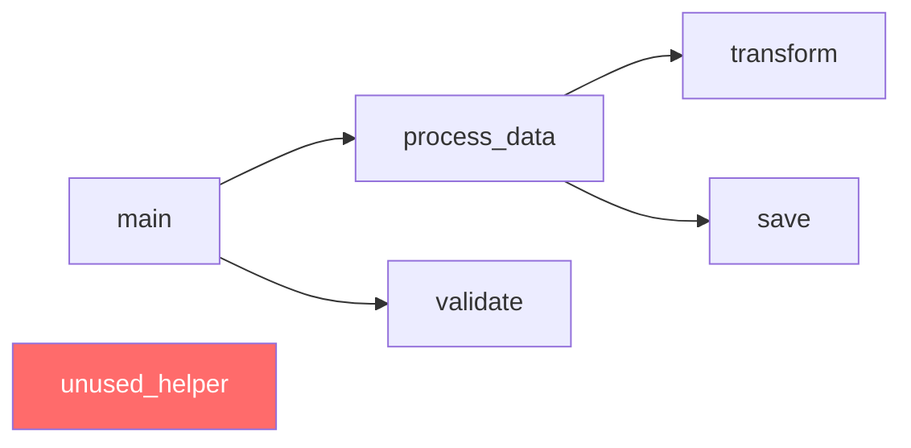
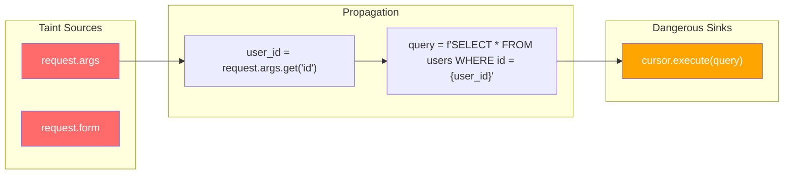
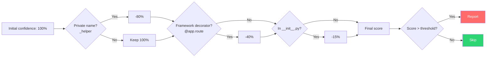
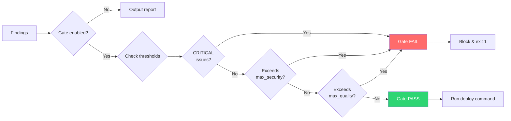

Skylos isn't a regex-based linter. It's a **multi-pass static analyzer** that builds a complete understanding of your codebase before reporting issues.

## The Analysis Pipeline

When you run `skylos .`, here's what happens:



---

## Phase 1: Discovery

Skylos starts by mapping your project:

```python
# Pseudocode
files = glob("**/*.py")
files = filter_exclusions(files, config.exclude)
# Result: list of files to analyze
```

**Default exclusions:** `__pycache__`, `.git`, `venv`, `.venv`, `node_modules`, `build`, `dist`

These are skipped because they contain non-source files or third-party code you don't control.

---

## Phase 2: Parsing

Each file is parsed into an **Abstract Syntax Tree (AST)**—a structured representation of your code:



From the AST, Skylos extracts:

| Extraction | What It Captures |
|------------|------------------|
| **Definitions** | Functions, classes, methods, variables, imports |
| **References** | Function calls, attribute access, name lookups |
| **Framework signals** | Decorators, base classes, magic patterns |

### Why AST, Not Regex?

Regex can't understand code structure:

```python
# Regex sees "def unused" and might flag it
"""
def unused():  # This is in a docstring, not real code!
    pass
"""

def real_function():
    pass
```

AST parsing knows the difference between code and strings.

---

## Phase 3: Analysis Engines

Skylos runs multiple analysis engines in parallel:

### Reference Graph Builder

Creates a map of what calls what:



Any definition with **zero incoming edges** is potentially dead code.

### Taint Analysis Engine

Traces data flow from sources to sinks:



The taint "flows" through assignments. When it reaches a sink, we flag it.

### Complexity Calculator

Walks function bodies counting decision points:


**def:**


```python example(x, y):      # Base: 1
    if x > 0:           # +1 = 2
        for i in y:     # +1 = 3
            if i:       # +1 = 4
                pass
    return x            # Total: 4
```

### Secret Scanner

Pattern-matches against known credential formats:

```
AKIA[0-9A-Z]{16}     → AWS Access Key
ghp_[a-zA-Z0-9]{36}  → GitHub Token
sk_live_[a-zA-Z0-9]+ → Stripe Key
```

---

## Phase 4: Confidence Scoring

Not every "unused" definition is actually dead. Skylos scores confidence based on signals:



This is why Skylos has far fewer false positives than tools that do simple "is it referenced?" checks.

### Reference Resolution (v3.5.1+)

Beyond simple name matching, Skylos uses several strategies to reduce false positives:

| Strategy | What It Does |
|----------|-------------|
| **`__init__.py` re-export tracking** | `from .module import name` marks the original definition as referenced and exported |
| **Import chain resolution** | Re-export chains (e.g., `compat.py` → `collections.abc`) are followed end-to-end |
| **Exported class propagation** | Public methods of exported classes are automatically marked as public API |
| **Attribute fallback** | When `obj.method()` can't be qualified, all definitions named `method` are considered potentially used |
| **`nonlocal` resolution** | `nonlocal x` references the outer scope variable instead of creating a spurious inner definition |

The attribute fallback is key to handling instance methods, protocol methods, and polymorphic dispatch across files — patterns that trip up simpler tools.

---

## Phase 5: Output & Gating

Results are formatted and optionally checked against gate policies:



---

## Performance

Skylos is designed for speed:

| Optimization | How It Helps |
|--------------|--------------|
| **Parallel file parsing** | Multi-core AST parsing |
| **Single-pass collection** | Definitions and references in one walk |
| **Lazy taint analysis** | Only runs when `--danger` is enabled |
| **Early filtering** | Exclusions applied before parsing |

**Typical performance:**
- 10K LOC: < 2 seconds
- 100K LOC: < 10 seconds
- 1M LOC: < 60 seconds

---

## Extensibility

Skylos uses a rule-based architecture:


**class:**


```python
# SkylosRule(ABC):
    @property
    def rule_id(self): ...      # e.g., "SKY-D210"
    
    @property
    def name(self): ...         # e.g., "SQL Injection"
    
    def visit_node(self, node, context):
        # Return findings or None
        ...
```

Rules are organized by category:
- `rules/danger/` — Security rules
- `rules/quality/` — Complexity, nesting, structure
- `rules/secrets.py` — Credential detection

---

## Next Steps


  ### [Static Analysis Concepts](/concepts/static-analysis)
    Learn the fundamentals of static analysis
  
  ### [Getting Started](/getting-started)
    Run your first Skylos scan
  

