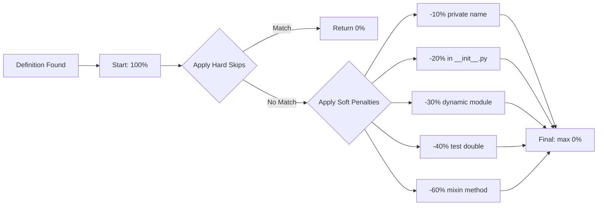

Unlike simple "used or unused" analyzers, Skylos uses a **confidence scoring system**. Every definition starts at 100% confidence and gets reduced based on patterns that suggest it might be used in ways the analyzer can't detect.

---

## Why Confidence Scoring?

Static analysis can't see everything:

```python
# Looks unused, but called dynamically
def handle_user_created(event):
    notify_admins(event)

# Called via: getattr(handlers, f"handle_{event_type}")
```

Instead of **false positives** (flagging used code) or **false negatives** (missing dead code), Skylos gives you **calibrated confidence**:

- **100%** = Almost certainly unused
- **60-80%** = Probably unused, worth investigating
- **30-50%** = Might be used dynamically
- **0%** = Definitely used or intentionally skipped

---

## How Penalties Work



---

## Penalty Application Order

Penalties are applied in this order:

1. **Inline ignore comments** (`# noqa`, `# skylos: ignore`)
2. **Whitelist matches** (config-based)
3. **Hard entrypoints** (`main`, `cli`, `app`)
4. **Framework decorated lines** (routes, endpoints)
5. **Protocol/ABC patterns**
6. **Framework lifecycle methods**
7. **Naming conventions**
8. **Test file/decorator checks**
9. **Soft penalties** (cumulative)

---

## Hard Skips (Confidence = 0)

These patterns are **definitely used** or **intentionally defined**:

### Dunder Methods

All Python magic methods:

```python
class MyClass:
    def __init__(self): ...      # Called by Python
    def __str__(self): ...       # Called by str()
    def __repr__(self): ...      # Called by repr()
    def __enter__(self): ...     # Called by `with`
    def __exit__(self, *args): ...
```

### Hard Entrypoints

```python
# These are entry points
def main(): ...
def cli(): ...
def app(): ...
def run(): ...
def setup(): ...
```

### Protocol Classes & Members

```python
from typing import Protocol

class MyProtocol(Protocol):      # Skipped
    def method(self) -> None:    # Skipped
        ...
```

### ABC Abstract Method Implementations

```python
from abc import ABC, abstractmethod

class BaseHandler(ABC):
    @abstractmethod
    def handle(self): ...

class ConcreteHandler(BaseHandler):
    def handle(self):            # Skipped
        return "handled"
```

### Protocol Implementers

```python
class MyImpl(MyProtocol):        # Explicit Protocol impl
    def method(self):            # Skipped
        pass
```

### Duck-Typed Protocol Implementations

```python
class DataStore(Protocol):
    def get(self, key): ...
    def set(self, key, value): ...
    def delete(self, key): ...

class RedisStore:                # skipped
    def get(self, key): ...
    def set(self, key, value): ...
    def delete(self, key): ...
```

### Base Class Methods

```python
class BaseHandler:               # Prefix pattern
    def handle(self): ...        # Skipped

class AbstractValidator:         # Contains "Abstract"
    def validate(self): ...      # Skipped

class StorageInterface:          # Suffix pattern
    def save(self): ...          # Skipped

class CacheAdapter:              # Suffix pattern
    def get(self): ...           # Skipped
```

**Patterns**: `Base*`, `*Base`, `*ABC`, `*Interface`, `*Adapter`

### Data Class Fields

```python
from dataclasses import dataclass

@dataclass
class User:
    name: str                    # Skipped
    email: str                   # Skipped
```

### NamedTuple Fields

```python
from typing import NamedTuple

class Point(NamedTuple):
    x: float                     #  Skipped
    y: float                     #  Skipped
```

### Enum Members

```python
from enum import Enum

class Status(Enum):
    PENDING = "pending"          # Skipped
    APPROVED = "approved"        # Skipped
```

### attrs Fields

```python
import attr

@attr.s
class Config:
    host: str = attr.ib()        # Skipped
    port: int = attr.ib()        # Skipped
```

### Pydantic Model Fields

```python
from pydantic import BaseModel

class UserModel(BaseModel):
    name: str                    # Skipped
    email: str                   # Skipped
```

### ORM Model Columns

```python
from sqlalchemy import Column, String

class User(Base):
    name = Column(String)        # Skipped
    email = Column(String)       # Skipped
```

### Type Aliases

```python
from typing import TypeAlias

UserId: TypeAlias = int          # Skipped
type UserMap = Dict[str, User]   # Skipped (this may vary depending on your python version)
```

### Settings/Config Class Attributes

```python
class AppSettings:
    DEBUG = True                 # Skipped
    API_KEY = "secret"           # Skipped

class DatabaseConfig:
    HOST = "localhost"           # Skipped
```

**Patterns**: `*Settings`, `*Config`

### Test Files & Test Decorators

```python
# test_example.py
def test_something():            # Skipped (test file)
    assert True

@pytest.mark.skip
def test_skipped():              # Skipped (test decorator)
    pass
```

### Inline Ignore Comments

```python
import unused_module  # noqa
import another  # noqa: F401
def handler():  # skylos: ignore
    pass
```

### Self/Cls Parameters

```python
class MyClass:
    def method(self, x):         # self always skipped
        pass
    
    @classmethod
    def class_method(cls, x):    # cls always skipped
        pass
```

### Future Imports

```python
from __future__ import annotations    # Skipped
from __future__ import division       # Skipped
```

### Underscore Variable

```python
for _ in range(10):              # Skipped (intentionally unused)
    do_something()
```

---

## Framework Lifecycle Methods (Confidence = 0)

Framework-specific methods called automatically:

### Django Models

```python
class User(models.Model):
    def save(self, *args): ...           # Skipped
    def delete(self, *args): ...         # Skipped
    def clean(self): ...                 # Skipped
    def get_absolute_url(self): ...      # Skipped
```

### Django Views

```python
class UserView(View):
    def get(self, request): ...          # Skipped
    def post(self, request): ...         # Skipped
    def get_queryset(self): ...          # Skipped
    def get_context_data(self): ...      # Skipped
```

### Django Admin

```python
class UserAdmin(admin.ModelAdmin):
    def get_list_display(self): ...      # Skipped
    def has_add_permission(self): ...    # Skipped
```

### DRF ViewSets

```python
class UserViewSet(viewsets.ModelViewSet):
    def list(self, request): ...         # Skipped
    def create(self, request): ...       # Skipped
    def retrieve(self, request, pk): ... # Skipped
    def update(self, request, pk): ...   # Skipped
    def destroy(self, request, pk): ...  # Skipped
```

### DRF Serializers

```python
class UserSerializer(serializers.ModelSerializer):
    def validate(self, data): ...           # Skipped
    def create(self, validated): ...        # Skipped
    def update(self, instance, data): ...   # Skipped
```

### pytest

```python
# conftest.py
def pytest_configure(config): ...        # Skipped
def pytest_addoption(parser): ...        # Skipped

@pytest.fixture
def my_fixture(): ...                    # Skipped
```

### unittest

```python
class TestExample(unittest.TestCase):
    def setUp(self): ...                 # Skipped
    def tearDown(self): ...              # Skipped
    def setUpClass(cls): ...             # Skipped
```

---

## Soft Penalties (Confidence Reduced)

Some of these patterns might be used dynamically, they get penalties instead of a full skip:

### Mixin Class Methods (-60%)

```python
class LoggingMixin:
    def log_action(self, action):        # -60% confidence penalty
        print(f"Action: {action}")
```

**Why**: Mixin methods are called via inheritance, not direct reference.

### Test Doubles (-40%)

```python
class InMemoryCache:                     # Prefix match
    def get(self, key): ...              # -40% confidence penalty

class MockPaymentGateway:                #  Prefix match
    def charge(self, amount): ...        # -40% confidence penalty

class DatabaseFake:                      # Suffix match
    def query(self, sql): ...            # -40% confidence penalty
```

**Prefixes**: `InMemory*`, `Mock*`, `Fake*`, `Stub*`, `Dummy*`, `Fixed*`

**Suffixes**: `*Mock`, `*Stub`, `*Fake`, `*Double`

### Method Name Matches Abstract (-40%)

```python
class MyClass:
    def validate(self):                  #  Name exists in some ABC
        pass                             # -40% confidence penalty
```

**Why**: Method name matches an abstract method and somewhere might be implementing it.

### Event Handlers (-30%)

```python
class MyWidget:
    def on_mount(self): ...              # -30% confidence penalty
    def on_click(self, event): ...       # -30% confidence penalty
    def on_key(self, event): ...         # -30% confidence penalty
```

**Pattern**: `on_*` methods (event handler convention)

### Reactive Watchers (-30%)

```python
class MyWidget:
    def watch_value(self, new): ...      # -30% confidence penalty
    def watch_count(self, new): ...      # -30% confidence penalty
```

**Pattern**: `watch_*` methods (reactive framework convention)

### Compose Method (-40%)

```python
class MyScreen:
    def compose(self): ...               # -40% confidence penalty
```

**Why**: Textual/React-like framework lifecycle method.

### SCREAMING_CASE Class Variables (-40%)

```python
class MyClass:
    MAX_RETRIES = 3                      # -40% confidence penalty
    DEFAULT_TIMEOUT = 30                 # -40% confidence penalty
```

**Why**: Likely constants accessed externally.

### Private Names (-10%)

```python
def _internal_helper():                  # -10% confidence penalty
    pass

class MyClass:
    def _private_method(self):           # -10% confidence penalty
        pass
```

**Why**: Internal API, might be used within module.

### In `__init__.py` (-20%)

```python
# mypackage/__init__.py
from .module import MyClass              # -20% confidence penalty
```

**Why**: Often re-exports for public API.

### Dynamic Module (-30%)

```python
# If module uses eval/exec
eval(code)                               #  All definitions -30% confidence penalty
```

**Why**: Dynamic code execution makes static analysis unreliable.

### Test Related (-100%)

```python
# test_example.py (any file)
def helper_function():                   # -100% confidence penalty
    pass

@pytest.fixture
def my_fixture():                        # -100% confidence penalty
    pass
```

**Why**: Test code isn't dead code.

---

## Naming Convention Penalties

| Pattern | Penalty | Example |
|---------|---------|---------|
| `handle_*` | -30% | Event handler pattern |
| `on_*` | -30% | Callback pattern |
| `*_handler` | -30% | Handler suffix |
| `*_callback` | -30% | Callback suffix |
| `test_*` | -50% | Test function (non-test file) |
| `*Plugin` | -20% | Plugin pattern |
| `*Factory` | -20% | Factory pattern |
| `*Mixin` (methods) | -60% | Mixin class methods |

---

## Configuration Integration

### Whitelist (Full Skip)

```toml
[tool.skylos.whitelist]
names = ["handle_*", "register_*", "setup_*"]
```

### Documented Whitelist (Full Skip + Reason)

```toml
[tool.skylos.whitelist.documented]
"celery_*" = "Celery task registered via decorator"
"signal_*" = "Django signal handler"
```

### Temporary Whitelist (Expires)

```toml
[tool.skylos.whitelist.temporary]
"legacy_*" = { reason = "Migration in progress", expires = "2026-06-01" }
```

### Lower Confidence (Reduced, Not Skipped)

```toml
[tool.skylos.whitelist]
lower_confidence = ["dynamic_*", "plugin_*"]
```

**Result**: Matches get **-30%** instead of full skip.

---

## Viewing Applied Penalties

Check the `whitelisted` section in JSON output:

```json
{
  "whitelisted": [
    {
      "name": "handle_event",
      "file": "handlers.py",
      "line": 42,
      "reason": "matches 'handle_*'"
    },
    {
      "name": "User.name",
      "file": "models.py", 
      "line": 15,
      "reason": "Pydantic model field"
    }
  ]
}
```

---

## Threshold Configuration

By default, only definitions with **≥60% confidence** are reported:

```bash
# Report everything ≥60% (default)
skylos analyze .

# Be stricter - only high confidence
skylos analyze . --confidence 80

# See everything, including low confidence
skylos analyze . --confidence 0
```

---

## Why These Specific Values?

| Penalty | Value | Rationale |
|---------|-------|-----------|
| Private name | -10% | Might be internal API |
| Init file | -20% | Often re-exports |
| Dynamic module | -30% | Can't trace `eval`/`exec` |
| Event handler (`on_*`) | -30% | Common framework convention |
| Watcher (`watch_*`) | -30% | Common reactive convention |
| Abstract method match | -40% | Likely interface implementation |
| Test double | -40% | Implements interface for testing |
| SCREAMING_CASE | -40% | Likely constants |
| Compose | -40% | Framework lifecycle |
| Mixin methods | -60% | Called via inheritance chain |
| Test file/decorator | -100% | Tests aren't dead code |
| Dunder methods | -100% | Python magic methods |

These values were **calibrated empirically** across many real-world codebases.

---

## Debugging Penalties

If something is incorrectly flagged:

1. **Check confidence**: Lower confidence = less certain
2. **Check patterns**: Does it match a naming convention?
3. **Check inheritance**: Is it implementing an interface?
4. **Check data class**: Is it a field in dataclass/attrs/Pydantic?
5. **Add to whitelist**: If it's a valid pattern for your codebase

```toml
[tool.skylos.whitelist.documented]
"my_pattern_*" = "Called by my_framework via magic"
```