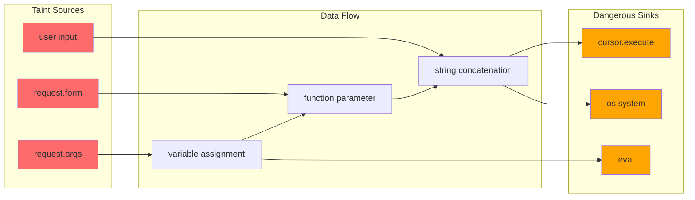
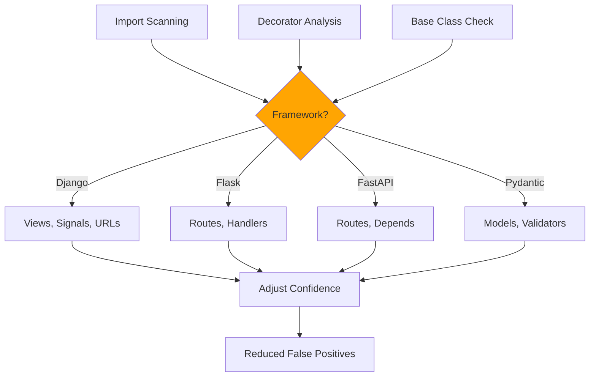

## Ship Cleaner, Safer Code — Automatically

Skylos is a static analysis tool that combines **dead code detection**, **security vulnerability scanning**, and **code quality enforcement** in a single CLI. Unlike generic linters, Skylos understands your frameworks and uses **taint analysis** to trace vulnerabilities through your actual code paths.


  ### Find Dead Code
    Detect unused functions, imports, classes, and variables with framework-aware analysis
  
  ### Catch Vulnerabilities
    Taint analysis traces user input to dangerous sinks like SQL queries and shell commands
  
  ### Enforce Quality
    Block deployments when complexity, nesting, or security issues exceed your thresholds
  


---

## The Problem with Traditional Tools

Most static analyzers fall into two camps:


**Pattern Matchers:**

    Tools like grep-based scanners find `eval()` but miss indirect vulnerabilities:
    
    
**data:**


```python = request.GET.get("q")
    query = data  # Pattern matchers lose track here
    execute(query)  # ⚠️ Vulnerability missed!
    ```
    
    **Result:** High false negatives. Real vulnerabilities slip through.
  
**Generic Linters:**

    Tools like Pylint flag everything without understanding context:
    
    ```python
    @app.route('/api/users')  # "Unused function" - false positive!
    def get_users():
        return jsonify(users)
    ```
    
    **Result:** High false positives. Teams ignore the noise.
  
---

## How Skylos is Different

### Taint Analysis That Actually Works

Skylos doesn't just pattern-match. It builds a **data flow graph** and traces values from untrusted sources to dangerous sinks.



This catches vulnerabilities that pattern matchers miss—even when data flows through multiple assignments and function calls.

### Framework-Aware Analysis

Skylos understands Django, Flask, FastAPI, and Pydantic. Route handlers, signal receivers, and validators aren't flagged as "unused."



---

## What You'll Achieve


  ### 50-80% Less Noise
    Framework awareness and confidence scoring eliminate false positives that plague other tools
  
  ### Catch Real Vulnerabilities
    Taint analysis finds SQL injection, command injection, and SSRF that pattern matchers miss
  
  ### Automated Quality Gates
    Block PRs that exceed complexity thresholds or introduce security issues
  
  ### AI-Powered Fixes
    Generate fixes for detected issues with GPT-4 or Claude integration
  


---

## Quick Example

```bash
# Install
pip install skylos

# Initialize config
skylos init

# Run full analysis
skylos . --danger --quality --secrets
```

**Output:**

```
Skylos Python Static Analysis Results
Analyzed 47 file(s)

Unreachable: 3  Unused imports: 12  Quality: 2

───────────────────── Security Issues ─────────────────────
 #  Rule       Severity   Message                         Location
 1  SKY-D210   Critical   SQL injection: tainted input    api/db.py:45
 2  SKY-D212   Critical   Command injection (shell=True)  utils/run.py:23

────────────────────── Quality Issues ─────────────────────
 #  Type        Function        Detail                    Location
 1  Complexity  process_order   Cyclomatic: 18 (max 10)   orders.py:89
```

---

## Who Uses Skylos?


  ### Security Teams
    Integrate into CI/CD to catch vulnerabilities before they reach production
  
  ### Platform Engineers
    Enforce code quality standards across all repositories automatically
  
  ### Individual Developers
    Clean up technical debt and remove dead code with confidence
  


---

## Next Steps


  ### [Getting Started](/getting-started)
    Install Skylos and run your first scan in 5 minutes
  
  ### [Security Analysis](/security-analysis)
    Learn how taint analysis catches real vulnerabilities
  
  ### [CI/CD Integration](/ci-cd-integration)
    Set up quality gates in GitHub Actions, GitLab, or Jenkins
  
  ### [Rule Reference](/rule-reference)
    Complete list of all detection rules
  
