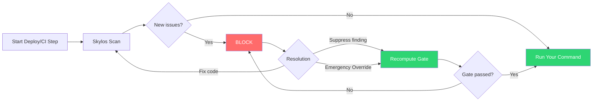

## What this is

Skylos Quality Gate is a **ratchet**: it does **not** punish you for legacy tech debt. It only blocks the changes that make things worse.

> "We ignore your existing 500 bugs. We only block you if you add Bug #501."

That means you can ship features *and* steadily improve code quality over time.

---

## Key concepts

### The Ratchet

Skylos compares the current scan against a baseline (usually your `main` branch).

- **Legacy issues**: already existed → shown, but don't block
- **New issues**: introduced by your change → can block the gate

### Governance actions

When a new issue appears, Skylos supports three resolution paths:

1. **Fix** (preferred): change code and re-run the scan  
2. **Suppress a specific finding** (adult workflow): mark *one* finding as False Positive / Accept Risk so it stops blocking  
3. **Emergency Override** (last resort): unblock the *entire* scan with a logged reason (for hotfixes)

---

## Who does what (roles)

### Developer
- Runs Skylos locally before pushing
- Fixes issues when possible
- If blocked, uses the dashboard link to resolve (or escalates)

### Tech Lead / Security Lead
- Reviews *new* findings introduced by PRs
- Uses **per-finding suppression** for true false positives (with a reason, optional expiry)
- Keeps overrides rare and justified

### CTO / Admin
- Defines policy (strict mode, who can override/suppress, audit requirements)
- Enables "no-bypass" rules for production branches
- Reviews audit logs and recurring suppressions

---

## Free vs Pro/Enterprise

| Capability | Free (Local) | Pro / Enterprise (Cloud) |
|---|---|---|
| Ratchet baseline | ✅ Local history / local baseline | ✅ Cloud baseline on `main` (team-wide) |
| Blocking behavior | ✅ CLI exits non-zero (fail the step) | ✅ CLI can **wait/poll** for approval (unblocks instantly) |
| Override method | `--force` (manual / insecure) | Dashboard override button (audit logged) |
| Per-finding suppression | Limited / local-only | ✅ Persistent + team-governed + audited |
| Strict mode | ❌ Anyone can bypass | ✅ Admin can disable `--force` |
| CI/CD integration | Basic fail/pass | ✅ GitHub checks / commit status turns green on approval |

---

## The workflow (at a glance)

When you wrap your deploy/test command with Skylos, Skylos becomes the "bouncer":
```bash
skylos run . --gate -- ./deploy.sh
```


---

## Quickstart

### 1) Install
```bash
pip install skylos
```

### 2) Run locally (recommended before every push)
```bash
skylos . --danger --secrets --quality
```

If you're gating a deploy/test step, use the wrapper:
```bash
skylos run . --gate -- ./deploy.sh
```

---

## What a failure looks like

If Skylos detects **new violations**, it blocks and prints an action link:
```text
QUALITY GATE FAILED
  1 New Violation introduced
   - app.py:23  SKY-D211  SQL Injection (string-built query)

Action required:
  https://app.skylos.dev/scans/123-abc
```

### What happens next depends on your tier

* **Free**: CLI exits with a failure code (your script stops)
* **Pro/Enterprise**: CLI can **wait/poll** until the scan becomes approved

---

## How to resolve (the "adult" way)

### Option A — Fix the code (preferred)

1. Open the scan
2. Click the finding to see the snippet and context
3. Fix the code
4. Re-run:
```bash
skylos . --danger --secrets --quality
```

5. Gate passes when there are **0 new unsuppressed** findings

### Option B — Suppress a specific finding (False Positive / Accept Risk)

Use this when the scanner is wrong *or* you accept the risk temporarily (hotfix pressure, mitigating controls exist, etc).

**Developer flow**

1. Click the scan link
2. Select the blocking finding
3. Click **Suppress**
4. Choose a reason type:
   * **False Positive** (scanner is incorrect)
   * **Accept Risk** (known risk accepted temporarily)
5. Add a reason (and optionally an expiry like "30 days")

**Result**

* That *specific* finding stops blocking the gate
* The scan updates immediately
* In Pro/Enterprise, your CLI wakes up and continues

### Option C — Emergency Override (last resort)

Use only when you must ship and can't triage properly.

1. Click **Emergency Override**
2. Enter a reason (required)

**Result**

* Entire scan becomes "passed"
* Audit log records who approved it and why

---

## Strict Mode (Enterprise)

Strict Mode disables local bypass flags so production controls can't be sidestepped.

* If Strict Mode is on:
  * `--force` is rejected
  * Approval must happen via dashboard governance

---

## Configuration

### pyproject.toml
```toml
[tool.skylos.gate]
enabled = true

# Free/local environments can allow manual bypass.
# In Pro/Enterprise, strict mode is managed by the dashboard project settings.
strict = false
```

### Recommended policy defaults

**For `main` / production deploys**

* Strict Mode: **ON**
* Allow override: **CTO/Security Lead only**
* Require suppression reasons: **ON**
* Prefer suppression over override: **ON**
* Optional: suppression expiry default 30–90 days

**For feature branches**

* Strict Mode: optional
* Allow suppression for false positives: **ON**
* Allow override: optional (but track it)

---

## CI/CD example (GitHub Actions)
```yaml
name: Production Deploy

on:
  push:
    branches: ["main"]

jobs:
  deploy:
    runs-on: ubuntu-latest
    env:
      SKYLOS_TOKEN: ${{ secrets.SKYLOS_TOKEN }}
      SKYLOS_API_URL: ${{ secrets.SKYLOS_API_URL }}
    steps:
      - uses: actions/checkout@v4

      - name: Install Skylos
        run: pip install skylos

      - name: Deploy with Quality Gate
        run: skylos run . --gate -- ./deploy.sh
```

### Pro workflow behavior

* If the gate fails, the job can **wait** for dashboard approval
* When a lead suppresses/overrides, the PR/check turns green and the job continues

---

## FAQ

### "Will this block me because my repo already has 500 issues?"

No. The ratchet only blocks **new** issues introduced by your change.

### "When should we suppress vs override?"

* **Suppress** when it's a real false positive or a controlled accepted risk.
* **Override** only when you must ship and can't triage (rare).

### "What's the biggest mistake teams make?"

Using override as the default. It defeats the point of the gate. Suppression is the safe release valve.

---

## Recommended rollout plan

1. Turn on the ratchet in "warn mode" for 1–2 weeks (non-blocking)
2. Enable blocking on `main`
3. Enable Strict Mode for production
4. Train leads on suppression vs override
5. Track suppressions with expiry to force periodic re-review