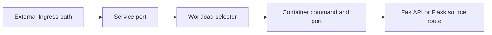
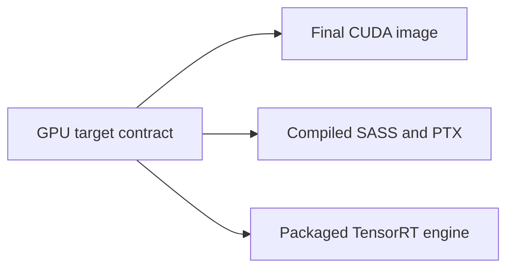

Most linters inspect one file at a time. Release failures often live in the
joins between files: an Ingress exposes a route whose guard exists only in
source, or a CUDA container is shipped to a driver and GPU architecture it
cannot run on.

Skylos' Release Reliability checks correlate those joins before deployment.
Their findings are evidence-backed, diff-aware, and reported separately from
Security so reliability policy does not distort a security grade.

## Quick Start

Run all security and deployment/runtime contract analyzers, then display only
Reliability findings:

```bash
skylos . --danger --category reliability --format concise
```

Run a narrow release gate by selecting exact rules:

```bash
# Kubernetes exposure proof
skylos . --select SKY-DEP001,SKY-DEP002,SKY-DEP003 --gate --format concise

# GPU release compatibility
skylos . --select SKY-GPU001,SKY-GPU002,SKY-GPU003 --gate --format concise
```

Exact selection enables the required analyzer family automatically. The GPU
command also retains the prerequisite `SKY-GPU000`, so an absent or invalid
target contract blocks instead of passing open.

## Kubernetes Deployment Exposure Proof

These rules answer a concrete question: **what source route does this external
Ingress actually reach, and is the deployed runtime mode safe?**



Skylos follows that chain only when every edge is explicit and unambiguous in
one rendered, multi-document Kubernetes YAML file.

### Opt In With Deployment Annotations

Mark the Ingress as an external plain-HTTP proof surface:

```yaml
apiVersion: networking.k8s.io/v1
kind: Ingress
metadata:
  name: api-public
  namespace: prod
  annotations:
    skylos.dev/network-scope: external
    skylos.dev/backend-protocol: http
```

For route-guard proof, declare the source file and required guards on the
workload's Pod template:

```yaml
apiVersion: apps/v1
kind: Deployment
metadata:
  name: api
  namespace: prod
spec:
  template:
    metadata:
      annotations:
        skylos.dev/source-file: app/main.py
        skylos.dev/required-guards: require_admin,login_required
```

`SKY-DEP002` and `SKY-DEP003` need the explicit Ingress scope/protocol contract
but do not require the source/guard annotations.

### Rules

| Rule | Category | What Skylos proves |
|------|----------|--------------------|
| `SKY-DEP001` | Security, HIGH | An externally reachable sensitive FastAPI or Flask route is missing a guard named by the workload contract |
| `SKY-DEP002` | Security, HIGH | The resolved external Flask container effectively enables its development debugger |
| `SKY-DEP003` | Reliability, MEDIUM | The resolved Flask, Uvicorn, or Gunicorn container effectively enables reload mode |

The finding includes the primary location plus `related_locations` for the
Ingress, Service, workload, container, source route, and guard evidence used in
the proof. Diff filtering considers those contributing locations, so a change
to either side of the join can keep the finding in PR scope.

### Intentional Boundaries

Skylos abstains rather than guessing when:

- external scope or plain-HTTP backend intent is not explicitly annotated;
- resources are split across files or the YAML is an unrendered Helm/Kustomize
  template;
- selectors, ports, commands, bindings, entrypoints, or route paths are
  dynamic or ambiguous;
- the chain does not resolve to a supported Flask or FastAPI route.

This is static release evidence. It does not query a live cluster, infer
network policy, or claim that an unannotated Ingress is private.

## GPU Release Compatibility

GPU checks compare the fleet you intend to support with the artifact you are
actually building and packaging:



### Declare The Target Fleet

Create `.skylos/gpu-targets.yml` (or `.yaml`) at the repository root:

```yaml
version: 1
targets:
  - name: a100-prod
    vendor: nvidia
    driver: "535.104.05"
    compute_capability: "8.0"
    platform: linux/amd64
  - name: rtx-a6000-edge
    vendor: nvidia
    driver: "535.104.05"
    compute_capability: "8.6"
    platform: linux/amd64
```

Target names must be unique. Skylos currently accepts NVIDIA targets and uses
the declared platform when applying CUDA driver branch floors.

### Rules And Evidence

| Rule | What Skylos correlates |
|------|-------------------------|
| `SKY-GPU000` | Contract validity and whether bounded evidence discovery completed without missing, deleted, dynamic, or ambiguous required inputs |
| `SKY-GPU001` | The effective final Docker stage's NVIDIA CUDA major version against each target's driver branch and platform |
| `SKY-GPU002` | Declared compute capabilities against real/virtual architectures emitted by CMake, `TORCH_CUDA_ARCH_LIST`, or real NVCC command evidence |
| `SKY-GPU003` | A serialized TensorRT engine's exact build/write path, its packaging into the effective final Docker stage, and hardware compatibility configured before the build |

The TensorRT proof recognizes concrete Python and C++ builder operations. A
comment, docstring, `echo` example, similarly named artifact, unused Docker
stage, or compatibility flag applied after the engine build is not accepted as
release evidence.

### Fail-Closed Contract Behavior

Repositories without a GPU target contract are not treated as GPU projects by
default. The contract becomes required when it exists, is deleted in a
changed-file scan, or any `SKY-GPU*` rule is explicitly selected.

If Skylos cannot validate the contract or authoritative evidence, it emits
`SKY-GPU000` rather than making a compatibility claim. Selecting a leaf rule
such as `SKY-GPU002` automatically retains `SKY-GPU000`, including in
diff-scoped release gates.

These checks do not probe local GPUs or drivers, run a CUDA build, benchmark
kernels, disassemble binaries, or scan dependencies for CVEs.

## Output And Gating

Reliability findings have their own JSON bucket and count:

```json
{
  "reliability": [
    {
      "rule_id": "SKY-GPU001",
      "category": "RELIABILITY",
      "severity": "HIGH",
      "file": "Dockerfile",
      "related_locations": []
    }
  ],
  "analysis_summary": {
    "reliability_count": 1
  }
}
```

They do not consume `danger_count` or `max_security`. Configure the independent
release threshold in `pyproject.toml`:

```toml
[tool.skylos.gate]
max_reliability = 0
```

`0` is the default, so any Reliability finding blocks a gate that enabled or
selected these analyzers.

Use `--category reliability` to filter displayed results after analysis. Use
`--select` when you want to enable and gate an exact rule family. See
[CLI Reference](./cli-reference#finding-filters),
[Understanding the Output](./guides/understanding-output#reliability), and
[Quality Gate](./quality-gate#release-reliability-gates) for the complete
operational contract.
