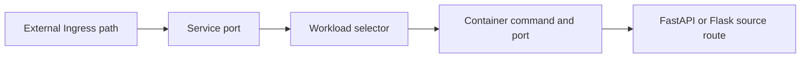
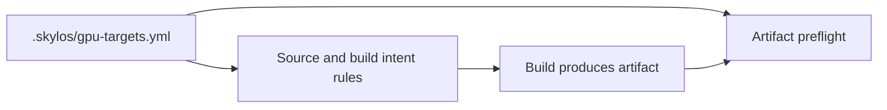

Most linters inspect one file at a time. Release failures often live in the
joins between files: an Ingress exposes a route whose guard exists only in
source, or a CUDA container is shipped to a driver and GPU architecture it
cannot run on.

Skylos' Release Reliability checks correlate those joins before deployment.
Their findings are evidence-backed, diff-aware, and reported separately from
Security so reliability policy does not distort a security grade.

## Quick Start

Run all security and deployment/runtime contract analyzers, then display only
Reliability findings:

```bash
skylos . --danger --category reliability --format concise
```

Run a narrow release gate by selecting exact rules:

```bash
# Kubernetes exposure proof
skylos . --select SKY-DEP001,SKY-DEP002,SKY-DEP003 --gate --format concise

# GPU source/build intent
skylos . --select SKY-GPU001,SKY-GPU002,SKY-GPU003 --gate --format concise

# Exact built GPU artifact
skylos preflight build/app
```

Exact selection enables the required analyzer family automatically. The GPU
command also retains the prerequisite `SKY-GPU000`, so an absent or invalid
target contract blocks instead of passing open.

## Kubernetes Deployment Exposure Proof

These rules answer a concrete question: **what source route does this external
Ingress actually reach, and is the deployed runtime mode safe?**


```mermaid
flowchart LR
    I[External Ingress path] --> S[Service port]
    S --> W[Workload selector]
    W --> C[Container command and port]
    C --> R[FastAPI or Flask source route]
```

Skylos follows that chain only when every edge is explicit and unambiguous in
one rendered, multi-document Kubernetes YAML file.

### Opt In With Deployment Annotations

Mark the Ingress as an external plain-HTTP proof surface:

```yaml
apiVersion: networking.k8s.io/v1
kind: Ingress
metadata:
  name: api-public
  namespace: prod
  annotations:
    skylos.dev/network-scope: external
    skylos.dev/backend-protocol: http
```

For route-guard proof, declare the source file and required guards on the
workload's Pod template:

```yaml
apiVersion: apps/v1
kind: Deployment
metadata:
  name: api
  namespace: prod
spec:
  template:
    metadata:
      annotations:
        skylos.dev/source-file: app/main.py
        skylos.dev/required-guards: require_admin,login_required
```

`SKY-DEP002` and `SKY-DEP003` need the explicit Ingress scope/protocol contract
but do not require the source/guard annotations.

### Rules

| Rule | Category | What Skylos proves |
|------|----------|--------------------|
| `SKY-DEP001` | Security, HIGH | An externally reachable sensitive FastAPI or Flask route is missing a guard named by the workload contract |
| `SKY-DEP002` | Security, HIGH | The resolved external Flask container effectively enables its development debugger |
| `SKY-DEP003` | Reliability, MEDIUM | The resolved Flask, Uvicorn, or Gunicorn container effectively enables reload mode |

The finding includes the primary location plus `related_locations` for the
Ingress, Service, workload, container, source route, and guard evidence used in
the proof. Diff filtering considers those contributing locations, so a change
to either side of the join can keep the finding in PR scope.

### Intentional Boundaries

Skylos abstains rather than guessing when:

- external scope or plain-HTTP backend intent is not explicitly annotated;
- resources are split across files or the YAML is an unrendered Helm/Kustomize
  template;
- selectors, ports, commands, bindings, entrypoints, or route paths are
  dynamic or ambiguous;
- the chain does not resolve to a supported Flask or FastAPI route.

This is static release evidence. It does not query a live cluster, infer
network policy, or claim that an unannotated Ingress is private.

## GPU Release Compatibility

One fleet contract supports two separate checks:


```mermaid
flowchart LR
    T[.skylos/gpu-targets.yml] --> S[Source and build intent rules]
    S --> B[Build produces artifact]
    T --> P[Artifact preflight]
    B --> P
```

- `skylos . --select SKY-GPU...` checks Dockerfiles, CMake/NVCC settings, and
  TensorRT packaging intent before or during the build.
- `skylos preflight [ARTIFACT]` inspects the exact built artifact and compares
  its static evidence with every declared target.

The source gate can catch a bad plan early. Artifact preflight tells you what
the resulting local build actually contains within its stated evidence scope.

### Declare The Target Fleet

Create `.skylos/gpu-targets.yml` (or `.yaml`) at the repository root:

```yaml
version: 1
targets:
  - name: a100-prod
    vendor: nvidia
    driver: "535.104.05"
    compute_capability: "8.0"
    platform: linux/amd64
  - name: rtx-a6000-edge
    vendor: nvidia
    driver: "535.104.05"
    compute_capability: "8.6"
    platform: linux/amd64
```

Target names must be unique. All targets in one profile receive the same
artifact. Use separate profiles and preflight runs for per-device builds.
Skylos currently accepts NVIDIA targets and uses the declared platform when
applying CUDA driver branch floors.

### Source And Build Intent Rules

```bash
skylos . \
  --select SKY-GPU001,SKY-GPU002,SKY-GPU003 \
  --gate --format concise
```

| Rule | What Skylos correlates |
|------|-------------------------|
| `SKY-GPU000` | Contract validity and whether bounded evidence discovery completed without missing, deleted, dynamic, or ambiguous required inputs |
| `SKY-GPU001` | The effective final Docker stage's NVIDIA CUDA major version against each target's driver branch and platform |
| `SKY-GPU002` | Declared compute capabilities against real/virtual architectures requested by CMake, `TORCH_CUDA_ARCH_LIST`, or real NVCC command evidence |
| `SKY-GPU003` | A serialized TensorRT engine's exact build/write path, its packaging into the effective final Docker stage, and hardware compatibility configured before the build |

The TensorRT proof recognizes concrete Python and C++ builder operations. A
comment, docstring, `echo` example, similarly named artifact, unused Docker
stage, or compatibility flag applied after the engine build is not accepted as
release evidence.

Repositories without a GPU target contract are not treated as GPU projects by
default. The contract becomes required when it exists, is deleted in a
changed-file scan, or any `SKY-GPU*` rule is explicitly selected. If Skylos
cannot validate the contract or authoritative source evidence, it emits
`SKY-GPU000`. Selecting a leaf rule automatically retains that prerequisite.

These `SKY-GPU*` rules do not inspect a built binary, probe GPUs or drivers,
run a CUDA build, benchmark kernels, or scan dependencies for CVEs.

### Built Artifact Preflight

Run preflight after the build:

```bash
skylos preflight build/app
```

`ARTIFACT` can be one local regular file or a directory bundle. Local version-1
inspection supports Linux ELF/CUDA artifacts and requires a trusted NVIDIA
`cuobjdump` installed outside the project and artifact. Skylos copies candidate
files into a private snapshot and never loads or executes target code.

For an argument-free CI step, create a strict release receipt whose artifact
path stays inside the project:

```json title=".skylos/release.json"
{"version": 1, "artifact": "build/app"}
```

Then run:

```bash
skylos preflight
```

There are no preflight mode flags. The artifact and declared fleet profile
define the check. Terminal output is concise;
after report generation, redirected stdout is a schema-version-1
`gpu_artifact_preflight` JSON report with the exact identity, per-target checks,
evidence, errors, and limitations. Argument and adapter errors can be plain text
and exit `2`.

| Status | Exit | Meaning |
|------|:----:|---------|
| `PASS` | `0` | Exact identity is verified and every target passes every check within the declared static scope |
| `FAIL` | `1` | Artifact evidence proves at least one target incompatible |
| `UNKNOWN` | `2` | Evidence is missing, ambiguous, unsupported, incomplete, or input is invalid |

`UNKNOWN` is an abstention. Missing evidence never becomes `PASS`.
Across checks and targets, a proved `FAIL` takes precedence over `UNKNOWN`, and
`UNKNOWN` takes precedence over `PASS`.

Version 1 checks:

- the SHA-256 identity of a local file or the full bounded content-tree
  identity of a directory;
- Linux ELF host platform;
- architecture routes in the selected executable fatbin, grouped by producer
  identifier;
- a static packaged `DT_NEEDED`/`DT_SONAME` CUDA runtime route anchored to
  `$ORIGIN`; and
- documented CUDA runtime/driver-family compatibility for each target.

The *selected executable fatbin* is the executable CUDA record set selected by
`cuobjdump --list-elf`/`--list-ptx`. The producer identifier is the label that
groups cubin and PTX records from that set; every observed group needs a
compatible native cubin route for `PASS`. PTX-only coverage remains `UNKNOWN`
because static inspection does not establish the deployment driver's PTX
compiler/ISA compatibility.

A `PASS` does not establish runtime execution, workload correctness, memory
demand, performance, nonselected or relocatable fatbins, or per-kernel symbol
parity. Loader environment overrides and hardware-capability directory
selection remain untested. Windows PE runtime import proof is not implemented.
`cuobjdump` has time, output, environment, working-directory, and executable
location bounds, but it is not placed inside a portable OS-level network and
filesystem sandbox.

Digest-pinned OCI references are accepted as identities. The CLI never pulls
or starts them and returns `UNKNOWN` because it has no trusted artifact facts.
A trusted caller can provide a digest-bound inventory through the library API:

```python
from skylos.preflight import run_preflight

report = run_preflight("build/app")
# For OCI, pass inventory=<trusted digest-bound mapping>.
```

Supplied inventory is validated strictly and must bind to the requested digest
before it can contribute to `PASS`.

## Source-Rule Output And Gating

Reliability findings have their own JSON bucket and count:

```json
{
  "reliability": [
    {
      "rule_id": "SKY-GPU001",
      "category": "RELIABILITY",
      "severity": "HIGH",
      "file": "Dockerfile",
      "related_locations": []
    }
  ],
  "analysis_summary": {
    "reliability_count": 1
  }
}
```

They do not consume `danger_count` or `max_security`. Configure the independent
release threshold in `pyproject.toml`:

```toml
[tool.skylos.gate]
max_reliability = 0
```

`0` is the default, so any Reliability finding blocks a gate that enabled or
selected these analyzers.

Use `--category reliability` to filter displayed results after analysis. Use
`--select` when you want to enable and gate an exact rule family. See
[CLI Reference](./cli-reference#finding-filters),
[Understanding the Output](./guides/understanding-output#reliability), and
[Quality Gate](./quality-gate#release-reliability-gates) for the complete
source-rule contract. Artifact preflight uses the separate `PASS`/`FAIL`/
`UNKNOWN` report and exit codes documented above.
