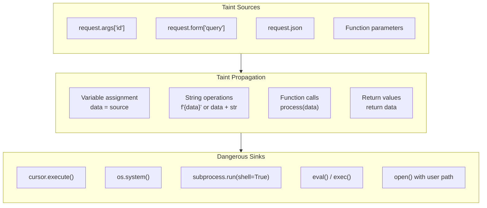
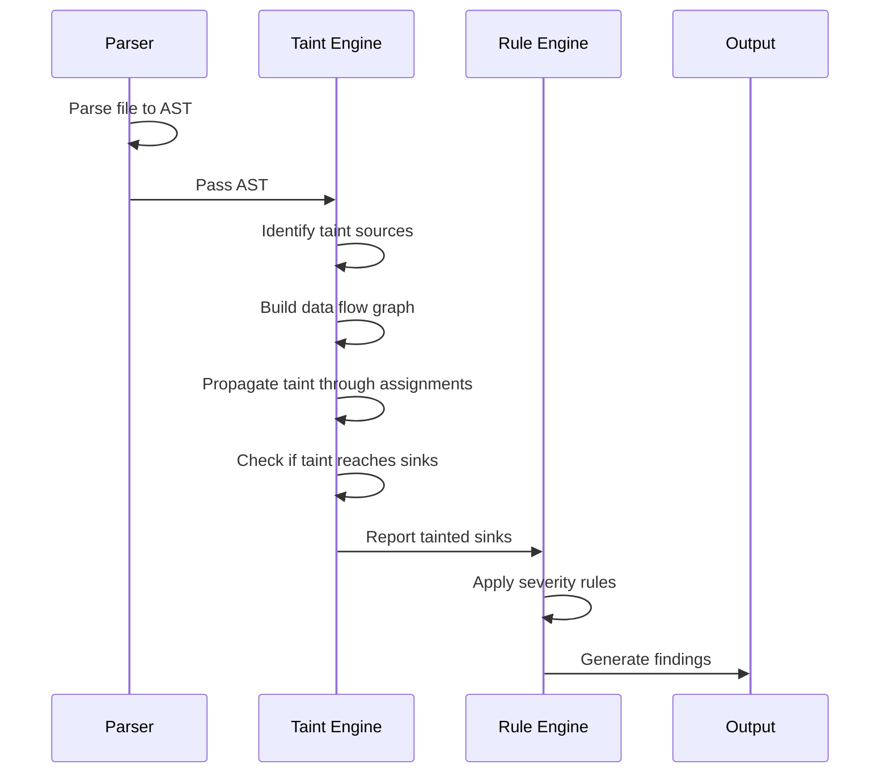

:::info
  **Enable security scanning:** `skylos . --danger`
:::

## Why Pattern Matching Fails

Most security scanners use regex patterns to find dangerous code. This approach has a fundamental flaw: **it can't follow data flow.**


**What Pattern Matchers See:**

    ```python
    # Caught
    cursor.execute("SELECT * FROM users WHERE id = " + user_id)
    
    # Missed
    def get_user(user_id):
        query = build_query(user_id)
        return db.execute(query)
    
    def build_query(uid):
        return f"SELECT * FROM users WHERE id = {uid}"
    ```
    
    Pattern matchers only see the `execute()` call with a variable—they can't tell if that variable contains user input.
  
**What Skylos Sees:**

    ```python
    # Skylos traces the full data flow:
    
    def get_user(user_id): # Tainted: function parameter
        query = build_query(user_id)  # Tainted: uses tainted value
        return db.execute(query) # ALERT: tainted value reaches sink
    
    def build_query(uid):  # Tainted: parameter from tainted caller
        return f"SELECT * FROM users WHERE id = {uid}"  # Tainted string
    ```
    
    Skylos follows the taint through every assignment and function call.
  
---

## How Taint Analysis Works

Skylos builds a data flow graph for each file, tracking how values propagate from **sources** (user input) to **sinks** (dangerous functions).



### The Analysis Pipeline



---

## Vulnerability Categories

### SQL Injection

:::warning
  **Severity: CRITICAL** — Attackers can read, modify, or delete your entire database.
:::

Skylos detects SQL injection across multiple frameworks:

| Framework | Dangerous Pattern | Rule ID |
|-----------|------------------|---------|
| Raw Python | `cursor.execute(f"...{user_input}...")` | SKY-D210 |
| SQLAlchemy | `session.execute(text(f"...{user_input}..."))` | SKY-D217 |
| Django ORM | `Model.objects.raw(f"...{user_input}...")` | SKY-D217 |
| Pandas | `pd.read_sql(f"...{user_input}...", conn)` | SKY-D217 |

<details>
<summary>See detection in action</summary>

```python
# Vulnerable - Skylos catches all of these

# Direct concatenation
cursor.execute("SELECT * FROM users WHERE id = " + user_id)

# F-string interpolation  
cursor.execute(f"SELECT * FROM users WHERE id = {user_id}")

# .format() method
cursor.execute("SELECT * FROM users WHERE id = {}".format(user_id))

# SQLAlchemy text()
from sqlalchemy import text
session.execute(text(f"SELECT * FROM t WHERE x = {val}"))

# Django raw()
User.objects.raw(f"SELECT * FROM users WHERE name = '{name}'")
```

```python
# Safe - parameterized queries
cursor.execute("SELECT * FROM users WHERE id = %s", (user_id,))
session.execute(text("SELECT * FROM t WHERE x = :val"), {"val": val})
User.objects.raw("SELECT * FROM users WHERE name = %s", [name])
```
</details>

### Command Injection

:::warning
  **Severity: CRITICAL** — Attackers can execute arbitrary commands on your server.
:::

<details>
<summary>See detection in action</summary>

```python
# Vulnerable
os.system(f"convert {user_filename} output.pdf")
subprocess.run(f"echo {user_input}", shell=True)

# Safe - use list arguments, no shell
subprocess.run(["convert", user_filename, "output.pdf"])
subprocess.run(["echo", user_input])  # shell=False by default
```
</details>

### Server-Side Request Forgery (SSRF)

:::warning
  **Severity: CRITICAL** — Attackers can access internal services or cloud metadata.
:::

```python
# Vulnerable - user controls the URL
requests.get(user_provided_url)

# Attacker provides: http://169.254.169.254/latest/meta-data/
# -> Accesses AWS instance metadata, potentially leaking credentials
```

### Path Traversal

```python
# Vulnerable
open(f"uploads/{user_filename}", "r")

# Attacker provides: ../../../etc/passwd
# -> Reads sensitive system files
```

### Cross-Site Scripting (XSS)

```python
# Vulnerable - user content rendered as HTML
from markupsafe import Markup
return Markup(f"<div>{user_comment}</div>")
```

---

## Dangerous Function Detection

Beyond taint analysis, Skylos flags inherently dangerous patterns:

| Function | Risk | Rule ID | Severity |
|----------|------|---------|----------|
| `eval()` | Arbitrary code execution | SKY-D201 | HIGH |
| `exec()` | Arbitrary code execution | SKY-D202 | HIGH |
| `pickle.load()` | Deserialization attack | SKY-D203 | CRITICAL |
| `pickle.loads()` | Deserialization attack | SKY-D204 | CRITICAL |
| `yaml.load()` | Code execution without SafeLoader | SKY-D205 | HIGH |
| `hashlib.md5()` | Weak cryptographic hash | SKY-D206 | MEDIUM |
| `hashlib.sha1()` | Weak cryptographic hash | SKY-D207 | MEDIUM |
| `requests.get(verify=False)` | SSL verification disabled | SKY-D208 | HIGH |

---

## Secret Detection

:::info
  **Enable secret scanning:** `skylos . --secrets`
:::

Skylos detects hardcoded credentials that should never be in source code:

| Provider | What's Detected | Example Pattern |
|----------|-----------------|-----------------|
| AWS | Access keys | `AKIA...` |
| GitHub | Personal access tokens | `ghp_...`, `gho_...` |
| Slack | Bot and user tokens | `xoxb-...`, `xoxp-...` |
| Stripe | Live API keys | `sk_live_...`, `rk_live_...` |
| Generic | Common variable names | `api_key = "..."`, `password = "..."` |

```
──────────────────────── Secrets ────────────────────────
 #  Provider  Message                    Preview           Location
 1  aws       AWS Access Key detected    AKIA****EXAMPLE   config.py:12
 2  stripe    Stripe Live Key detected   sk_live_****xyz   payments.py:8
```

---

## Comparison: Skylos vs. Other Tools

| Capability | Skylos | Bandit | Semgrep | Snyk Code |
|------------|--------|--------|---------|-----------|
| Taint analysis | ✅ | ❌ | ✅ | ✅ |
| Framework awareness | ✅ | ❌ | Partial | ✅ |
| Dead code detection | ✅ | ❌ | ❌ | ❌ |
| Quality metrics | ✅ | ❌ | ❌ | ❌ |
| AI-powered fixes | ✅ | ❌ | ❌ | ✅ |
| Self-hosted | ✅ | ✅ | ✅ | ❌ |
| Free | ✅ | ✅ | Partial | Partial |

---

## Integration Example

Block PRs with critical security issues:

```yaml
# .github/workflows/security.yml
name: Security Scan

on: [pull_request]

jobs:
  skylos-security:
    runs-on: ubuntu-latest
    steps:
      - uses: actions/checkout@v4
      - uses: actions/setup-python@v5
        with:
          python-version: '3.11'
      
      - run: pip install skylos
      
      - name: Security Scan
        run: skylos . --danger --secrets --gate
```

With `fail_on_critical = true` (default), any CRITICAL finding blocks the PR.

---

## Next Steps


  ### [Rule Reference](/rule-reference)
    See all security rules with examples
  
  ### [Quality Gate](/quality-gate)
    Configure thresholds to block deployments
  
