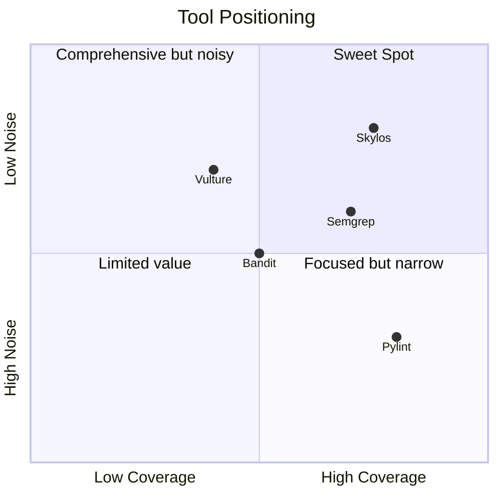
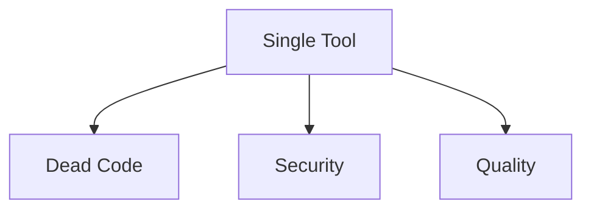
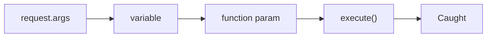

## The Analysis Tool Landscape

There are many static analysis tools for Python. Here's how Skylos fits in:



---

## Feature Comparison

| Capability | Skylos | Bandit | Semgrep | Vulture | Pylint |
|------------|:------:|:------:|:-------:|:-------:|:------:|
| Dead code detection | ✅ | ❌ | ❌ | ✅ | Partial |
| Taint analysis | ✅ | ❌ | ✅ | ❌ | ❌ |
| Framework awareness | ✅ | ❌ | Partial | ❌ | ❌ |
| Complexity metrics | ✅ | ❌ | ❌ | ❌ | ✅ |
| Secret detection | ✅ | ❌ | ✅ | ❌ | ❌ |
| Quality gate | ✅ | ❌ | ❌ | ❌ | ❌ |
| AI-powered fixes | ✅ | ❌ | ❌ | ❌ | ❌ |
| TypeScript support | ✅ | ❌ | ✅ | ❌ | ❌ |
| Confidence scoring | ✅ | ❌ | ❌ | Partial | ❌ |
| Interactive removal | ✅ | ❌ | ❌ | ❌ | ❌ |

---

## Tool-by-Tool Comparison


**vs Bandit:**

    ### Bandit
    
    **What it does:** Security-focused linter using AST pattern matching.
    
    **Limitations:**
    - No taint analysis—misses indirect vulnerabilities
    - No dead code detection
    - No quality metrics
    - No framework awareness (high false positives)
    
    ```python
    # Bandit catches this:
    eval(user_input)  # ✅ B307: eval detected
    
    # Bandit misses this:
    data = user_input
    query = data
    cursor.execute(query)  # ❌ No SQL injection warning
    ```
    
    **When to use Bandit:** Quick security audit when you don't need depth.
    
    **When to use Skylos:** Production security where indirect vulnerabilities matter.
  
**vs Semgrep:**

    ### Semgrep
    
    **What it does:** Pattern-based analysis with custom rules, includes taint mode.
    
    **Limitations:**
    - No dead code detection
    - No quality metrics
    - Requires rule authoring for custom patterns
    - Pro features (Supply chain, secrets) require paid tier
    
    **When to use Semgrep:** Custom rule authoring, supply chain security (Pro).
    
    **When to use Skylos:** All-in-one analysis with dead code + security + quality.
  
**vs Vulture:**

    ### Vulture
    
    **What it does:** Dead code detection via AST analysis.
    
    **Limitations:**
    - No security scanning
    - No quality metrics
    - Limited framework awareness
    - No confidence scoring
    - No interactive removal
    
    ```python
    # Vulture flags this as unused:
    @app.route('/users')  # ❌ False positive
    def get_users():
        return users
    ```
    
    **When to use Vulture:** Simple dead code check on non-framework code.
    
    **When to use Skylos:** Framework-aware detection with confidence filtering.
  
**vs Pylint:**

    ### Pylint
    
    **What it does:** Comprehensive linting covering style, errors, and some security.
    
    **Limitations:**
    - Very noisy—many stylistic warnings
    - No taint analysis
    - No dedicated security focus
    - No quality gate
    - Slow on large codebases
    
    **When to use Pylint:** Enforcing code style alongside a formatter.
    
    **When to use Skylos:** Focused analysis on what matters—dead code, security, complexity.
  
**vs Snyk Code:**

    ### Snyk Code
    
    **What it does:** Commercial SAST with taint analysis and AI fixes.
    
    **Limitations:**
    - No dead code detection
    - No quality metrics
    - SaaS-only (code sent to cloud)
    - Pricing based on usage
    
    **When to use Snyk:** Enterprise security with compliance requirements.
    
    **When to use Skylos:** Self-hosted, free, with dead code + quality.
  
---

## The Skylos Difference

### 1. All-in-One Analysis

Most tools focus on one thing. Skylos combines three:



One tool, one config, one CI step—not three separate pipelines.

### 2. Framework Awareness Reduces Noise

Other tools don't understand Django, Flask, or FastAPI:

```python
# What other tools see:
@app.route('/api/users')
def get_users():  # "Unused function"
    return jsonify(users)

# What Skylos sees:
@app.route('/api/users')
def get_users():  # Not flagged—called by framework
    return jsonify(users)
```

### 3. Confidence Scoring Filters Uncertainty

Instead of boolean "used/unused", Skylos scores confidence:

| Finding | Confidence | Other Tools | Skylos |
|---------|------------|-------------|--------|
| `def _helper()` | 20% | Flagged | Filtered out |
| `def __str__()` | 0% | Flagged | Excluded |
| `def unused_fn()` | 85% | Flagged | Reported |

### 4. Taint Analysis Catches Real Vulnerabilities

Pattern matching finds obvious issues. Taint analysis follows data flow:



### 5. Built-in Quality Gate

No scripting required to block bad PRs:

```bash
# Other tools: requires wrapper script
bandit -r . -f json > report.json
python check_results.py report.json || exit 1

# Skylos: built-in
skylos . --danger --gate
```

---

## Migration Guide

### From Vulture

```bash
# Before
vulture myproject/ --min-confidence 80

# After
skylos myproject/ --confidence 80
```

Skylos uses similar confidence scoring but adds framework awareness.

### From Bandit

```bash
# Before
bandit -r myproject/ -f json -o bandit.json

# After
skylos myproject/ --danger --json -o skylos.json
```

Skylos includes all Bandit-style checks plus taint analysis.

### From Pylint (complexity only)

```bash
# Before
pylint myproject/ --disable=all --enable=R0912,R0915

# After
skylos myproject/ --quality
```

Skylos focuses on actionable metrics, not style.

---

## When to Use Multiple Tools

Skylos doesn't replace everything. Consider combining:

| Use Case | Recommendation |
|----------|----------------|
| Code formatting | Use Black/Prettier (not Skylos) |
| Type checking | Use mypy/Pyright (not Skylos) |
| Dead code + Security + Quality | Use Skylos |
| Custom security rules | Use Semgrep + Skylos |
| Supply chain analysis | Use Snyk/Dependabot + Skylos |

---

## Try It Yourself


**pip:**


```bash install skylos

skylos . --danger --quality --secrets

```

---

## Next Steps


  ### [Getting Started](/getting-started)
    Install and run your first scan
  
  ### [Security Analysis](/security-analysis)
    Deep dive into taint analysis
  
