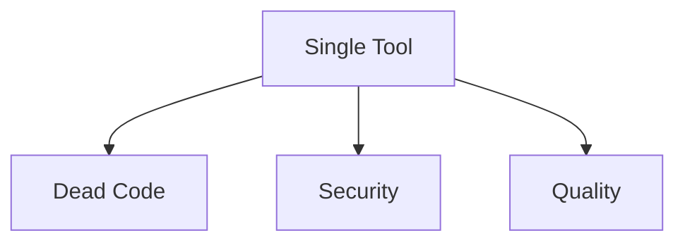

:::tip Detailed comparisons
Tool-by-tool comparison pages are on [skylos.dev/compare](https://skylos.dev/compare): [Bandit](https://skylos.dev/compare/bandit-vs-skylos), [Semgrep](https://skylos.dev/compare/semgrep-vs-skylos), [SonarQube](https://skylos.dev/compare/sonarqube-vs-skylos), [Snyk](https://skylos.dev/compare/snyk-vs-skylos), [Vulture and deadcode](https://skylos.dev/compare/deadcode-vs-vulture-vs-skylos) and [GitHub Code Quality](https://skylos.dev/compare/github-code-quality-vs-skylos).
:::

## The Analysis Tool Landscape

Tools have different scopes. Compare their documented checks and measure
runtime on your repository; a feature list does not establish accuracy,
false-positive rates or speed.

---

## Feature Comparison

| Capability | Skylos | Bandit | Semgrep | Vulture | Pylint |
|------------|:------:|:------:|:-------:|:-------:|:------:|
| Dead code detection | ✅ | ❌ | ❌ | ✅ | Partial |
| Taint analysis | ✅ | ❌ | ✅ | ❌ | ❌ |
| Framework awareness | ✅ | ❌ | Partial | ❌ | ❌ |
| Complexity metrics | ✅ | ❌ | ❌ | ❌ | ✅ |
| Secret detection | ✅ | ❌ | ✅ | ❌ | ❌ |
| Configurable combined findings gate | ✅ | Security exit status | CI policy | Dead-code exit status | Lint exit status |
| AI-powered fixes | ✅ | ❌ | ❌ | ❌ | ❌ |
| TypeScript support | ✅ | ❌ | ✅ | ❌ | ❌ |
| Dead-code confidence scoring | ✅ | — | — | ✅ | — |
| Interactive removal | ✅ | ❌ | ❌ | ❌ | ❌ |

---

## Tool-by-Tool Comparison


**vs Bandit:**

### Bandit

**What it does:** Security-focused linter using AST pattern matching.

**Limitations:**
- No taint analysis—misses indirect vulnerabilities
- No dead code detection
- No quality metrics
- Focuses on Python security patterns rather than project reachability

```python
# Bandit catches this:
eval(user_input)  # ✅ B307: eval detected

# Bandit misses this:
data = user_input
query = data
cursor.execute(query)  # ❌ No SQL injection warning
```

**When to use Bandit:** Quick security audit when you don't need depth.

**When to use Skylos:** Production security where indirect vulnerabilities matter.
  
**vs Semgrep:**

### Semgrep

**What it does:** Pattern-based analysis with custom rules, includes taint mode.

**Limitations:**
- No dead code detection
- No quality metrics
- Requires rule authoring for custom patterns
- Pro features (Supply chain, secrets) require paid tier

**When to use Semgrep:** Custom rule authoring, supply chain security (Pro).

**When to use Skylos:** All-in-one analysis with dead code + security + quality.
  
**vs Vulture:**

### Vulture

**What it does:** Dead code detection via AST analysis.

**Limitations:**
- No security scanning
- No quality metrics
- Limited framework awareness
- Confidence scores are based on finding type; framework entry points may need whitelists or decorator exclusions
- No interactive removal

```python
# Vulture flags this as unused:
@app.route('/users')  # ❌ False positive
def get_users():
    return users
```

**When to use Vulture:** A dedicated Python dead-code check with confidence filtering.

Vulture supports `--min-confidence` and returns exit code `3` when it finds
unused code above the selected threshold, so it can fail CI directly.
See the [Vulture documentation](https://github.com/jendrikseipp/vulture#types-of-unused-code).

**When to use Skylos:** Framework-aware detection with confidence filtering.
  
**vs Pylint:**

### Pylint

**What it does:** Comprehensive linting covering style, errors, and some security.

**Limitations:**
- Includes stylistic warnings as well as code checks
- No taint analysis
- No dedicated security focus
- Its CI status concerns lint findings rather than Skylos's combined gate

**When to use Pylint:** Enforcing code style alongside a formatter.

**When to use Skylos:** Focused analysis on what matters—dead code, security, complexity.
  
**vs Snyk Code:**

### Snyk Code

**What it does:** Commercial SAST with taint analysis and AI fixes.

**Limitations:**
- No dead code detection
- No quality metrics
- SaaS-only (code sent to cloud)
- Pricing based on usage

**When to use Snyk:** Enterprise security with compliance requirements.

**When to use Skylos:** Self-hosted, free, with dead code + quality.
  
---

## The Skylos Difference

### 1. All-in-One Analysis

Most tools focus on one thing. Skylos combines three:


```mermaid
flowchart TD
   
        G[Single Tool] --> H[Dead Code]
        G --> I[Security]
        G --> J[Quality]
```

One tool, one config, one CI step—not three separate pipelines.

### 2. Framework Awareness Reduces Noise

Skylos recognizes supported Django, Flask and FastAPI entry-point conventions.
This can reduce false positives on code invoked by a framework. Other tools
may support whitelists, decorator exclusions or their own framework rules.

```python
@app.route('/api/users')
def get_users():  # A recognized framework entry point
    return jsonify(users)
```

### 3. Confidence Scoring Filters Uncertainty

Skylos assigns heuristic confidence scores and supports a threshold:

```bash
skylos . --confidence 80
```

Higher thresholds show fewer candidates. Vulture also supports confidence
filtering through `--min-confidence`; neither score proves that removing a
symbol is safe. Review public APIs and dynamically invoked code before removal.

### 4. Taint Analysis Catches Real Vulnerabilities

Pattern matching finds obvious issues. Taint analysis follows data flow:


```mermaid
flowchart LR
    
        E["request.args"] --> F["variable"]
        F --> G["function param"]
        G --> H["execute()"]
        H --> I["Caught"]
```

### 5. Built-in Quality Gate

No scripting required to block bad PRs:

```bash
# Bandit can fail CI on security findings directly
bandit -r . -f json > report.json

# Skylos applies the configured combined gate limits
skylos . --danger --gate
```

---

## Migration Guide

### From Vulture

```bash
# Before
vulture myproject/ --min-confidence 80

# After
skylos myproject/ --confidence 80
```

Skylos uses similar confidence scoring but adds framework awareness.

### From Bandit

```bash
# Before
bandit -r myproject/ -f json -o bandit.json

# After
skylos myproject/ --danger --json -o skylos.json
```

Skylos includes all Bandit-style checks plus taint analysis.

### From Pylint (complexity only)

```bash
# Before
pylint myproject/ --disable=all --enable=R0912,R0915

# After
skylos myproject/ --quality
```

Skylos focuses on actionable metrics, not style.

---

## When to Use Multiple Tools

Skylos doesn't replace everything. Consider combining:

| Use Case | Recommendation |
|----------|----------------|
| Code formatting | Use Black/Prettier (not Skylos) |
| Type checking | Use mypy/Pyright (not Skylos) |
| Dead code + Security + Quality | Use Skylos |
| Custom security rules | Use Semgrep + Skylos |
| Supply chain analysis | Use Snyk/Dependabot + Skylos |

---

## Try It Yourself


**pip:**


```bash install skylos

skylos . --danger --quality --secrets

```

---

## Next Steps


  ### [Getting Started](/)
    Install and run your first scan
  
  ### [Security Analysis](/security-analysis)
    Deep dive into taint analysis
  
